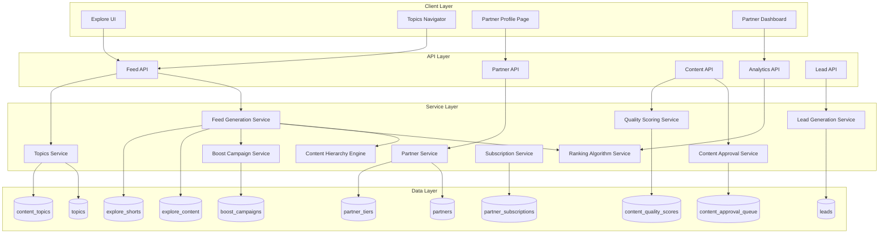

# Design Document: Explore Partner Marketplace System

## Overview

The Explore Partner Marketplace System extends the existing Explore Discovery Engine with a comprehensive partner ecosystem, content governance framework, and monetization layer. This design maintains the "entertainment that converts" principle while enabling sustainable platform growth through structured partner relationships.

The system introduces four key architectural components:
1. **Partner Management Layer** - Tier classification, profiles, and governance
2. **Content Governance Engine** - Hierarchy enforcement, approval workflows, quality scoring
3. **Topics Navigation System** - Intent-based feed reconfiguration
4. **Monetization Framework** - Subscriptions, boosts, leads, and bundles

This design integrates with existing Explore infrastructure (explore_content, explore_shorts, recommendation engine) while adding new tables and services for partner-specific functionality.

## Architecture



## Components and Interfaces

### 1. Partner Management Service

Handles partner registration, tier assignment, profile management, and verification.

```typescript
interface Partner {
  id: string;
  userId: string;
  tierId: number; // 1-4
  companyName: string;
  description: string;
  logoUrl: string;
  verificationStatus: 'pending' | 'verified' | 'rejected';
  trustScore: number; // 0-100
  serviceLocations: string[];
  subscriptionTier: 'free' | 'basic' | 'premium' | 'featured';
  approvedContentCount: number;
  createdAt: Date;
  updatedAt: Date;
}

interface PartnerTier {
  id: number;
  name: string; // 'Property Professional', 'Home Service Provider', etc.
  allowedContentTypes: ContentType[];
  allowedCTAs: CTAType[];
  requiresCredentials: boolean;
  maxMonthlyContent: number;
}

interface PartnerService {
  registerPartner(data: PartnerRegistration): Promise<Partner>;
  assignTier(partnerId: string, tierId: number): Promise<void>;
  updateProfile(partnerId: string, data: PartnerProfileUpdate): Promise<Partner>;
  verifyPartner(partnerId: string, credentials: VerificationData): Promise<void>;
  calculateTrustScore(partnerId: string): Promise<number>;
  getPartnerProfile(partnerId: string): Promise<PartnerProfile>;
  getPartnersByTier(tierId: number): Promise<Partner[]>;
}
```

### 2. Content Hierarchy Engine

Enforces the 70/20/10 content distribution rule across all feeds.

```typescript
interface ContentHierarchyConfig {
  primaryRatio: number;    // 0.70 - Properties & Developments
  secondaryRatio: number;  // 0.20 - Services, Finance, Education
  tertiaryRatio: number;   // 0.10 - Inspiration, Trends
  minPrimaryRatio: number; // 0.60 - Minimum before rebalancing
  segmentSize: number;     // 20 - Items per evaluation segment
}

interface ContentCategory {
  type: 'primary' | 'secondary' | 'tertiary';
  contentTypes: string[];
}

interface HierarchyEngine {
  categorizeContent(content: ExploreContent): ContentCategory;
  calculateRatios(feedItems: ExploreContent[]): ContentRatios;
  rebalanceFeed(feedItems: ExploreContent[], config: ContentHierarchyConfig): ExploreContent[];
  validateHierarchy(feedItems: ExploreContent[]): HierarchyValidationResult;
  getOlderPrimaryContent(limit: number): Promise<ExploreContent[]>;
}

interface ContentRatios {
  primary: number;
  secondary: number;
  tertiary: number;
  isValid: boolean;
  requiresRebalancing: boolean;
}
```

### 3. Topics Navigation Service

Manages intent-based navigation and feed reconfiguration.

```typescript
interface Topic {
  id: string;
  slug: string;
  name: string;
  description: string;
  icon: string;
  displayOrder: number;
  isActive: boolean;
  contentTags: string[];      // Tags that match this topic
  propertyFeatures: string[]; // Property features relevant to topic
  partnerCategories: string[]; // Partner categories for this topic
}

interface TopicsService {
  getAllTopics(): Promise<Topic[]>;
  getTopicBySlug(slug: string): Promise<Topic>;
  getContentForTopic(topicId: string, pagination: Pagination): Promise<ExploreContent[]>;
  tagContentWithTopics(contentId: string, topicIds: string[]): Promise<void>;
  getRelatedTopics(topicId: string): Promise<Topic[]>;
  getTopicContentCount(topicId: string): Promise<number>;
}

// Topic-aware feed generation
interface TopicFeedRequest {
  topicId?: string;
  userId: string;
  pagination: Pagination;
  filters?: FeedFilters;
}
```

### 4. Content Approval Service

Manages content review workflow and quality gates.

```typescript
interface ContentApprovalQueue {
  id: string;
  contentId: string;
  partnerId: string;
  status: 'pending' | 'approved' | 'rejected' | 'revision_requested';
  submittedAt: Date;
  reviewedAt?: Date;
  reviewerId?: string;
  feedback?: string;
  autoApprovalEligible: boolean;
}

interface ApprovalService {
  submitForApproval(contentId: string, partnerId: string): Promise<ContentApprovalQueue>;
  reviewContent(queueId: string, decision: ApprovalDecision): Promise<void>;
  checkAutoApprovalEligibility(partnerId: string): Promise<boolean>;
  flagContent(contentId: string, reason: string, reporterId: string): Promise<void>;
  getApprovalQueue(filters: QueueFilters): Promise<ContentApprovalQueue[]>;
  validateContentRules(content: ExploreContent, partner: Partner): ValidationResult;
}

interface ApprovalDecision {
  status: 'approved' | 'rejected' | 'revision_requested';
  feedback?: string;
  violationTypes?: string[];
}
```

### 5. Quality Scoring Service

Calculates and updates content quality scores based on multiple signals.

```typescript
interface QualityScore {
  contentId: string;
  overallScore: number;        // 0-100
  metadataScore: number;       // Completeness of metadata
  engagementScore: number;     // Watch time, saves, clicks
  productionScore: number;     // Video/image quality
  negativeSignals: number;     // Quick skips, reports
  lastCalculatedAt: Date;
}

interface QualityWeights {
  metadata: number;      // 0.20
  engagement: number;    // 0.40
  production: number;    // 0.25
  negativeSignals: number; // 0.15 (subtracted)
}

interface QualityService {
  calculateInitialScore(content: ExploreContent): Promise<number>;
  updateScoreFromEngagement(contentId: string, engagement: EngagementData): Promise<void>;
  recordNegativeSignal(contentId: string, signalType: string): Promise<void>;
  getQualityScore(contentId: string): Promise<QualityScore>;
  getUnderperformingContent(partnerId: string): Promise<ExploreContent[]>;
  notifyPartnerOfLowQuality(partnerId: string, contentIds: string[]): Promise<void>;
}
```

### 6. Feed Ranking Service

Implements the weighted ranking algorithm for feed generation.

```typescript
interface RankingWeights {
  userInterest: number;    // 0.35
  contentQuality: number;  // 0.25
  localRelevance: number;  // 0.20
  recency: number;         // 0.10
  partnerTrust: number;    // 0.10
}

interface RankingFactors {
  userInterestScore: number;   // Based on user behavior signals
  qualityScore: number;        // From QualityService
  localRelevanceScore: number; // Distance/location match
  recencyScore: number;        // Time decay function
  trustScore: number;          // Partner trust score
  boostMultiplier: number;     // 1.0 for organic, >1.0 for boosted
}

interface RankingService {
  calculateRankingScore(content: ExploreContent, factors: RankingFactors): number;
  rankFeedItems(items: ExploreContent[], userId: string): Promise<ExploreContent[]>;
  applyBoostMultiplier(score: number, boost: BoostCampaign): number;
  ensureBoostLimit(items: ExploreContent[]): ExploreContent[]; // Max 1 per 10
}
```

### 7. Subscription Service

Manages partner subscription tiers and feature access.

```typescript
interface PartnerSubscription {
  id: string;
  partnerId: string;
  tier: 'free' | 'basic' | 'premium' | 'featured';
  priceMonthly: number;
  startDate: Date;
  endDate?: Date;
  status: 'active' | 'cancelled' | 'expired';
  features: SubscriptionFeatures;
}

interface SubscriptionFeatures {
  profileType: 'standard' | 'enhanced' | 'premium';
  analyticsLevel: 'basic' | 'detailed' | 'advanced';
  supportLevel: 'community' | 'priority' | 'dedicated';
  organicReachMultiplier: number; // 1.0, 1.5, 2.0
  maxMonthlyContent: number;
  boostDiscountPercent: number;
}

interface SubscriptionService {
  createSubscription(partnerId: string, tier: string): Promise<PartnerSubscription>;
  upgradeSubscription(subscriptionId: string, newTier: string): Promise<void>;
  cancelSubscription(subscriptionId: string): Promise<void>;
  checkFeatureAccess(partnerId: string, feature: string): Promise<boolean>;
  handleExpiredSubscriptions(): Promise<void>;
  getSubscriptionTierPricing(): SubscriptionTierPricing[];
}
```

### 8. Boost Campaign Service

Manages paid content promotion within Topics.

```typescript
interface BoostCampaign {
  id: string;
  partnerId: string;
  contentId: string;
  topicId: string;
  budget: number;
  spent: number;
  status: 'draft' | 'active' | 'paused' | 'completed' | 'depleted';
  startDate: Date;
  endDate?: Date;
  impressions: number;
  clicks: number;
  costPerImpression: number;
}

interface BoostService {
  createCampaign(data: BoostCampaignCreate): Promise<BoostCampaign>;
  activateCampaign(campaignId: string): Promise<void>;
  pauseCampaign(campaignId: string): Promise<void>;
  recordImpression(campaignId: string): Promise<void>;
  recordClick(campaignId: string): Promise<void>;
  checkBudgetDepletion(campaignId: string): Promise<boolean>;
  getActiveCampaignsForTopic(topicId: string): Promise<BoostCampaign[]>;
  getCampaignAnalytics(campaignId: string): Promise<BoostAnalytics>;
  validateBoostEligibility(contentId: string): Promise<ValidationResult>;
}
```

### 9. Lead Generation Service

Handles lead capture, pricing, and partner notification.

```typescript
interface Lead {
  id: string;
  partnerId: string;
  userId: string;
  contentId?: string;
  type: 'quote_request' | 'consultation' | 'eligibility_check';
  status: 'new' | 'contacted' | 'converted' | 'disputed' | 'refunded';
  price: number;
  contactInfo: ContactInfo;
  intentDetails: string;
  createdAt: Date;
  disputeReason?: string;
}

interface LeadPricing {
  quoteRequest: { min: number; max: number }; // R50-R200
  consultation: { min: number; max: number };  // R100-R300
  eligibilityCheck: { min: number; max: number }; // R500-R1000
}

interface LeadService {
  createLead(data: LeadCreate): Promise<Lead>;
  calculateLeadPrice(type: string, partnerId: string): number;
  notifyPartner(lead: Lead): Promise<void>;
  disputeLead(leadId: string, reason: string): Promise<void>;
  processDispute(leadId: string, decision: 'refund' | 'reject'): Promise<void>;
  getPartnerLeads(partnerId: string, filters: LeadFilters): Promise<Lead[]>;
  getLeadConversionFunnel(partnerId: string): Promise<ConversionFunnel>;
}
```

### 10. Content Badge Service

Determines and renders content type badges.

```typescript
interface ContentBadge {
  type: 'property' | 'expert_tip' | 'service' | 'finance' | 'design';
  icon: string;
  color: string;
  label: string;
}

interface BadgeConfig {
  property: { icon: '🏠', color: 'primary', label: 'Property' };
  expert_tip: { icon: '💡', color: 'amber', label: 'Expert Tip' };
  service: { icon: '🛠️', color: 'blue', label: 'Service' };
  finance: { icon: '💰', color: 'green', label: 'Finance' };
  design: { icon: '📐', color: 'purple', label: 'Design' };
}

interface BadgeService {
  determineBadgeType(content: ExploreContent): ContentBadge;
  getPrimaryCategory(content: ExploreContent): string;
}
```

## Data Models

### Database Schema Extensions

```sql
-- Partner tiers configuration
CREATE TABLE partner_tiers (
  id INT PRIMARY KEY,
  name VARCHAR(100) NOT NULL,
  allowed_content_types JSON NOT NULL,
  allowed_ctas JSON NOT NULL,
  requires_credentials BOOLEAN DEFAULT false,
  max_monthly_content INT DEFAULT 10,
  created_at TIMESTAMP DEFAULT CURRENT_TIMESTAMP
);

-- Partners table
CREATE TABLE partners (
  id VARCHAR(36) PRIMARY KEY,
  user_id VARCHAR(36) NOT NULL REFERENCES users(id),
  tier_id INT NOT NULL REFERENCES partner_tiers(id),
  company_name VARCHAR(255) NOT NULL,
  description TEXT,
  logo_url VARCHAR(500),
  verification_status ENUM('pending', 'verified', 'rejected') DEFAULT 'pending',
  trust_score DECIMAL(5,2) DEFAULT 50.00,
  service_locations JSON,
  approved_content_count INT DEFAULT 0,
  created_at TIMESTAMP DEFAULT CURRENT_TIMESTAMP,
  updated_at TIMESTAMP DEFAULT CURRENT_TIMESTAMP ON UPDATE CURRENT_TIMESTAMP,
  INDEX idx_partner_tier (tier_id),
  INDEX idx_partner_verification (verification_status),
  INDEX idx_partner_trust (trust_score)
);

-- Partner subscriptions
CREATE TABLE partner_subscriptions (
  id VARCHAR(36) PRIMARY KEY,
  partner_id VARCHAR(36) NOT NULL REFERENCES partners(id),
  tier ENUM('free', 'basic', 'premium', 'featured') NOT NULL,
  price_monthly DECIMAL(10,2) NOT NULL,
  start_date DATE NOT NULL,
  end_date DATE,
  status ENUM('active', 'cancelled', 'expired') DEFAULT 'active',
  features JSON NOT NULL,
  created_at TIMESTAMP DEFAULT CURRENT_TIMESTAMP,
  INDEX idx_subscription_partner (partner_id),
  INDEX idx_subscription_status (status)
);

-- Topics for intent-based navigation
CREATE TABLE topics (
  id VARCHAR(36) PRIMARY KEY,
  slug VARCHAR(100) UNIQUE NOT NULL,
  name VARCHAR(100) NOT NULL,
  description TEXT,
  icon VARCHAR(50),
  display_order INT DEFAULT 0,
  is_active BOOLEAN DEFAULT true,
  content_tags JSON,
  property_features JSON,
  partner_categories JSON,
  created_at TIMESTAMP DEFAULT CURRENT_TIMESTAMP,
  INDEX idx_topic_slug (slug),
  INDEX idx_topic_active (is_active, display_order)
);

-- Content-to-topic mapping
CREATE TABLE content_topics (
  content_id VARCHAR(36) NOT NULL,
  topic_id VARCHAR(36) NOT NULL REFERENCES topics(id),
  relevance_score DECIMAL(5,2) DEFAULT 1.00,
  created_at TIMESTAMP DEFAULT CURRENT_TIMESTAMP,
  PRIMARY KEY (content_id, topic_id),
  INDEX idx_content_topic (topic_id)
);

-- Content approval queue
CREATE TABLE content_approval_queue (
  id VARCHAR(36) PRIMARY KEY,
  content_id VARCHAR(36) NOT NULL,
  partner_id VARCHAR(36) NOT NULL REFERENCES partners(id),
  status ENUM('pending', 'approved', 'rejected', 'revision_requested') DEFAULT 'pending',
  submitted_at TIMESTAMP DEFAULT CURRENT_TIMESTAMP,
  reviewed_at TIMESTAMP,
  reviewer_id VARCHAR(36),
  feedback TEXT,
  auto_approval_eligible BOOLEAN DEFAULT false,
  INDEX idx_approval_status (status),
  INDEX idx_approval_partner (partner_id)
);

-- Content quality scores
CREATE TABLE content_quality_scores (
  content_id VARCHAR(36) PRIMARY KEY,
  overall_score DECIMAL(5,2) DEFAULT 50.00,
  metadata_score DECIMAL(5,2) DEFAULT 0,
  engagement_score DECIMAL(5,2) DEFAULT 0,
  production_score DECIMAL(5,2) DEFAULT 0,
  negative_signals INT DEFAULT 0,
  last_calculated_at TIMESTAMP DEFAULT CURRENT_TIMESTAMP,
  INDEX idx_quality_score (overall_score)
);

-- Boost campaigns
CREATE TABLE boost_campaigns (
  id VARCHAR(36) PRIMARY KEY,
  partner_id VARCHAR(36) NOT NULL REFERENCES partners(id),
  content_id VARCHAR(36) NOT NULL,
  topic_id VARCHAR(36) NOT NULL REFERENCES topics(id),
  budget DECIMAL(10,2) NOT NULL,
  spent DECIMAL(10,2) DEFAULT 0,
  status ENUM('draft', 'active', 'paused', 'completed', 'depleted') DEFAULT 'draft',
  start_date DATE NOT NULL,
  end_date DATE,
  impressions INT DEFAULT 0,
  clicks INT DEFAULT 0,
  cost_per_impression DECIMAL(6,4) DEFAULT 0.10,
  created_at TIMESTAMP DEFAULT CURRENT_TIMESTAMP,
  INDEX idx_boost_status (status),
  INDEX idx_boost_topic (topic_id, status),
  INDEX idx_boost_partner (partner_id)
);

-- Leads
CREATE TABLE leads (
  id VARCHAR(36) PRIMARY KEY,
  partner_id VARCHAR(36) NOT NULL REFERENCES partners(id),
  user_id VARCHAR(36) NOT NULL REFERENCES users(id),
  content_id VARCHAR(36),
  type ENUM('quote_request', 'consultation', 'eligibility_check') NOT NULL,
  status ENUM('new', 'contacted', 'converted', 'disputed', 'refunded') DEFAULT 'new',
  price DECIMAL(10,2) NOT NULL,
  contact_info JSON NOT NULL,
  intent_details TEXT,
  dispute_reason TEXT,
  created_at TIMESTAMP DEFAULT CURRENT_TIMESTAMP,
  updated_at TIMESTAMP DEFAULT CURRENT_TIMESTAMP ON UPDATE CURRENT_TIMESTAMP,
  INDEX idx_lead_partner (partner_id),
  INDEX idx_lead_status (status),
  INDEX idx_lead_type (type)
);

-- Marketplace bundles
CREATE TABLE marketplace_bundles (
  id VARCHAR(36) PRIMARY KEY,
  slug VARCHAR(100) UNIQUE NOT NULL,
  name VARCHAR(255) NOT NULL,
  description TEXT,
  target_audience VARCHAR(100),
  is_active BOOLEAN DEFAULT true,
  display_order INT DEFAULT 0,
  created_at TIMESTAMP DEFAULT CURRENT_TIMESTAMP
);

-- Bundle partners
CREATE TABLE bundle_partners (
  bundle_id VARCHAR(36) NOT NULL REFERENCES marketplace_bundles(id),
  partner_id VARCHAR(36) NOT NULL REFERENCES partners(id),
  category VARCHAR(100) NOT NULL,
  display_order INT DEFAULT 0,
  inclusion_fee DECIMAL(10,2),
  performance_score DECIMAL(5,2) DEFAULT 50.00,
  PRIMARY KEY (bundle_id, partner_id),
  INDEX idx_bundle_category (bundle_id, category)
);

-- Add partner_id and agency_id to existing explore tables
ALTER TABLE explore_content 
  ADD COLUMN partner_id VARCHAR(36) REFERENCES partners(id),
  ADD COLUMN content_category ENUM('primary', 'secondary', 'tertiary') DEFAULT 'primary',
  ADD COLUMN badge_type VARCHAR(50),
  ADD INDEX idx_content_partner (partner_id),
  ADD INDEX idx_content_category (content_category);

ALTER TABLE explore_shorts
  ADD COLUMN partner_id VARCHAR(36) REFERENCES partners(id),
  ADD COLUMN content_category ENUM('primary', 'secondary', 'tertiary') DEFAULT 'primary',
  ADD COLUMN badge_type VARCHAR(50),
  ADD INDEX idx_shorts_partner (partner_id),
  ADD INDEX idx_shorts_category (content_category);
```

### Seed Data for Partner Tiers

```sql
INSERT INTO partner_tiers (id, name, allowed_content_types, allowed_ctas, requires_credentials, max_monthly_content) VALUES
(1, 'Property Professional', '["property_tour", "development_showcase", "agent_walkthrough"]', '["view_listing", "contact", "save"]', false, 50),
(2, 'Home Service Provider', '["educational", "showcase", "how_to"]', '["request_quote", "book_consult"]', true, 20),
(3, 'Financial Partner', '["educational", "market_insight"]', '["check_eligibility", "learn_more"]', true, 10),
(4, 'Content Educator', '["educational", "inspiration", "trend"]', '["follow", "save", "share"]', false, 30);
```

### Seed Data for Topics

```sql
INSERT INTO topics (id, slug, name, description, icon, display_order, content_tags, property_features, partner_categories) VALUES
(UUID(), 'find-your-home', 'Find Your Home', 'Discover your perfect property', '🏠', 1, '["property", "listing", "for_sale"]', '[]', '["Property Professional"]'),
(UUID(), 'home-security', 'Home Security', 'Keep your home safe', '🔒', 2, '["security", "safety", "alarm"]', '["security_estate", "24hr_security", "cctv"]', '["Home Service Provider"]'),
(UUID(), 'renovations', 'Renovations & Upgrades', 'Transform your space', '🔨', 3, '["renovation", "upgrade", "remodel"]', '["renovated", "modern_finishes"]', '["Home Service Provider"]'),
(UUID(), 'finance-investment', 'Finance & Investment', 'Smart property decisions', '💰', 4, '["finance", "investment", "bond", "mortgage"]', '[]', '["Financial Partner"]'),
(UUID(), 'architecture-design', 'Architecture & Design', 'Beautiful spaces', '📐', 5, '["architecture", "design", "interior"]', '["architect_designed", "modern"]', '["Content Educator"]'),
(UUID(), 'first-time-buyers', 'First-Time Buyers', 'Start your property journey', '🎯', 6, '["first_time", "starter", "affordable"]', '[]', '["Financial Partner", "Property Professional"]'),
(UUID(), 'smart-homes', 'Smart Homes', 'Connected living', '🤖', 7, '["smart", "automation", "tech"]', '["smart_home", "automation"]', '["Home Service Provider"]'),
(UUID(), 'estate-living', 'Estate Living', 'Secure community lifestyle', '🏘️', 8, '["estate", "community", "secure"]', '["security_estate", "gated"]', '["Property Professional"]');
```


## Correctness Properties

*A property is a characteristic or behavior that should hold true across all valid executions of a system—essentially, a formal statement about what the system should do. Properties serve as the bridge between human-readable specifications and machine-verifiable correctness guarantees.*

### Property 1: Partner Tier Content Validation

*For any* partner and content submission, the system SHALL accept only content types and CTAs that are explicitly allowed by the partner's assigned tier, and SHALL reject all other combinations.

**Validates: Requirements 1.2, 1.3, 1.4, 1.5, 1.6**

### Property 2: Content Hierarchy Ratio Enforcement

*For any* generated feed of 20+ items, the content ratio SHALL be within acceptable bounds: Primary content between 60-80%, Secondary content between 15-25%, and Tertiary content between 5-15%.

**Validates: Requirements 2.1, 2.2, 2.3, 2.4, 2.5**

### Property 3: Topic Feed Filtering

*For any* selected Topic, all content items in the resulting feed SHALL have at least one matching tag, property feature, or partner category that corresponds to the Topic's configuration.

**Validates: Requirements 3.2, 3.4**

### Property 4: Content Badge Consistency

*For any* content item, the displayed badge type SHALL match the content's primary category, and exactly one badge SHALL be displayed regardless of how many categories the content spans.

**Validates: Requirements 4.1, 4.2, 4.3, 4.4, 4.5, 4.6, 4.7**

### Property 5: Partner Verification Badge Propagation

*For any* verified partner, all content items created by that partner SHALL display the verification badge, and no content from unverified partners SHALL display the verification badge.

**Validates: Requirements 5.5**

### Property 6: Content Approval Routing

*For any* partner with fewer than 3 approved content pieces, all new content submissions SHALL be routed to the manual review queue. *For any* partner with 3+ approved pieces, new content SHALL be eligible for automated approval unless flagged.

**Validates: Requirements 6.1, 6.2, 6.3**

### Property 7: Subscription Feature Access

*For any* subscription tier (free, basic, premium, featured), the partner SHALL have access to exactly the features defined for that tier, no more and no less.

**Validates: Requirements 7.1, 7.2, 7.3, 7.6**

### Property 8: Subscription State Transitions

*For any* subscription that lapses, the partner's feature access SHALL immediately downgrade to Basic tier. *For any* subscription upgrade, the partner's feature access SHALL immediately upgrade to the new tier.

**Validates: Requirements 7.4, 7.5**

### Property 9: Boost Campaign Topic Requirement

*For any* boost campaign creation, the system SHALL require a valid Topic selection, and SHALL reject campaigns without a Topic.

**Validates: Requirements 8.1**

### Property 10: Boost Ratio Limit

*For any* generated feed, the ratio of boosted content to organic content SHALL not exceed 1:10 (maximum 1 boosted item per 10 organic items).

**Validates: Requirements 8.3, 10.6**

### Property 11: Boost Budget Depletion

*For any* boost campaign where spent >= budget, the system SHALL automatically pause the campaign and the campaign status SHALL be 'depleted'.

**Validates: Requirements 8.5**

### Property 12: Lead Pricing Bounds

*For any* lead of a given type, the price charged SHALL be within the defined range: quote_request (R50-R200), consultation (R100-R300), eligibility_check (R500-R1000).

**Validates: Requirements 9.1, 9.2, 9.3**

### Property 13: Lead Data Completeness

*For any* generated lead, the lead record SHALL contain non-null values for: partner_id, user_id, type, price, and contact_info.

**Validates: Requirements 9.4**

### Property 14: Ranking Weight Sum

*For any* ranking calculation, the sum of all weights (userInterest + contentQuality + localRelevance + recency + partnerTrust) SHALL equal 1.0 (100%).

**Validates: Requirements 10.1, 10.2, 10.3, 10.4, 10.5**

### Property 15: Quality Score Engagement Update

*For any* content item that receives positive engagement (watch time > threshold, save, click-through), the quality score SHALL increase. *For any* content item that receives negative signals (quick skip, report), the quality score SHALL decrease.

**Validates: Requirements 11.2, 11.3**

### Property 16: Quality Score Visibility Impact

*For any* content item with quality score below the threshold, the content's visibility multiplier in feed ranking SHALL be reduced compared to content above the threshold.

**Validates: Requirements 11.4**

### Property 17: Bundle Partner Display

*For any* marketplace bundle, the displayed partners SHALL include at least one partner from each required category (Finance, Legal, Inspection, Insurance for First-Time Buyer bundle).

**Validates: Requirements 12.1**

### Property 18: Bundle Attribution Tracking

*For any* user engagement with a bundle partner, the system SHALL create an attribution record linking the engagement to the bundle.

**Validates: Requirements 12.3**

### Property 19: Analytics Metrics Calculation

*For any* partner dashboard view, the displayed metrics (total views, engagement rate, lead conversions) SHALL be calculated from actual engagement and lead data, and SHALL be consistent with the underlying data.

**Validates: Requirements 13.1, 13.2, 13.3, 13.4**

### Property 20: Progressive Disclosure Thresholds

*For any* user, feature visibility SHALL follow the progressive disclosure rules: filters/save visible after 10+ views, Topics visible after 3+ saves, partner profiles visible after partner engagement.

**Validates: Requirements 14.2, 14.3, 14.4**

### Property 21: Metadata Validation

*For any* content submission, the system SHALL reject content with incomplete required metadata fields and SHALL accept content with all required fields populated.

**Validates: Requirements 15.3**

### Property 22: Violation Escalation

*For any* partner with 3+ content rule violations within a 30-day period, the system SHALL escalate the partner to account review status.

**Validates: Requirements 15.5**

## Error Handling

### Partner Service Errors

| Error Condition | Response | Recovery |
|----------------|----------|----------|
| Invalid tier assignment | 400 Bad Request with valid tier options | Client retries with valid tier |
| Partner not found | 404 Not Found | Client handles missing partner |
| Duplicate registration | 409 Conflict | Client shows existing partner |
| Verification failed | 422 Unprocessable Entity with reason | Partner resubmits credentials |

### Content Approval Errors

| Error Condition | Response | Recovery |
|----------------|----------|----------|
| Content type not allowed for tier | 400 Bad Request with allowed types | Partner selects valid type |
| CTA not allowed for tier | 400 Bad Request with allowed CTAs | Partner selects valid CTA |
| Incomplete metadata | 422 Unprocessable Entity with missing fields | Partner completes metadata |
| Content flagged | 202 Accepted, routed to review | Partner awaits review |

### Subscription Errors

| Error Condition | Response | Recovery |
|----------------|----------|----------|
| Payment failed | 402 Payment Required | Client retries payment |
| Invalid tier upgrade | 400 Bad Request | Client shows valid options |
| Subscription not found | 404 Not Found | Client creates new subscription |

### Boost Campaign Errors

| Error Condition | Response | Recovery |
|----------------|----------|----------|
| No topic selected | 400 Bad Request | Client requires topic selection |
| Budget too low | 400 Bad Request with minimum | Client increases budget |
| Content not eligible | 422 Unprocessable Entity with reason | Partner fixes content issues |
| Budget depleted | Campaign auto-paused, 200 OK | Partner adds budget or ends campaign |

### Lead Generation Errors

| Error Condition | Response | Recovery |
|----------------|----------|----------|
| Partner not accepting leads | 400 Bad Request | User shown alternative partners |
| Invalid contact info | 422 Unprocessable Entity | User corrects contact info |
| Lead creation failed | 500 Internal Server Error | System retries, user notified |

### Feed Generation Errors

| Error Condition | Response | Recovery |
|----------------|----------|----------|
| Insufficient primary content | Feed rebalanced with older content | Automatic recovery |
| Topic has no content | 200 OK with empty results + suggestions | Client shows related topics |
| Ranking service unavailable | Fallback to recency-based ranking | Automatic degradation |

## Testing Strategy

### Property-Based Testing Configuration

- **Framework**: fast-check for TypeScript
- **Minimum iterations**: 100 per property test
- **Tag format**: `Feature: explore-partner-marketplace, Property {number}: {property_text}`

### Unit Tests

Unit tests focus on specific examples and edge cases:

1. **Partner Tier Validation**
   - Test each tier's allowed content types
   - Test each tier's allowed CTAs
   - Test rejection of invalid combinations

2. **Content Hierarchy Engine**
   - Test ratio calculation for various feed compositions
   - Test rebalancing when primary content is low
   - Test segment boundary handling

3. **Topics Service**
   - Test topic filtering logic
   - Test related topics suggestions
   - Test empty topic handling

4. **Quality Scoring**
   - Test initial score calculation
   - Test engagement score updates
   - Test negative signal impact

5. **Subscription Service**
   - Test feature access per tier
   - Test upgrade/downgrade transitions
   - Test expiration handling

### Property-Based Tests

Property tests verify universal properties across all inputs:

1. **Property 1**: Generate random partners and content, verify tier validation
2. **Property 2**: Generate random feeds, verify ratio bounds
3. **Property 3**: Generate random topic selections, verify content filtering
4. **Property 4**: Generate random content, verify badge assignment
5. **Property 10**: Generate random feeds with boosts, verify ratio limit
6. **Property 12**: Generate random leads, verify pricing bounds
7. **Property 14**: Generate random ranking inputs, verify weight sum
8. **Property 20**: Generate random user engagement histories, verify progressive disclosure

### Integration Tests

1. **End-to-end partner registration and content submission flow**
2. **Boost campaign lifecycle (create → activate → deplete → pause)**
3. **Lead generation and notification flow**
4. **Feed generation with hierarchy enforcement and boost integration**

### Performance Tests

1. **Feed generation latency** - Target: <200ms for cached, <500ms for uncached
2. **Ranking calculation throughput** - Target: 1000 items/second
3. **Topic filtering performance** - Target: <100ms for topic switch


## Cold Start & Launch Components

### 11. Launch Management Service

Manages the phased launch process, content seeding, and metric tracking.

```typescript
interface LaunchPhase {
  phase: 'pre_launch' | 'launch_period' | 'ramp_up' | 'ecosystem_maturity';
  startDate: Date;
  endDate?: Date;
  primaryContentRatio: number; // 0.80 for launch, 0.70 for maturity
  algorithmWeight: number;     // 0.0 for launch, 0.50 for ramp-up, 1.0 for maturity
  editorialWeight: number;     // 1.0 for launch, 0.50 for ramp-up, 0.0 for maturity
}

interface LaunchContentQuota {
  propertyTours: { required: 50; current: number };
  neighbourhoodGuides: { required: 30; current: number };
  expertTips: { required: 50; current: number };
  marketInsights: { required: 20; current: number };
  serviceShowcases: { required: 30; current: number };
  inspirationPieces: { required: 20; current: number };
}

interface LaunchMetrics {
  topicEngagementRate: number;    // Target: 60%
  partnerContentWatchRate: number; // Target: 40%
  saveShareRate: number;           // Target: 30%
  weeklyVisitsPerUser: number;     // Target: 3+
  algorithmConfidenceScore: number; // Target: 75%
}

interface LaunchService {
  getCurrentPhase(): Promise<LaunchPhase>;
  checkLaunchReadiness(): Promise<LaunchReadinessResult>;
  getContentQuotas(): Promise<LaunchContentQuota>;
  getLaunchMetrics(): Promise<LaunchMetrics>;
  transitionPhase(newPhase: string): Promise<void>;
  triggerRecoveryMode(): Promise<void>;
  getPhaseConfiguration(phase: string): LaunchPhase;
}
```

### 12. Onboarding Service

Manages first-time user experience and progressive feature revelation.

```typescript
interface UserOnboardingState {
  userId: string;
  isFirstSession: boolean;
  welcomeOverlayShown: boolean;
  welcomeOverlayDismissed: boolean;
  suggestedTopics: string[];
  tooltipsShown: string[];
  contentViewCount: number;
  saveCount: number;
  partnerEngagementCount: number;
  featuresUnlocked: string[];
}

interface OnboardingService {
  getOnboardingState(userId: string): Promise<UserOnboardingState>;
  showWelcomeOverlay(userId: string): Promise<void>;
  dismissWelcomeOverlay(userId: string): Promise<void>;
  getSuggestedTopics(userId: string): Promise<Topic[]>;
  showTooltip(userId: string, tooltipId: string): Promise<void>;
  dismissTooltip(userId: string, tooltipId: string): Promise<void>;
  checkFeatureUnlock(userId: string): Promise<string[]>;
  unlockFeature(userId: string, feature: string): Promise<void>;
  trackOnboardingEvent(userId: string, event: OnboardingEvent): Promise<void>;
}
```

### 13. Founding Partner Service

Manages early partner program with special benefits.

```typescript
interface FoundingPartner {
  partnerId: string;
  enrollmentDate: Date;
  benefitsEndDate: Date;
  contentCommitment: { preLaunch: 5; weekly: 2 };
  contentDelivered: { preLaunch: number; weekly: number[] };
  warningCount: number;
  status: 'active' | 'warning' | 'revoked';
}

interface FoundingPartnerBenefits {
  featuredTierMonths: 3;
  foundingBadge: boolean;
  coMarketingEligible: boolean;
  fastTrackReview: boolean; // 24hr vs 48hr
}

interface FoundingPartnerService {
  enrollFoundingPartner(partnerId: string): Promise<FoundingPartner>;
  checkEnrollmentOpen(): Promise<boolean>; // Max 15 partners
  getFoundingPartnerStatus(partnerId: string): Promise<FoundingPartner>;
  checkContentCommitment(partnerId: string): Promise<CommitmentStatus>;
  issueWarning(partnerId: string, reason: string): Promise<void>;
  revokeFoundingStatus(partnerId: string): Promise<void>;
  getFoundingPartnerBenefits(): FoundingPartnerBenefits;
}
```

### Database Schema for Cold Start

```sql
-- Launch phases configuration
CREATE TABLE launch_phases (
  id VARCHAR(36) PRIMARY KEY,
  phase ENUM('pre_launch', 'launch_period', 'ramp_up', 'ecosystem_maturity') NOT NULL,
  start_date DATE NOT NULL,
  end_date DATE,
  primary_content_ratio DECIMAL(3,2) DEFAULT 0.70,
  algorithm_weight DECIMAL(3,2) DEFAULT 0.00,
  editorial_weight DECIMAL(3,2) DEFAULT 1.00,
  is_active BOOLEAN DEFAULT false,
  created_at TIMESTAMP DEFAULT CURRENT_TIMESTAMP
);

-- Launch content quotas tracking
CREATE TABLE launch_content_quotas (
  id VARCHAR(36) PRIMARY KEY,
  content_type VARCHAR(50) NOT NULL,
  required_count INT NOT NULL,
  current_count INT DEFAULT 0,
  last_updated TIMESTAMP DEFAULT CURRENT_TIMESTAMP,
  UNIQUE KEY idx_quota_type (content_type)
);

-- Launch metrics tracking
CREATE TABLE launch_metrics (
  id VARCHAR(36) PRIMARY KEY,
  metric_date DATE NOT NULL,
  topic_engagement_rate DECIMAL(5,2),
  partner_content_watch_rate DECIMAL(5,2),
  save_share_rate DECIMAL(5,2),
  weekly_visits_per_user DECIMAL(5,2),
  algorithm_confidence_score DECIMAL(5,2),
  created_at TIMESTAMP DEFAULT CURRENT_TIMESTAMP,
  INDEX idx_metrics_date (metric_date)
);

-- User onboarding state
CREATE TABLE user_onboarding_state (
  user_id VARCHAR(36) PRIMARY KEY,
  is_first_session BOOLEAN DEFAULT true,
  welcome_overlay_shown BOOLEAN DEFAULT false,
  welcome_overlay_dismissed BOOLEAN DEFAULT false,
  suggested_topics JSON,
  tooltips_shown JSON DEFAULT '[]',
  content_view_count INT DEFAULT 0,
  save_count INT DEFAULT 0,
  partner_engagement_count INT DEFAULT 0,
  features_unlocked JSON DEFAULT '[]',
  created_at TIMESTAMP DEFAULT CURRENT_TIMESTAMP,
  updated_at TIMESTAMP DEFAULT CURRENT_TIMESTAMP ON UPDATE CURRENT_TIMESTAMP
);

-- Founding partners
CREATE TABLE founding_partners (
  partner_id VARCHAR(36) PRIMARY KEY REFERENCES partners(id),
  enrollment_date DATE NOT NULL,
  benefits_end_date DATE NOT NULL,
  pre_launch_content_delivered INT DEFAULT 0,
  weekly_content_delivered JSON DEFAULT '[]',
  warning_count INT DEFAULT 0,
  status ENUM('active', 'warning', 'revoked') DEFAULT 'active',
  created_at TIMESTAMP DEFAULT CURRENT_TIMESTAMP
);

-- Launch content tagging
ALTER TABLE explore_content ADD COLUMN is_launch_content BOOLEAN DEFAULT false;
ALTER TABLE explore_shorts ADD COLUMN is_launch_content BOOLEAN DEFAULT false;
```

## Additional Correctness Properties for Cold Start

### Property 23: Launch Content Quota Enforcement

*For any* launch attempt, the system SHALL prevent public launch if any content quota category is below its required minimum (50 property tours, 30 neighbourhood guides, 50 expert tips, 20 market insights, 30 service showcases, 20 inspiration pieces).

**Validates: Requirements 16.3, 16.5, 16.6**

### Property 24: Launch Period Content Ratio

*For any* feed generated during Launch Period (weeks 1-4), the Primary content ratio SHALL be 80% (±5%), and SHALL gradually transition to 70% over the following 2 weeks.

**Validates: Requirements 16.15, 16.16, 2.7, 2.8**

### Property 25: Founding Partner Enrollment Limit

*For any* Founding Partner enrollment attempt after 15 partners have enrolled, the system SHALL reject the enrollment and return the standard partner registration flow.

**Validates: Requirements 16.29**

### Property 26: Founding Partner Content Commitment

*For any* Founding Partner with 2+ warnings for failing content commitments, the system SHALL revoke their Founding Partner status and remove special benefits.

**Validates: Requirements 16.30**

### Property 27: Topic Content Minimum

*For any* Topic with fewer than 20 pieces of relevant content, the system SHALL display "Coming Soon" instead of an empty feed, and SHALL suggest related Topics.

**Validates: Requirements 16.36**

### Property 28: Algorithm Confidence Transition

*For any* algorithm confidence score exceeding 75%, the system SHALL automatically transition from Hybrid Mode to full algorithm mode.

**Validates: Requirements 16.23**

### Property 29: Cold Start Recovery Trigger

*For any* Cold Start metric that misses its target by more than 20%, the system SHALL trigger Cold Start Recovery Mode with increased editorial curation.

**Validates: Requirements 16.32**

### Property 30: Onboarding Progressive Disclosure

*For any* first-time user, the welcome overlay SHALL be shown before any feed content, and suggested Topics SHALL be displayed based on user profile data.

**Validates: Requirements 16.7, 16.8, 14.7**

