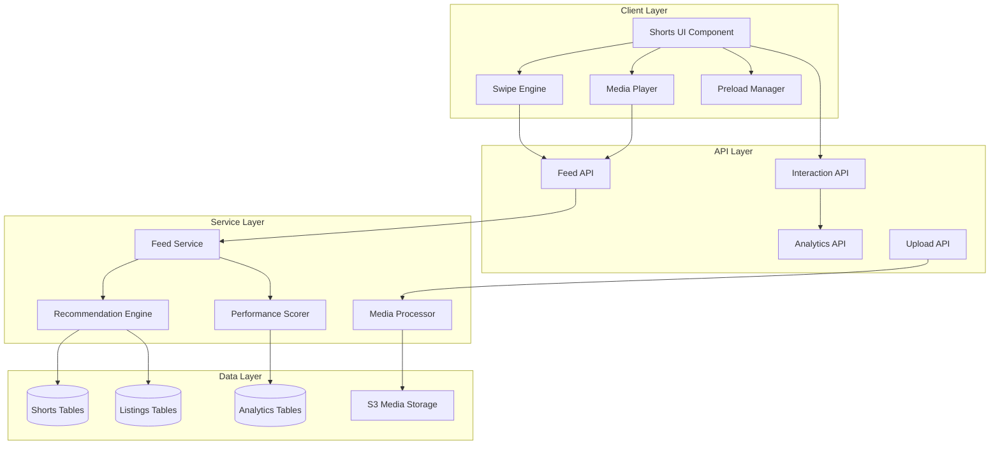

# Design Document: Property Explore Shorts

## Overview

The Property Explore Shorts feature transforms property discovery into an addictive, vertical short-form content experience inspired by TikTok, Instagram Reels, and YouTube Shorts. This system provides a full-screen, gesture-driven interface for browsing properties with smooth animations, intelligent recommendations, and seamless integration with the existing real estate ecosystem.

The feature consists of three main components:
1. **User-Facing Shorts Feed** - The vertical browsing experience for property seekers
2. **Content Creator Interface** - Upload and management tools for agents and developers
3. **Analytics & Recommendation Engine** - Performance tracking and intelligent feed curation

## Architecture

### High-Level Architecture



### Technology Stack

- **Frontend**: React + TypeScript
- **State Management**: React Context + Custom Hooks
- **Gestures**: React Spring + React Use Gesture
- **Video Player**: Custom HTML5 Video with HLS support
- **API**: tRPC (existing pattern)
- **Database**: MySQL (existing)
- **Media Storage**: AWS S3 (existing)
- **Caching**: Redis (for feed caching and performance scores)

## Components and Interfaces

### 1. Frontend Components

#### ShortsContainer
Main container component managing the shorts experience.

```typescript
interface ShortsContainerProps {
  feedType: 'recommended' | 'area' | 'category' | 'agent' | 'developer';
  feedId?: number; // For area/agent/developer feeds
  category?: string; // For category feeds
}

interface ShortsState {
  currentIndex: number;
  cards: PropertyCard[];
  isLoading: boolean;
  hasMore: boolean;
}
```

#### PropertyCard
Individual property card component.

```typescript
interface PropertyCardProps {
  property: PropertyShort;
  isActive: boolean;
  onSwipeUp: () => void;
  onSwipeDown: () => void;
  onDoubleTap: () => void;
  onLongPress: () => void;
}

interface PropertyShort {
  id: number;
  listingId?: number;
  developmentId?: number;
  title: string;
  price: number;
  location: {
    city: string;
    suburb?: string;
    province: string;
  };
  specs: {
    bedrooms?: number;
    bathrooms?: number;
    parking?: number;
  };
  media: MediaItem[];
  highlights: HighlightTag[];
  agent: AgentInfo;
  performanceScore: number;
  boostPriority: number;
}

interface MediaItem {
  id: number;
  type: 'image' | 'video';
  url: string;
  thumbnailUrl?: string;
  previewUrl?: string;
  orientation: 'vertical' | 'horizontal' | 'square';
  duration?: number;
  width: number;
  height: number;
}

interface HighlightTag {
  id: string;
  label: string;
  icon?: string;
  color?: string;
}

interface AgentInfo {
  id: number;
  name: string;
  logo?: string;
  phone?: string;
  whatsapp?: string;
}
```

#### SwipeEngine
Gesture handling system.

```typescript
interface SwipeEngineProps {
  onSwipeUp: () => void;
  onSwipeDown: () => void;
  onTapLeft: () => void;
  onTapRight: () => void;
  onDoubleTap: () => void;
  onLongPress: () => void;
  children: React.ReactNode;
}

interface SwipeConfig {
  swipeThreshold: number; // 50px
  velocityThreshold: number; // 0.5
  tapZoneWidth: number; // 30% of screen width
  doubleTapDelay: number; // 300ms
  longPressDelay: number; // 500ms
}
```

#### MediaPlayer
Video and image display component.

```typescript
interface MediaPlayerProps {
  media: MediaItem[];
  currentIndex: number;
  isActive: boolean;
  isMuted: boolean;
  onToggleMute: () => void;
  onMediaChange: (index: number) => void;
}

interface MediaPlayerState {
  isPlaying: boolean;
  currentTime: number;
  duration: number;
  buffered: number;
  error?: string;
}
```

#### PropertyOverlay
Bottom overlay with property details and CTAs.

```typescript
interface PropertyOverlayProps {
  property: PropertyShort;
  isExpanded: boolean;
  onToggleExpand: () => void;
  onContactAgent: () => void;
  onBookViewing: () => void;
  onWhatsApp: () => void;
}
```

#### PreloadManager
Manages preloading of adjacent cards.

```typescript
interface PreloadManagerProps {
  cards: PropertyCard[];
  currentIndex: number;
  preloadCount: number; // 1 before, 1 after
}

interface PreloadStrategy {
  preloadImages: boolean;
  preloadVideos: boolean;
  preloadFirstFrameOnly: boolean;
  maxConcurrentLoads: number;
}
```

### 2. Backend API Endpoints

#### Feed Endpoints

```typescript
// Get recommended feed
router.get('/explore/recommended', async (req, res) => {
  const { userId, limit = 20, offset = 0 } = req.query;
  // Returns personalized feed based on user behavior
});

// Get area-based feed
router.get('/explore/by-area', async (req, res) => {
  const { location, limit = 20, offset = 0 } = req.query;
  // Returns properties from specific area
});

// Get category feed
router.get('/explore/by-category', async (req, res) => {
  const { category, limit = 20, offset = 0 } = req.query;
  // Returns properties matching category
});

// Get agent/developer feed
router.get('/explore/agent-feed/:id', async (req, res) => {
  const { id } = req.params;
  const { limit = 20, offset = 0 } = req.query;
  // Returns all properties from specific agent/developer
});
```

#### Interaction Endpoints

```typescript
// Record interaction
router.post('/explore/interaction', async (req, res) => {
  const {
    propertyId,
    userId,
    interactionType, // 'view', 'skip', 'hold', 'save', 'share'
    duration,
    metadata
  } = req.body;
  // Records user interaction for analytics
});

// Save property
router.post('/explore/save/:propertyId', async (req, res) => {
  const { propertyId } = req.params;
  const { userId } = req.body;
  // Adds property to user favorites
});

// Share property
router.post('/explore/share/:propertyId', async (req, res) => {
  const { propertyId } = req.params;
  const { userId, platform } = req.body;
  // Records share event
});
```

#### Upload Endpoints

```typescript
// Upload shorts content
router.post('/explore/upload', async (req, res) => {
  const {
    listingId,
    developmentId,
    media, // Array of media files
    highlights, // Selected highlight tags
    caption
  } = req.body;
  // Processes and stores shorts content
});

// Update shorts content
router.put('/explore/:id', async (req, res) => {
  const { id } = req.params;
  const { highlights, caption, isPublished } = req.body;
  // Updates existing shorts content
});
```

## Data Models

### Database Schema

#### explore_shorts Table
```sql
CREATE TABLE explore_shorts (
  id INT AUTO_INCREMENT PRIMARY KEY,
  listing_id INT NULL,
  development_id INT NULL,
  agent_id INT NULL,
  developer_id INT NULL,
  
  title VARCHAR(255) NOT NULL,
  caption TEXT,
  
  -- Media references
  primary_media_id INT NOT NULL,
  media_ids JSON NOT NULL, -- Array of media IDs
  
  -- Highlights (max 4)
  highlights JSON, -- Array of highlight tag IDs
  
  -- Performance metrics
  performance_score DECIMAL(5,2) DEFAULT 0,
  boost_priority INT DEFAULT 0,
  
  -- Engagement metrics
  view_count INT DEFAULT 0,
  unique_view_count INT DEFAULT 0,
  save_count INT DEFAULT 0,
  share_count INT DEFAULT 0,
  skip_count INT DEFAULT 0,
  average_watch_time INT DEFAULT 0, -- seconds
  
  -- Calculated rates
  view_through_rate DECIMAL(5,2) DEFAULT 0,
  save_rate DECIMAL(5,2) DEFAULT 0,
  share_rate DECIMAL(5,2) DEFAULT 0,
  skip_rate DECIMAL(5,2) DEFAULT 0,
  
  -- Status
  is_published BOOLEAN DEFAULT TRUE,
  is_featured BOOLEAN DEFAULT FALSE,
  
  -- Timestamps
  created_at TIMESTAMP DEFAULT CURRENT_TIMESTAMP,
  updated_at TIMESTAMP DEFAULT CURRENT_TIMESTAMP ON UPDATE CURRENT_TIMESTAMP,
  published_at TIMESTAMP NULL,
  
  -- Indexes
  INDEX idx_listing_id (listing_id),
  INDEX idx_development_id (development_id),
  INDEX idx_agent_id (agent_id),
  INDEX idx_performance_score (performance_score DESC),
  INDEX idx_boost_priority (boost_priority DESC),
  INDEX idx_published (is_published, published_at DESC),
  
  -- Foreign keys
  FOREIGN KEY (listing_id) REFERENCES listings(id) ON DELETE CASCADE,
  FOREIGN KEY (development_id) REFERENCES developments(id) ON DELETE CASCADE,
  FOREIGN KEY (agent_id) REFERENCES agents(id) ON DELETE CASCADE,
  FOREIGN KEY (developer_id) REFERENCES developers(id) ON DELETE CASCADE
);
```

#### explore_interactions Table
```sql
CREATE TABLE explore_interactions (
  id INT AUTO_INCREMENT PRIMARY KEY,
  short_id INT NOT NULL,
  user_id INT NULL, -- NULL for guest users
  session_id VARCHAR(255) NOT NULL, -- For guest tracking
  
  interaction_type ENUM(
    'impression',
    'view',
    'skip',
    'save',
    'share',
    'contact',
    'whatsapp',
    'book_viewing'
  ) NOT NULL,
  
  -- Timing data
  duration INT NULL, -- seconds (for view/hold)
  timestamp TIMESTAMP DEFAULT CURRENT_TIMESTAMP,
  
  -- Context
  feed_type ENUM('recommended', 'area', 'category', 'agent', 'developer') NOT NULL,
  feed_context JSON, -- Additional context about the feed
  
  -- Device/location
  device_type ENUM('mobile', 'tablet', 'desktop') NOT NULL,
  user_agent TEXT,
  ip_address VARCHAR(45),
  
  -- Metadata
  metadata JSON,
  
  -- Indexes
  INDEX idx_short_id (short_id),
  INDEX idx_user_id (user_id),
  INDEX idx_session_id (session_id),
  INDEX idx_interaction_type (interaction_type),
  INDEX idx_timestamp (timestamp DESC),
  
  -- Foreign keys
  FOREIGN KEY (short_id) REFERENCES explore_shorts(id) ON DELETE CASCADE,
  FOREIGN KEY (user_id) REFERENCES users(id) ON DELETE SET NULL
);
```

#### explore_highlight_tags Table
```sql
CREATE TABLE explore_highlight_tags (
  id INT AUTO_INCREMENT PRIMARY KEY,
  tag_key VARCHAR(50) UNIQUE NOT NULL,
  label VARCHAR(100) NOT NULL,
  icon VARCHAR(50),
  color VARCHAR(7), -- Hex color
  category VARCHAR(50), -- 'status', 'feature', 'financial', etc.
  display_order INT DEFAULT 0,
  is_active BOOLEAN DEFAULT TRUE,
  created_at TIMESTAMP DEFAULT CURRENT_TIMESTAMP,
  
  INDEX idx_category (category),
  INDEX idx_display_order (display_order)
);
```

#### explore_user_preferences Table
```sql
CREATE TABLE explore_user_preferences (
  id INT AUTO_INCREMENT PRIMARY KEY,
  user_id INT NOT NULL UNIQUE,
  
  -- Preference data
  preferred_locations JSON, -- Array of city/suburb IDs
  budget_min INT,
  budget_max INT,
  property_types JSON, -- Array of preferred types
  
  -- Behavior tracking
  interaction_history JSON, -- Recent interactions
  saved_properties JSON, -- Array of property IDs
  
  -- Calculated preferences
  inferred_preferences JSON, -- ML-derived preferences
  
  -- Timestamps
  created_at TIMESTAMP DEFAULT CURRENT_TIMESTAMP,
  updated_at TIMESTAMP DEFAULT CURRENT_TIMESTAMP ON UPDATE CURRENT_TIMESTAMP,
  
  -- Foreign keys
  FOREIGN KEY (user_id) REFERENCES users(id) ON DELETE CASCADE
);
```

### TypeScript Interfaces

```typescript
interface ExploreShort {
  id: number;
  listingId?: number;
  developmentId?: number;
  agentId?: number;
  developerId?: number;
  title: string;
  caption?: string;
  primaryMediaId: number;
  mediaIds: number[];
  highlights: string[]; // Array of tag keys
  performanceScore: number;
  boostPriority: number;
  viewCount: number;
  uniqueViewCount: number;
  saveCount: number;
  shareCount: number;
  skipCount: number;
  averageWatchTime: number;
  viewThroughRate: number;
  saveRate: number;
  shareRate: number;
  skipRate: number;
  isPublished: boolean;
  isFeatured: boolean;
  createdAt: Date;
  updatedAt: Date;
  publishedAt?: Date;
}

interface ExploreInteraction {
  id: number;
  shortId: number;
  userId?: number;
  sessionId: string;
  interactionType: InteractionType;
  duration?: number;
  timestamp: Date;
  feedType: FeedType;
  feedContext: Record<string, any>;
  deviceType: 'mobile' | 'tablet' | 'desktop';
  userAgent: string;
  ipAddress: string;
  metadata?: Record<string, any>;
}

type InteractionType =
  | 'impression'
  | 'view'
  | 'skip'
  | 'save'
  | 'share'
  | 'contact'
  | 'whatsapp'
  | 'book_viewing';

type FeedType = 'recommended' | 'area' | 'category' | 'agent' | 'developer';

interface HighlightTag {
  id: number;
  tagKey: string;
  label: string;
  icon?: string;
  color?: string;
  category: string;
  displayOrder: number;
  isActive: boolean;
}

interface UserPreferences {
  id: number;
  userId: number;
  preferredLocations: number[];
  budgetMin?: number;
  budgetMax?: number;
  propertyTypes: string[];
  interactionHistory: InteractionSummary[];
  savedProperties: number[];
  inferredPreferences: Record<string, any>;
  createdAt: Date;
  updatedAt: Date;
}

interface InteractionSummary {
  shortId: number;
  type: InteractionType;
  timestamp: Date;
  duration?: number;
}
```

## Correctness Properties

*A property is a characteristic or behavior that should hold true across all valid executions of a system-essentially, a formal statement about what the system should do. Properties serve as the bridge between human-readable specifications and machine-verifiable correctness guarantees.*

### Property 1: Full-screen card display
*For any* property short displayed in the feed, the card should occupy the full viewport height and width with all required information visible (price, location, specs, highlights).
**Validates: Requirements 1.1, 1.2**

### Property 2: Swipe navigation consistency
*For any* swipe gesture (up or down), the system should transition to the adjacent property card within 300ms with smooth animation and no visual glitches.
**Validates: Requirements 2.1, 2.2, 10.1**

### Property 3: Photo gallery navigation
*For any* property card with multiple photos, tapping left/right should cycle through the gallery, and the current photo index should be visually indicated.
**Validates: Requirements 2.3, 2.4**

### Property 4: Double-tap save action
*For any* property card, double-tapping should add the property to favorites and provide immediate visual feedback without disrupting the viewing experience.
**Validates: Requirements 2.5, 11.2**

### Property 5: Video autoplay behavior
*For any* property card with vertical video, when the card becomes active, the video should autoplay in muted mode, and tapping should toggle mute state.
**Validates: Requirements 1.3, 1.5**

### Property 6: Photo slideshow fallback
*For any* property card without video, the system should display a photo slideshow with automatic transitions every 3 seconds.
**Validates: Requirements 1.4**

### Property 7: Overlay expansion
*For any* property card, swiping up on the bottom overlay should expand to show full details without navigating to the next property.
**Validates: Requirements 3.1, 3.2**

### Property 8: CTA button functionality
*For any* expanded property overlay, all CTA buttons (Contact Agent, Book Viewing, WhatsApp Agent) should be functional and trigger the appropriate actions.
**Validates: Requirements 3.3, 3.4, 3.5**

### Property 9: Feed type switching
*For any* feed type selection (Recommended, Area, Category, Agent/Developer), the system should load and display properties matching that feed type.
**Validates: Requirements 4.1, 4.2, 4.3, 4.4**

### Property 10: Highlight tag display limit
*For any* property card, a maximum of 4 highlight tags should be displayed, selected from the predefined tag list.
**Validates: Requirements 7.1, 7.2, 7.4**

### Property 11: Interaction tracking
*For any* user interaction (view, skip, save, share), the system should record the event with accurate timing and context data.
**Validates: Requirements 8.1, 8.2, 8.3, 8.4, 8.5, 8.6**

### Property 12: Performance score calculation
*For any* property short, the performance score should be calculated based on view-through rate, watch time, save rate, share rate, and skip rate, with boosted listings receiving priority.
**Validates: Requirements 9.1, 9.2, 9.3, 9.4, 9.5, 9.6**

### Property 13: Preloading efficiency
*For any* active property card, the next and previous cards' first frames should be preloaded to ensure smooth transitions.
**Validates: Requirements 10.2, 10.3, 10.4**

### Property 14: Desktop frame simulation
*For any* desktop user, the interface should display in a centered mobile-sized frame to maintain the vertical shorts experience.
**Validates: Requirements 10.5**

### Property 15: Quick action icons
*For any* property card, the top-right corner should display Save, Share, and More icons that trigger their respective actions.
**Validates: Requirements 11.1, 11.2, 11.3, 11.4, 11.5**

### Property 16: Platform integration
*For any* property displayed in Explore Shorts, the data should be retrieved from the internal listings/developments database and integrate with existing CRM, messaging, and revenue systems.
**Validates: Requirements 12.1, 12.2, 12.3, 12.4, 12.5**

## Error Handling

### Client-Side Error Handling

1. **Media Loading Failures**
   - Retry failed media loads up to 3 times
   - Show placeholder image if all retries fail
   - Log error to analytics for monitoring

2. **Network Errors**
   - Cache last 5 viewed cards for offline viewing
   - Show "Connection Lost" message
   - Retry feed requests with exponential backoff

3. **Gesture Conflicts**
   - Prevent simultaneous swipe and tap gestures
   - Debounce rapid gesture inputs
   - Clear gesture state on card transition

4. **Video Playback Errors**
   - Fall back to photo slideshow if video fails
   - Show error message for unsupported formats
   - Track video errors in analytics

### Server-Side Error Handling

1. **Feed Generation Failures**
   - Fall back to generic feed if personalization fails
   - Return cached feed if database is unavailable
   - Log errors for investigation

2. **Performance Score Calculation Errors**
   - Use default score (50) if calculation fails
   - Queue for recalculation
   - Alert if errors exceed threshold

3. **Media Processing Failures**
   - Notify uploader of processing failure
   - Retry processing with different settings
   - Store original file for manual review

4. **Rate Limiting**
   - Implement rate limits on interaction endpoints
   - Return 429 status with retry-after header
   - Track abuse patterns

## Testing Strategy

### Unit Tests

1. **Component Tests**
   - Test SwipeEngine gesture detection
   - Test MediaPlayer state management
   - Test PropertyCard rendering with various data
   - Test PreloadManager loading logic

2. **Service Tests**
   - Test feed generation algorithms
   - Test performance score calculation
   - Test recommendation engine logic
   - Test media processing pipeline

3. **API Tests**
   - Test all endpoint responses
   - Test authentication and authorization
   - Test error handling
   - Test rate limiting

### Property-Based Tests

Property-based tests will use **fast-check** (JavaScript/TypeScript PBT library) with a minimum of 100 iterations per test.

1. **Property 1: Full-screen card display**
   - Generate random property data
   - Verify all required fields are rendered
   - Verify layout constraints are met

2. **Property 2: Swipe navigation consistency**
   - Generate random swipe velocities and distances
   - Verify transitions complete within 300ms
   - Verify correct card is displayed after swipe

3. **Property 5: Video autoplay behavior**
   - Generate random video properties
   - Verify autoplay triggers when card is active
   - Verify mute toggle works correctly

4. **Property 11: Interaction tracking**
   - Generate random interaction sequences
   - Verify all interactions are recorded
   - Verify timing data is accurate

5. **Property 12: Performance score calculation**
   - Generate random engagement metrics
   - Verify score is within valid range (0-100)
   - Verify boosted listings have higher priority

### Integration Tests

1. **End-to-End Feed Flow**
   - Test complete user journey from feed load to property save
   - Test feed switching between types
   - Test interaction recording and analytics

2. **Media Pipeline**
   - Test video upload and processing
   - Test image optimization
   - Test media delivery and playback

3. **Recommendation Engine**
   - Test personalized feed generation
   - Test boost priority application
   - Test performance-based ranking

### Performance Tests

1. **Load Testing**
   - Test feed API under high concurrent load
   - Test media delivery performance
   - Test database query performance

2. **Client Performance**
   - Test smooth 60fps animations
   - Test memory usage during extended browsing
   - Test preloading efficiency

3. **Mobile Performance**
   - Test on various mobile devices
   - Test on slow network connections
   - Test battery impact

## Implementation Notes

### Phase 1: Core Infrastructure
- Database schema creation
- Basic API endpoints
- Media storage setup

### Phase 2: Frontend Foundation
- ShortsContainer component
- PropertyCard component
- SwipeEngine implementation
- MediaPlayer component

### Phase 3: Feed System
- Feed generation service
- Recommendation engine (basic)
- Performance scoring

### Phase 4: Interactions & Analytics
- Interaction tracking
- Analytics dashboard
- Performance optimization

### Phase 5: Content Creator Tools
- Upload interface
- Highlight tag management
- Preview and publishing

### Phase 6: Advanced Features
- Advanced recommendation ML
- A/B testing framework
- Boost campaign management

## Security Considerations

1. **Content Moderation**
   - Review uploaded media before publishing
   - Implement automated content filtering
   - Allow user reporting of inappropriate content

2. **Rate Limiting**
   - Limit interaction API calls per user/session
   - Prevent bot-driven engagement manipulation
   - Monitor for suspicious patterns

3. **Data Privacy**
   - Anonymize guest user tracking
   - Comply with GDPR/POPIA requirements
   - Allow users to delete their interaction history

4. **Media Security**
   - Validate uploaded file types and sizes
   - Scan for malware
   - Use signed URLs for media access

## Performance Optimization

1. **Caching Strategy**
   - Cache feed results in Redis (5-minute TTL)
   - Cache performance scores (15-minute TTL)
   - Cache user preferences (1-hour TTL)

2. **Database Optimization**
   - Index all foreign keys and query fields
   - Use read replicas for analytics queries
   - Implement query result caching

3. **Media Optimization**
   - Use CDN for media delivery
   - Generate multiple quality versions
   - Implement adaptive bitrate streaming for videos

4. **Client Optimization**
   - Lazy load non-visible cards
   - Implement virtual scrolling
   - Use Web Workers for heavy computations

## Monitoring and Observability

1. **Key Metrics**
   - Feed load time (p50, p95, p99)
   - Card transition smoothness (FPS)
   - Media load success rate
   - API error rates
   - User engagement rates

2. **Logging**
   - Log all API requests and responses
   - Log client-side errors
   - Log performance metrics

3. **Alerting**
   - Alert on high error rates
   - Alert on slow API responses
   - Alert on media processing failures
   - Alert on unusual engagement patterns

## Future Enhancements

1. **Machine Learning**
   - Advanced recommendation algorithms
   - Predictive performance scoring
   - Automated highlight tag suggestion

2. **Social Features**
   - Comments on properties
   - Share to social media
   - Follow agents/developers

3. **Gamification**
   - Achievement badges for agents
   - Leaderboards for top-performing properties
   - Rewards for user engagement

4. **Advanced Analytics**
   - Heatmaps of user interactions
   - A/B testing framework
   - Cohort analysis

5. **Accessibility**
   - Screen reader support
   - Keyboard navigation
   - High contrast mode
   - Reduced motion mode
