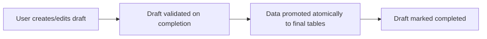

# Definitive Schema Strategy for Concurrent Platform Development

> **Version 1.0** - Authoritative Schema Discipline for Real Estate Portal
> This document is the **source of truth** for database schema, migrations, and feature evolution.

---

## Purpose

This document defines the authoritative strategy for managing database schema, migrations, and feature evolution while multiple major features are developed concurrently on a single platform.

It exists to solve the following realities:

- **Explore** behaves like a standalone application
- **Listing wizards** are complex, long-lived flows
- **Developments** and **existing properties** have different data models
- Features ship at different times and are often incomplete
- The platform must remain stable in production at all times

> [!IMPORTANT]
> This strategy is **mandatory** for all backend and full-stack work.

---

## Core Principle (Non-Negotiable)

> **One database. One schema contract. Many independently shipped features.**

Features are allowed to be out of sync in time,
but the database schema is **never** allowed to be out of sync with deployed code.

```
Local → Staging → Production
```

**Production is never treated as a source of truth for schema.**

---

## Architectural Model

### Summary

| Concept                   | Approach            |
| ------------------------- | ------------------- |
| Physical database         | One                 |
| Logical schema contract   | One                 |
| Schema ownership          | Modular by domain   |
| Schema evolution          | Backward-compatible |
| Cross-feature consumption | Unified read models |

---

## 1. Schema Organization (Modular Ownership)

The database schema is split by **domain**, not by feature flow.

### Folder Structure

```
db/
├── schema/
│   ├── index.ts          # Single export surface (mandatory)
│   ├── core.ts           # users, auth, organizations, roles
│   ├── listings.ts       # canonical listing entity
│   ├── developments.ts   # development-specific extensions
│   ├── existing.ts       # resale / rental extensions
│   ├── wizards.ts        # draft state + progress tracking
│   ├── explore.ts        # read models (views / projections)
│   ├── media.ts
│   └── locations.ts
│
├── migrations/
└── seeds/
```

### Import Rule (Strict)

All schema imports **must** go through `index.ts`.

```typescript
// ✅ Allowed
import { listings, developments } from '@/db/schema';

// ❌ Forbidden
import { listings } from '@/db/schema/listings';
```

### Rationale

- Prevents merge conflicts in a single schema file
- Makes ownership explicit (which domain owns which tables)
- Guarantees one coherent schema contract
- Enables concurrent development without blocking

---

## 2. Migration Discipline (Source of Truth)

### Iron Law

> **Schema changes only happen through migrations.**

### Enforced Rules

| Rule                             | Description                                      |
| -------------------------------- | ------------------------------------------------ |
| No schema edit without migration | Every change requires a migration file           |
| No code merge without migrations | PRs touching `db/schema` must include migrations |
| Append-only migrations           | Never edit after merge                           |
| Unified history                  | Every environment runs the same migrations       |
| No manual edits                  | Production schema is never edited manually       |

### Outcome

- ✅ No environment drift
- ✅ Deterministic production state
- ✅ No "works locally, breaks in prod" schema bugs

---

## 3. Backward-Compatible Schema Evolution

All schema changes must follow this pattern:

### Expand → Backfill → Switch → Contract

This allows features to ship independently without breaking older code.

### Example: Replacing a Column

#### Step 1: Expand

```sql
ALTER TABLE listings ADD COLUMN price_from INTEGER;
```

#### Step 2: Backfill

```sql
UPDATE listings SET price_from = price WHERE price_from IS NULL;
```

#### Step 3: Switch (Code)

```typescript
const priceFrom = listing.price_from ?? listing.price;
```

#### Step 4: Contract (Later)

```sql
ALTER TABLE listings DROP COLUMN price;
```

### Forbidden Operations (Without Staging)

> [!CAUTION]
> These operations are **forbidden** without proper staging:
>
> - Immediate column renames
> - Immediate column drops
> - `NOT NULL` without backfill
> - Enum value removal

### Rationale

- CDN-cached frontend bundles may still run
- Multiple features deploy at different times
- Backward compatibility prevents silent production failures

---

## 4. Canonical Read Model for Explore (Mandatory)

### Rule

> **Explore never queries base tables directly.**

Explore consumes a **single canonical read model** that abstracts internal differences.

### Implementation

A database view named `explore_listings`:

```sql
CREATE VIEW explore_listings AS
SELECT
  l.id,
  l.type            AS listing_type,
  l.status,
  l.title,
  l.location_id,

  COALESCE(d.price_from, e.price) AS price_from,
  COALESCE(d.price_to,   e.price) AS price_to,

  e.bedrooms,
  e.bathrooms,

  m.primary_image_url,
  loc.city,
  loc.area,

  l.created_at
FROM listings l
LEFT JOIN developments d ON d.listing_id = l.id
LEFT JOIN existing_properties e ON e.listing_id = l.id
LEFT JOIN media m ON m.listing_id = l.id AND m.is_primary = true
LEFT JOIN locations loc ON loc.id = l.location_id
WHERE l.status IN ('published', 'active');
```

### Usage Rules

| Rule                 | Description                                      |
| -------------------- | ------------------------------------------------ |
| Query this view only | Explore queries `explore_listings` exclusively   |
| No direct joins      | Explore never joins domain tables directly       |
| Future optimization  | May upgrade to materialized view for performance |

### Benefits

- ✅ Explore works across all listing types
- ✅ Developments and existing properties remain independent
- ✅ UI stays simple and consistent

---

## 5. Wizard Architecture (Draft-First Model)

### Rule

> **Wizards never write directly to production tables.**

All wizard state is stored in **draft tables**.

### Draft Table: `listing_drafts`

| Feature  | Description                            |
| -------- | -------------------------------------- |
| Payload  | Flexible JSON                          |
| Progress | Step tracking                          |
| Safety   | Changes don't affect production schema |

### Promotion Flow



### Benefits

- ✅ No incomplete or invalid production data
- ✅ Wizards can evolve freely
- ✅ Users can resume progress safely
- ✅ Clear separation between "in progress" and "live"

---

## 6. Feature Readiness & Flags

### Rule

> **Incomplete features must be gated.**

No partially built flows are exposed to users.

### Applies To

- Wizards
- Explore filters
- Listing types
- Admin or internal tools

### Result

- ✅ Independent shipping without waiting
- ✅ Safe production deployments
- ✅ Clear product visibility control

---

## 7. Domain Boundaries (Enforced)

### Rule

| Boundary         | Description                                                            |
| ---------------- | ---------------------------------------------------------------------- |
| Explore → Wizard | Explore does not depend on wizard internals                            |
| Wizard → Explore | Wizards do not depend on Explore logic                                 |
| Communication    | Domains communicate only via schema, migrations, canonical read models |

### Enforcement

- Folder structure
- ESLint import restrictions
- Code review checklist

### Outcome

- ✅ No cross-domain coupling
- ✅ Teams ship independently
- ✅ Architecture remains stable as complexity grows

---

## The Six Iron Laws (Final)

> [!WARNING]
> These rules are **mandatory**. Violation is considered a **production risk**.

| #   | Law                                            |
| --- | ---------------------------------------------- |
| 1   | Schema changes require migrations              |
| 2   | Migrations must be backward compatible         |
| 3   | Schema is split by domain, exported centrally  |
| 4   | Explore uses canonical read models only        |
| 5   | Wizards write to drafts, not production tables |
| 6   | Domain boundaries are enforced                 |

---

## Implementation Order (Authoritative)

### Phase 1 – Immediate (Highest ROI)

- [ ] Split `db/schema` into domain files
- [ ] Add `index.ts`
- [ ] Update all imports
- [ ] Add CI check: schema change ⇒ migration required

### Phase 2

- [ ] Formalize expand-backfill-switch-contract
- [ ] Review recent migrations for compliance

### Phase 3

- [ ] Introduce `explore_listings` read model
- [ ] Migrate Explore queries

### Phase 4

- [ ] Move wizard writes to `listing_drafts`
- [ ] Implement promotion flow

### Phase 5

- [ ] Add feature flags
- [ ] Gate incomplete flows

### Phase 6

- [ ] Enforce domain boundaries via lint rules

---

## Final Statement

> The problems experienced so far are not implementation mistakes —
> they are **symptoms of a growing platform without enforced schema discipline**.

This strategy enables:

- ✅ Independent feature development
- ✅ Stable production environments
- ✅ Predictable schema evolution
- ✅ Long-term scalability without rewrites

---

> [!IMPORTANT]
> **This document is the source of truth.**
