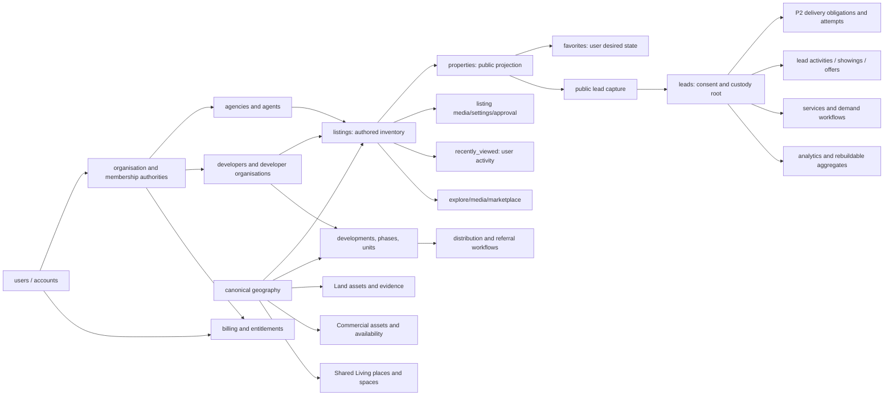

# Database takeover architecture decisions

Status: **P1 implementation accepted after senior review; P2 implementation open.**
This record belongs to `feat/database-architecture-takeover` at
the post-P0 implementation commit. It is the decision index for the coverage
register and the implementation packets in `implementation-plan.md`.

## Authority and evidence

- The canonical schema authority is `drizzle/schema/index.ts` and its
  exported module files. The generated inventory contains 213 physical tables
  with current structural digest
  `f6416d31d84609203c96e00f7b2455acd78b3a4d0b2c0d8aaa232a2c44b30328`.
- No Drizzle `mysqlView` export or inventory view is present at P0. A future
  view must be registered in the same inventory and receive an owning packet.
- The exact task-owned target was resolved with
  `pnpm db:authority:status`: local disposable MySQL, expected migration head
  `0075_recently_viewed_microsecond_recency.sql`, no incomplete attempts, and
  congruent schema. No remote or protected database was accessed.
- A fresh consumer contract established the disposable schema from empty
  through 0075 (plan `0b8448faf4e0955992a0f305`, target fingerprint
  `806c61e7e0d23daf1c70942dc80e91884d2778cc31d6c95ebef8a2023ea207ca`).
  P0's historical evidence remains below where explicitly labeled.
- The delivery-authority release-convergence branch
  (`aacb6220`, `feat/delivery-authority-release-convergence`) is based on a
  different integration point and contains a broad older consumer/schema
  change set plus a delivery-authority document. Its name is not evidence that
  its runtime model is current. It was inspected read-only; no files were
  copied, reverted, or staged. The delivery document is treated as input to P2,
  while the current branch's consumer fixes and migration head remain the
  selected authority.

## Current relationship model

The diagram separates credentials/control from application facts. It is a
relationship hypothesis, not a reason to merge tables with similar names.
Each packet must prove cardinality, ownership, and lifecycle with call-path and
physical evidence.

## Decisions already established

### Consumer activity

The authenticated favorites fact is a protected desired-state set keyed by
`(userId, propertyId)`. The authenticated recent-view fact is keyed by
`(userId, listingId)`; property and listing identities are deliberately
different. Public reads use a filtered DTO and public eligibility rules.
Guest transfer resolves each public property to one available source listing,
rejects unknown or ambiguous identities, validates before writing, locks the
user, and rolls back on a later failure. Every authority-created MySQL
connection now establishes a UTC session before durable timestamps are read or
written; `TIMESTAMP` values must never be interpreted through the host's local
timezone.

P1 defines public withdrawal at the activity-admission boundary. If public
eligibility is established and a withdrawal commits before the corresponding
private activity transaction, the private favorite or view may persist as a
historical account fact. It is never exposed as public inventory: every
favorites or recently-viewed read resolves current public eligibility again
and fails closed. This avoids pretending that a public read performed before
an independent withdrawal transaction remains a live-public assertion.

The P1 physical suite creates two separately authorized runtime pools, uses a
controlled admission barrier, and verifies cardinality, rollback, ownership,
UTC timestamps, ambiguity rejection, committed-order save/remove behavior,
and the withdrawal rule against MySQL. Its browser proof exercises real login,
guest transfer, favorite removal/save, and reload persistence. The test-owned
visitor and facts are removed after each run.

### Retired disconnected consumer models

`prospect_favorites`, `scheduled_viewings`, and `prospects` are retired in
the admitted 0072–0074 lineage. The old unregistered prospects router and
helpers are not revived. Reachability evidence and replacement behavior are
recorded in the assessment and must remain reflected in the coverage register.

### Public inventory authority

`listings` is the authored supply fact. `properties` is a public
projection and may not be treated as a source listing by ID equality.
`inventoryLinkResolver` and `publicPropertyEligibilityService` are the
current boundary. P3 owns proof of one-to-one mappings where a supply type
requires them, publication/revision behavior, withdrawal, and rebuildability.

### Lead delivery direction

`leads` remains the capture, consent, and custody root. The JSON
`deliveryAttempts` value is not a sufficient operational authority: it cannot
enforce delivery uniqueness, typed recipient references, indexed due work, or
lease fencing. P2 owns the relational delivery/attempt model, state machine,
crash recovery, provider uncertainty, and migration of every reader and writer.
No replacement table or dual authority is admitted by P0.

## Control-plane versus application facts

The following are control or credential authorities and must not be used as
untyped product facts: `users` authentication identity, session/token
records, `platform_settings`, `audit_logs`, `managerial_audit_logs`,
email templates, database migration metadata, and database-authority target
metadata. Their access and retention rules belong to P4 or P9.

Application facts include authored inventory (`listings`), public projections
(`properties`), user activity (`favorites`, `recently_viewed`), lead
capture/custody (`leads`), workflow facts (showings, offers, deals),
domain-specific supply (development, Land, Commercial, Shared Living), and
financial facts. A control record may audit an application fact, but it does
not become that fact's owner.

## Unresolved decisions and owning packets

| Decision                                                                                                                        | Why it is open                                                                                                       | Owner |
| ------------------------------------------------------------------------------------------------------------------------------- | -------------------------------------------------------------------------------------------------------------------- | ----- |
| Relational lead delivery names, recipient FKs, state transitions, lease fencing, retry and provider uncertainty                 | Current JSON is shared by capture, correction, audit, reports, publisher delivery, and admin queries                 | P2    |
| Whether every public property has exactly one source listing, and how development/commercial/shared-living supply maps          | Existing supply families may have different lifecycles; non-null links cannot be imposed before the census           | P3    |
| Account, organisation, agency, developer, and membership tenant predicates                                                      | Existing routes include owner/agent fallbacks whose authority and revocation behavior need proof                     | P4    |
| Billing/subscription/invoice/payment family boundaries and monetary units                                                       | Similar names may represent separate products or competing authorities; webhook ordering is unproven                 | P5    |
| Agency deals, distribution deals, referrals, commissions, and showing transitions                                               | Relationships and assignments cross tenant and inventory boundaries; duplicate workflows must not be removed by name | P6    |
| Canonical geography versus provider/display metadata, Land journey authority, Commercial value states, Shared Living moderation | Domain contracts require one geography authority and explicit classification/provenance semantics                    | P7    |
| Explore/media/marketplace/service/demand event identity, durable jobs, and analytics rebuildability                             | Engagements, notifications, service leads, and aggregates require retention and idempotency proof                    | P8    |
| Full physical/query-plan and product-journey closure                                                                            | Each packet needs independent database evidence and actual user-flow verification                                    | P9    |

No unresolved decision may be closed by a schema-only change. A packet must
update the coverage register, trace readers and writers, specify authorization
and deletion behavior, and provide targeted physical tests.

## P0 review outcome

P0 establishes one inventory, one selected disposable target, one packet
assignment, and one decision register. Every current physical table is present
in `coverage-register.md`; no table is marked for removal without evidence.
The register intentionally leaves incomplete cells explicit so the next packet
cannot mistake a declaration or green mock test for architectural proof.
