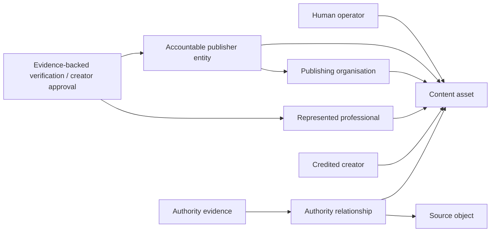
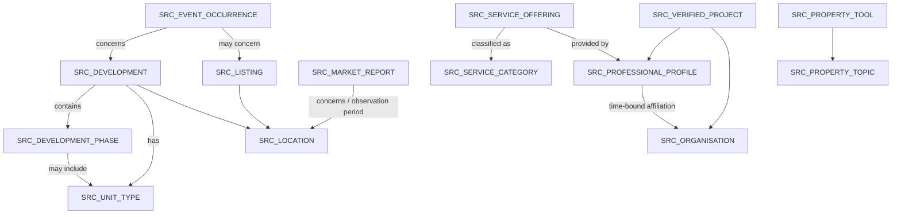
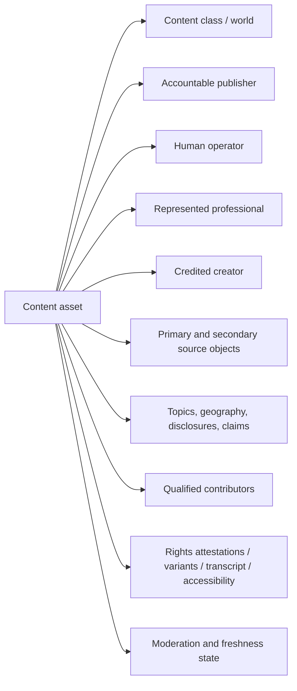
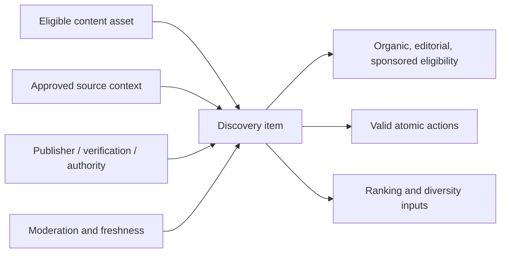
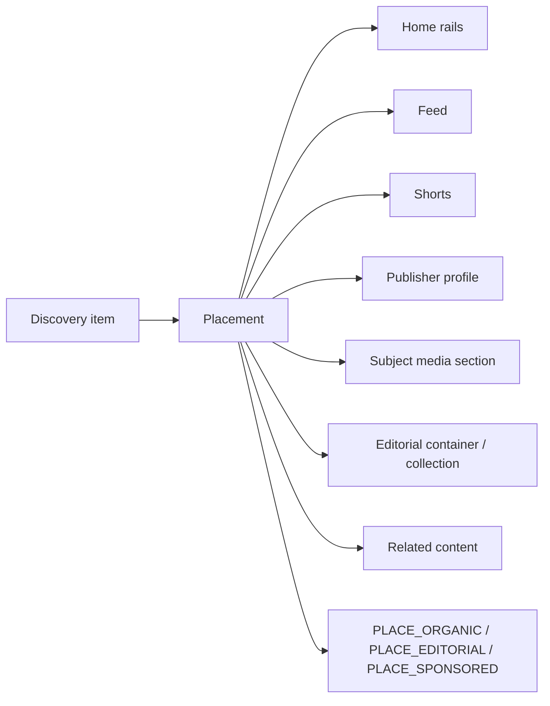
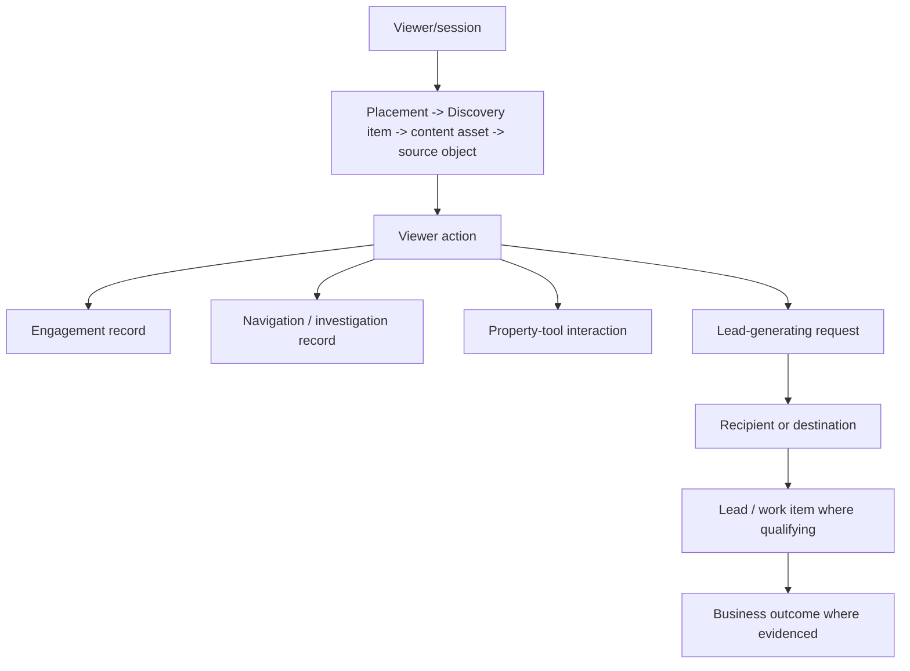
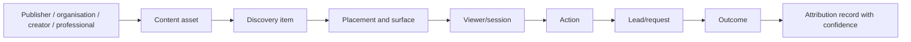

# Explore Property Context Graph

| Field | Value |
| --- | --- |
| Status | Canonical conceptual architecture |
| Governing documents | `00-explore-product-doctrine.md`; `01-explore-content-taxonomy.md` |
| Scope | Canonical entities, relationships, authority, lifecycle, action, and attribution concepts for Explore |
| Boundary | Implementation-independent; not a database, API, or current-state schema design |

## 1. Purpose and authority

This graph makes the Explore doctrine concrete: **Video is the front door. Property context is the intelligence. Trust is the filter. Action is the outcome.** It defines the concepts and relationships future product, design, schema, API, and AI work must preserve.

The product doctrine is strategic authority; the taxonomy is semantic and policy authority. Existing implementation and audits are evidence of current fragmentation, never the definition of the target graph.

## 2. Governing principles

1. Media is useful only when its publisher, subject, claims, context, and actions are governable.
2. The graph separates canonical source truth from authored media and from distribution.
3. Verification, approval, authority evidence, moderation, freshness, and placement are distinct decisions.
4. Organic, editorial, and sponsored delivery remain structurally distinguishable.
5. Attribution records what can be proven; it must not manufacture certainty, identity, or commercial credit.

## 3. Graph scope and boundaries

The graph covers identities, source objects, media, discovery, placement, engagement, conversion, lead/request, outcome, and attribution. It does not prescribe tables, foreign keys, event transport, ranking weights, billing, campaign tooling, or current legacy contracts.

## 4. Concept glossary

| Concept | Canonical meaning |
| --- | --- |
| Accountable publisher entity | Person or organisation operationally accountable for public publication and policy compliance. |
| Publishing organisation | Brand, agency, developer, provider, or editorial organisation whose channel/identity is used. |
| Human operator | Authenticated person who uploads, edits, submits, schedules, or approves an asset. |
| Represented professional | Professional whose authority, expertise, or representation is relied upon. |
| Credited creator | Person credited for creation, presentation, production, or authorship; not necessarily publisher or authority holder. |
| Verification or approval | Evidence-backed status: identity, organisation, affiliation/employment, professional credential, platform creator approval, source-object authority, or portfolio/project evidence. Verification confirms evidence/status; it does not itself grant authority. |
| Authority relationship/evidence | Permission connecting parties to a permitted claim/activity and subject, plus evidence supporting its scope. |
| Source object | Governed subject owning facts and lifecycle. |
| Content asset | Authored media plus publication metadata; never owner of canonical property truth. |
| Discovery item | Distribution-ready representation of an eligible content asset and approved context. |
| Editorial container | Series, collection, programme, commission, or governance relationship; not a source object. |
| Placement | Governed occurrence of a Discovery item on a surface. |
| Moderation decision | Accountable decision about asset/placement eligibility; distinct from source state. |
| Viewer/session | Person where authenticated, otherwise consented guest/session context with stated certainty. |
| Viewer action | Broad atomic action family: engagement, navigation/investigation, property-tool interaction, or lead-generating request. |
| Engagement action | Interaction such as like, save, follow, share, hide, or preference reset; normally creates no lead. |
| Navigation/investigation action | Opening a subject, profile, organisation, or related content; normally creates no lead. |
| Property-tool action | Interaction with a governed property tool; normally creates no lead unless a separate qualifying request follows. |
| Request / lead-work item / outcome | Request is viewer-submitted intent; lead/work item is a qualifying request created, assigned, and processed business-side; outcome is later evidenced result. Not every request creates a lead, and not every lead creates an outcome. |
| Historical context snapshot | Evidence of what was displayed at impression/action time; it never replaces source truth. |
| Attribution record | Interaction, request/lead, or business-outcome attribution with evidence and confidence. |

## 5. Publisher and identity graph

The five identity roles may coincide but must not be assumed to do so. Identity verification proves a person/entity identity; organisation verification proves organisation status; affiliation/employment verification proves a time-bound relationship; credential verification proves professional scope; creator approval defines a platform boundary; source-authority verification proves subject scope; portfolio/project verification proves project evidence. Authority then determines what activity or claim is permitted. Agency example: agency is accountable publisher; administrator is operator; verified agent is represented professional; agent/videographer is credited creator; listing is source object. Development example: developer organisation publishes; marketing employee operates; development representative is professional; development and unit type are subjects. Editorial example: Property Listify editorial publishes; editor operates; qualified finance professional is represented; property topic and tool are subjects; the series is only an editorial container.

## 6. Verification, approval and authority

| Authority | Grant/proof | Authorises | Does not authorise | Expiry, revocation, invalidity |
| --- | --- | --- | --- | --- |
| `AUTH_OWNER` | Subject owner or authorised owner record | Publication/claims within owned subject scope | Professional, legal, financial, or unrelated-subject claims | Ends on transfer, withdrawal, dispute, or revoked authority; suppress affected eligibility. |
| `AUTH_REPRESENTATIVE` | Recorded mandate, delegation, employment, or organisation authority | Named delegated subject/channel activity | Automatic authority from mere employment; unrelated inventory | Expires/revokes with mandate, affiliation, or delegation. |
| `AUTH_PROFESSIONAL` | Verified credential/scope | Bounded professional explanation | Ownership, representation, or regulated scope not verified | Re-review/suppress on credential expiry, suspension, or scope change. |
| `AUTH_EVIDENCE` | Verified project, portfolio, client permission, or source evidence | Evidence-backed project/portfolio statement | General expertise, ownership, or unverified outcome | Ends on permission withdrawal, evidence challenge, or correction. |
| `AUTH_TOPIC` | Governed topic boundary and approved scope | General topic education | Personalised advice, inventory facts, or professional title | Review when topic policy or contributor scope changes. |
| `AUTH_EDITORIAL` | Accountable editor, editorial source record, and editorial process scoped by an editorial container | Commissioning, curation, and public-interest publication | Treating the container itself as evidence or turning unsupported claims into facts | Revocable on source failure, correction, or editorial withdrawal. |
| `AUTH_MULTIPLE` | Each linked subject’s independent authority | Multi-subject content | Weakening the requirements for any linked subject | Invalid if any material subject authority becomes invalid. |

Ownership is not professional authority; employment is not publication authority; platform approval is not a credential; and editorial commissioning is not factual proof.

## 7. Authority evidence

Authority evidence conceptually identifies evidence type; subject and parties; issuer/source; permitted scope; verification status; effective date; expiry where applicable; revocation/dispute state; and responsible reviewer/process. It may include organisation membership/employment, agency delegation, listing mandate, development ownership/representation, professional credential, service-provider verification, portfolio/client permission, project evidence, contributor consent, editorial source record, and commercial-relationship disclosure. Evidence supports authority but does not itself become the source object. Source linkage answers “what is this about?”; evidence answers “why may this party say or publish this?”

## 8. Source-object graph

Canonical source types are `SRC_LISTING`, `SRC_DEVELOPMENT`, `SRC_DEVELOPMENT_PHASE`, `SRC_UNIT_TYPE`, `SRC_EVENT_OCCURRENCE`, `SRC_LOCATION`, `SRC_MARKET_REPORT`, `SRC_PROFESSIONAL_PROFILE`, `SRC_ORGANISATION`, `SRC_SERVICE_CATEGORY`, `SRC_SERVICE_OFFERING`, `SRC_VERIFIED_PROJECT`, `SRC_PROPERTY_TOPIC`, and `SRC_PROPERTY_TOOL`.

Development owns phases and has unit types; a unit type may occur in more than one phase. Event occurrence concerns a listing/development but owns only its schedule, access, cancellation, and expiry, not property facts. A market report concerns one or more locations for an observation period and owns provenance, methodology, date, and revision history. Professional-to-organisation affiliation is many-to-many and time-bound; organisations may have many affiliated professionals. A service offering may belong to an organisation, professional, or both; whether it is first-class is open. Locations form a governed hierarchy and contextualise inventory, development, and services without manufacturing their facts. Diagram arrows do not imply ownership unless labelled as ownership.

## 9. Editorial-container relationships

An editorial container may commission assets, group Discovery items, identify editors/contributors, record source checks, and appear as a collection surface. It cannot replace a source object, constitute authority evidence by itself, or make a publisher claim independently true.

## 10. Content asset graph

A content asset is authored media plus publication metadata. It relates to accountable publisher, operator, creator, represented professional, class/world, source objects, topics, geographic relevance, disclosures, claims, qualified contributors, rights attestations, media variants, transcript/accessibility metadata, moderation, and freshness. It never owns listing, development, price, market, availability, or professional truth.

## 11. Multi-subject linkage

An asset has one primary subject to identify its principal meaning and action path, plus zero or more secondary subjects for context. Examples include comparison listings; location plus market report; development plus phase and unit type; professional plus service category; and property topic plus tool. Primary does not diminish secondary importance. Each linked subject independently satisfies authority, freshness, disclosure, and action rules.

## 12. Discovery item graph

A Discovery item is the approved distribution representation of a content asset and context: canonical subjects, accountable publisher, trust signals, class/world, valid actions, freshness, moderation eligibility, placement eligibility, and ranking/diversity inputs. It duplicates no canonical source truth. One asset may create more than one item only for approved subject framing or surface adaptation while preserving one underlying asset and engagement truth; the exact rule remains open.

## 13. Placement and surface graph

A placement identifies item, surface, policy, eligibility decision, editorial container where applicable, sponsor/campaign where applicable, disclosure, active window, targeting restrictions, provenance, and reporting context. It never changes the asset’s publisher. Sponsored eligibility never makes false or unmoderated material eligible; editorial placement is not independent validation; and organic ranking remains separate from paid delivery. Public Map discovery is deferred.

## 14. Moderation and lifecycle

Content lifecycle may progress through draft, media processing, submitted, pending review, changes requested, approved, scheduled, published, suppressed, expired, withdrawn, rejected, and taken down. Moderation decision is separate from source-object lifecycle, placement lifecycle, and freshness eligibility.

Re-review is required for material changes to media, transcript, caption, publisher, affiliation, represented professional, credentials, source objects, price, availability, sponsor, disclosure, claim methodology, CTA, and development/project status. A source change may suppress an item, expire a placement, or remove a CTA without erasing historical audit records.

## 15. Viewer identity and sessions

Viewer identity may be authenticated or a consented guest. A session is a real bounded interaction context with device/client and consent state, never a fabricated or hardcoded user identifier. Guest activity may reconcile to authentication only under approved privacy rules; attribution confidence reflects identity certainty. Anonymous viewing remains possible where product and privacy policy allow it.

## 16. Engagement graph

Atomic engagement includes impression, view start, qualified view, watch progress, completion, replay, like/unlike, save/unsave content, save/unsave source object, follow/unfollow, share, not interested/preference reset, hide/unhide, report, open source object, and open publisher profile.

Impression, progress, replay, and completion are event-based and deduplicated by policy. Like, save, follow, hide, and not-interested are stateful and reversible where their inverse exists. Reports are safety/moderation records, not ordinary reversible ranking preferences. Signals may inform ranking only after policy, abuse, consent, and confidence controls; no weights are defined here.

## 17. Action eligibility

An action is exposed only if taxonomy permits it for the class; required source exists, is current, and is actionable; recipient/tool exists; viewer has permission; publisher has authority; workflow functions; and required disclosure/consent is present. Invalid action state must remove or disable the CTA rather than leave a deceptive dead end.

## 18. Conversion, leads and outcomes

Viewer action is the broad concept. Engagement action and navigation/investigation action normally create neither request nor lead. Property-tool action records tool use and only becomes lead-related if a separate qualifying request follows. A request is viewer-submitted intent; a lead/work item is a business-side record created, assigned, and processed from a qualifying request; an outcome is later evidenced result. Not every request creates a lead, and not every lead creates an outcome. Taxonomy actions include opens, compare, contact/WhatsApp, valid requests, tool use, follow, save, share, and related-content continuation.

## 19. Attribution graph

Attribution has three evidence levels. **Interaction attribution** connects exposure/placement to a viewer action. **Request/lead attribution** connects a qualifying request and any created work item to its antecedents. **Business-outcome attribution** connects an evidenced outcome only when additional downstream evidence exists; it is never inferred solely from a view, save, follow, or other engagement. Each record carries confidence and may include a historical context snapshot: source identifiers/version or effective time, displayed price/availability, publisher, organisation, represented professional, disclosures, placement class, and exposed CTA. A snapshot preserves what was displayed; it neither owns source truth nor permits later source changes to rewrite historical attribution evidence. Attribution does not define windows, revenue sharing, or commercial credit beyond what evidence proves.

## 20. Freshness, invalidation and historical integrity

Listing withdrawal/sale, rental unavailability, price change, development inventory change, event cancellation/completion, market-report expiry, credential expiry, affiliation end, service-offering disablement, project permission withdrawal, and sponsor end must propagate to eligibility. Canonical sources follow governed lifecycle terms such as withdrawn, archived, unavailable, superseded, invalidated, or restricted from public action; Explore does not casually delete them. Explore suppresses derivative Discovery items, expires placements, or removes CTAs while retaining canonical and historical audit records according to governing policy. Historical context snapshots preserve then-displayed evidence without replacing source truth.

## 21. Commercial relationship boundaries

Sponsor, advertiser, campaign, commercial relationship, sponsored placement, publisher, source owner, and lead recipient are separate concepts. A sponsor can differ from every other party. Commercial disclosure and placement provenance are mandatory; billing, campaign tooling, and revenue distribution are deferred.

## 22. Canonical invariants

1. No public asset without accountable publisher.
2. No canonical property fact owned by media.
3. No subject link without valid authority or editorial basis.
4. No professional claim without verified scope.
5. No action without real subject and recipient/tool.
6. No sponsored placement without disclosure.
7. No payment bypassing trust or moderation.
8. No editorial container as substitute source object.
9. No placement redefining asset or source truth.
10. No attribution beyond evidence.
11. No invalid subject leaving deceptive CTA.
12. No approved creator treated as regulated professional by default.
13. No synthetic media presented as current physical reality without disclosure.
14. No guest activity silently identified outside approved consent.
15. No existing implementation table treated as canonical merely because it exists.
16. No lead implied by a non-lead-generating action.
17. No business outcome attributed solely from exposure or engagement.
18. Historical context snapshots preserve display evidence without replacing source truth.
19. Verification does not automatically grant authority.
20. Source lifecycle change suppresses derivative eligibility without rewriting historical evidence.
21. Editorial containers do not constitute evidence merely by existing.

## 23. V1 graph subset

Preliminary, not final V1: accountable publisher, organisation, operator, represented professional, listing, development, unit type, location, content asset, Discovery item, moderation eligibility, organic/editorial placement, atomic engagement, listing/development/location/profile opens, contact/WhatsApp, valid viewing/development-information requests, and basic historical-context/provenance plus attribution. Engagement and navigation attribution are required; request attribution applies only to functional contact, WhatsApp, viewing, and development-information workflows. Saves, follows, and opens do not create leads. It supports listing walkthrough, development overview, unit-type walkthrough, suburb overview, and area-agent expertise. It excludes sponsored campaigns, payouts, livestreaming, and open public publishing.

## 24. Deferred graph capabilities

Defer public livestreaming, creator revenue/referral payouts, self-service campaigns, general public publishing, advanced cross-device identity, fully automated recommendation, public Map discovery, sensitive documentary workflow detail, and broad regulated financial/legal content.

## 25. Decisions required from later journey and V1 documents

Open: service offering as first-class subject; multiple items per asset; publisher-channel ownership; organisation versus individual follow; guest retention/consent; attribution windows/confidence; lead routing/ownership; editorial-container visibility; source correction/dispute workflow; exact V1 action set; and South African credential/identity evidence.

## 26. Non-negotiable instructions for schema and API design

Do not flatten identity roles, source truth, media, item, placement, moderation, or attribution. Do not invent tables, columns, or payloads from this document; first preserve the concepts and invariants in future contracts. Source links, authority evidence, claims, disclosures, freshness, actions, and placement policy must be independently representable. Current legacy storage is not the canonical graph.

## 27. Relationship to subsequent canonical documents

`03-explore-user-and-publisher-journeys.md` must validate graph transitions in human journeys. `04-explore-south-african-supply-validation.md` must test publisher/evidence assumptions. `05-explore-v1-capability-boundary.md` selects a launch subset. `06-explore-current-state-and-remediation.md` maps this target to current evidence and incremental consolidation. None may weaken doctrine or taxonomy authority without an approved canonical replacement.
