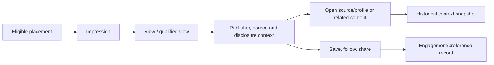
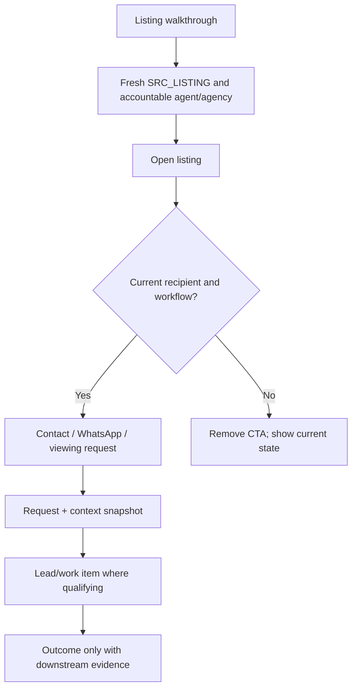
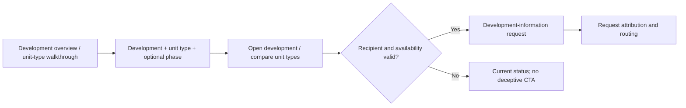
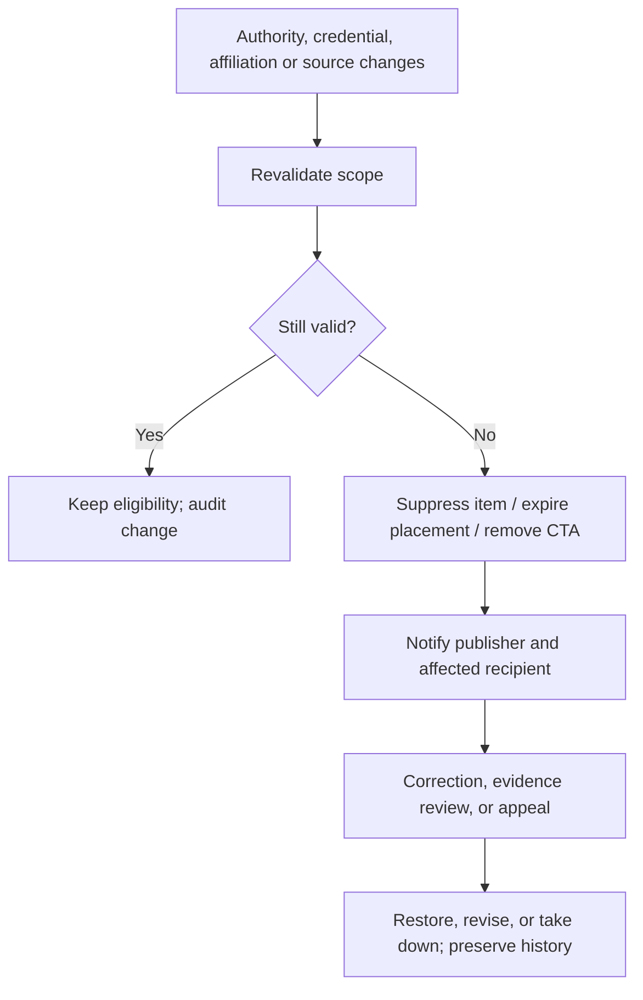
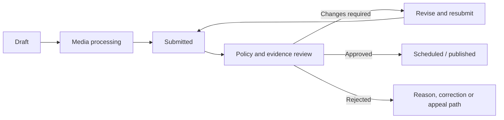
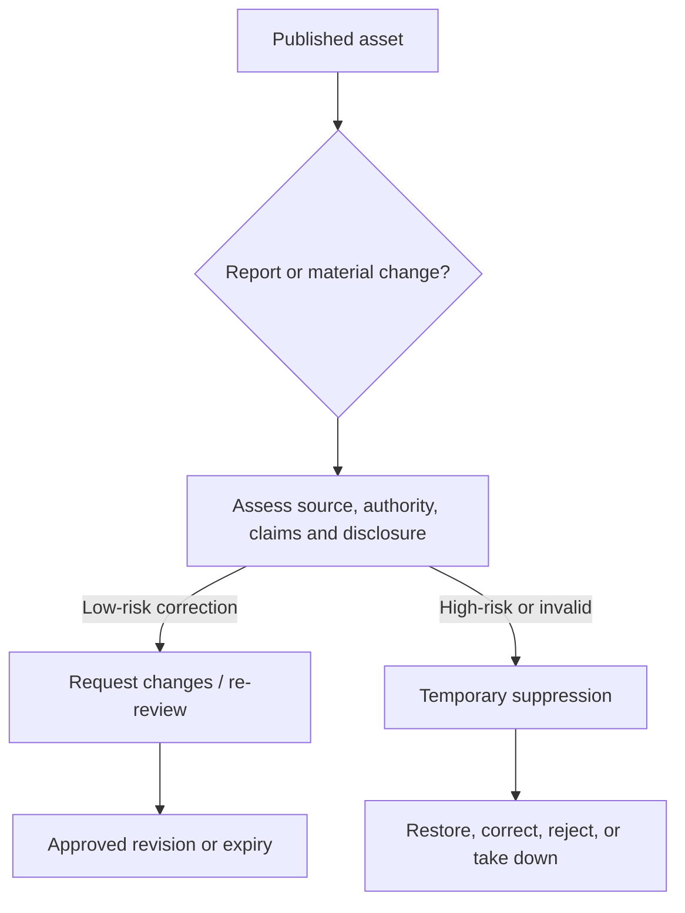
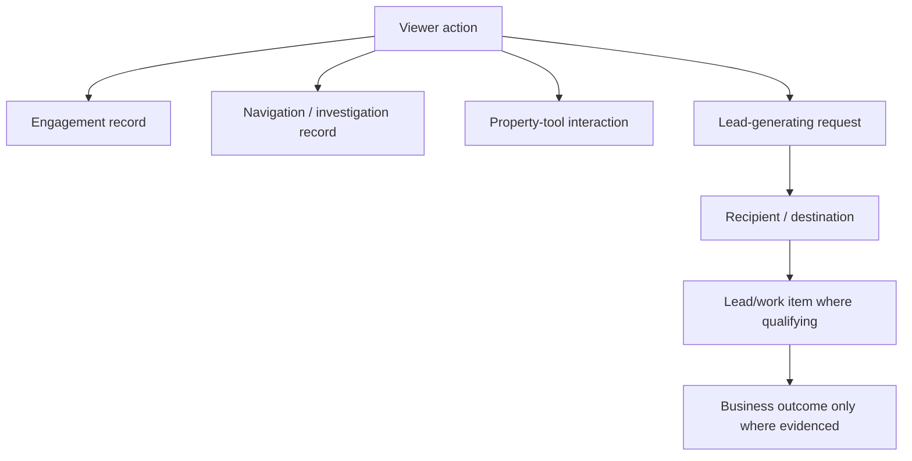

# Explore User and Publisher Journeys

| Field | Value |
| --- | --- |
| Status | Canonical journey architecture |
| Governing authorities | `00-explore-product-doctrine.md`, `01-explore-content-taxonomy.md`, `02-explore-property-context-graph.md` |
| Scope | Human journeys, decision points, trust conditions, and operational boundaries for Explore |
| Boundary | Not UI design, a data model, an API, a route plan, or an implementation backlog |

## 1. Purpose and authority

This document makes the doctrine, taxonomy, and Property Context Graph testable as human journeys. It is the canonical journey authority for future Explore work, subject to the doctrine's strategic authority, the taxonomy's content and policy authority, and the Context Graph's relationship authority. Current Explore implementation and audits are evidence of risk and validation needs, not the authority for these journeys.

## 2. Governing journey principles

Every journey preserves video-first discovery, canonical property and professional context, accountable publishing, verified authority, truthful atomic actions, moderation and disclosure, freshness, privacy, and attribution only to the degree evidence proves it. A journey fails if it relies on fabricated facts, unsupported credentials, an unavailable recipient, a dead CTA, or hidden commercial influence.

## 3. Scope and boundaries

Explore supports the progression **watch -> understand -> trust -> investigate -> act**. It complements deliberate Search; it is neither a generic social feed, an open public creator platform, nor a listing-video attachment feature. This document describes people and governed transitions, not screens, databases, payloads, ranking weights, billing, or revenue sharing.

## 4. Actor model

| Actor | Journey role |
| --- | --- |
| Viewer | Guest or authenticated person discovering, investigating, acting, or reporting. |
| Accountable publisher | Person or organisation responsible for a public asset. |
| Publishing organisation | Brand/channel and authority context; may differ from the accountable publisher. |
| Human operator | Authenticated person who submits, edits, schedules, or approves on behalf of a publisher. |
| Represented professional | Verified person whose professional scope supports a claim or action. |
| Credited creator | Presenter, videographer, or author credited for the asset; not necessarily accountable. |
| Moderator or reviewer | Applies policy and evidence review; automation may assist but does not replace accountability. |
| Lead recipient | Verified accountable destination for a qualifying request. |
| Organisation authority manager | Grants, scopes, revokes, and audits operating and representation authority. |
| Property Listify editorial | Accountable editorial publisher with editor, source-record, and qualified-contributor responsibilities. |

## 5. Journey-state model

All journey cards below state: actor and objective; entry/trigger and preconditions; class, publisher, sources, authority, verification, and disclosures; steps and trust/decision moments; permitted atomic actions; context, consent, freshness, and moderation conditions; attribution; success; recovery and notifications; V1 relevance; and open decisions.

| State domain | Conceptual states |
| --- | --- |
| Media lifecycle | Draft; processing; submitted; review; approved; scheduled; published; suppressed; expired; withdrawn; rejected; taken down. |
| Discovery lifecycle | Ineligible; eligible; placed; ranked; displayed; suppressed; expired. |
| Request lifecycle | Initiated; submitted; failed; accepted; qualifying lead/work item created; rejected or closed. A request remains a distinct record when a downstream lead/work item is created from it. |
| Lead/work-item lifecycle | Created; routed; assigned; acknowledged; progressing; completed; lost or closed. Downstream lead engines own this operational truth. |

## 6. Consumer discovery journeys

### 6.1 Passive discovery to investigation

**Contract.** Primary actor: guest or authenticated viewer; objective: understand an unexpected useful opportunity. Entry: an eligible organic or editorial placement. Trigger: impression and view start. Preconditions: approved, fresh Discovery item; accountable publisher; canonical source context; valid disclosure and action state. Classes: any approved V1 class. Sources: primary subject and relevant secondary context. Authority and verification: already validated for publication.

The viewer sees publisher identity, relevant organisation/professional context, source context, and disclosures before choosing to investigate. Impression, view start, qualified view, and progress produce interaction evidence. The viewer may use only the item’s permitted actions: `ACT_OPEN_LISTING`, `ACT_OPEN_DEVELOPMENT`, `ACT_OPEN_LOCATION`, `ACT_OPEN_PROFESSIONAL_PROFILE`, `ACT_OPEN_ORGANISATION_PROFILE`, `ACT_SAVE_CONTENT`, `ACT_SAVE_SOURCE_OBJECT`, `ACT_FOLLOW_PUBLISHER`, `ACT_SHARE`, or `ACT_CONTINUE_RELATED_CONTENT` where individually allowed. Opening a subject records navigation/investigation, not a lead.

Guest viewing requires the applicable consent posture. Saving or following may require authentication or a consented guest mechanism; reconciliation after sign-in is an open policy decision. A historical context snapshot is captured for attributable investigation actions. If freshness, disclosure, or subject eligibility fails, suppress the item or remove the affected CTA. Success is a truthful investigation or recorded preference; recovery is an updated state or sign-in prompt without claiming persistence that does not exist. V1: core; exact guest-save behaviour remains open.

## 7. Listing journey

### 7.1 Listing walkthrough to property enquiry

**Contract.** Primary actor: viewer; supporting actors: accountable verified agent or agency, represented agent, verified lead recipient. Objective: investigate and, if desired, enquire about a current property. Entry: `listing_walkthrough`. Preconditions: current actionable `SRC_LISTING`; `AUTH_OWNER` or `AUTH_REPRESENTATIVE`; verified publisher/affiliation; moderation approval; contact and viewing workflows functional. Disclosure: price/availability and commercial disclosures where applicable.

The viewer watches, opens the listing, reviews canonical listing context, and may select a contact route, WhatsApp, or request a viewing only when the current listing and recipient permit it: `ACT_OPEN_LISTING`, `ACT_CONTACT_PROFESSIONAL`, `ACT_WHATSAPP_PROFESSIONAL`, `ACT_REQUEST_VIEWING`, save, follow, share, and related-content continuation if the taxonomy permits. Selecting a route is interaction attribution. A platform contact-form request exists only after successful, consented submission. A WhatsApp click or external-app handoff does not prove that a message was sent; request/lead attribution for that channel requires reliable downstream or integration evidence. No lead is created merely because a viewer selected a channel. A valid viewing request is also separate from navigation. Each attributable action carries the applicable historical context snapshot; a qualifying request may then route to a downstream lead/work item.

Trust moments: identity, affiliation, listing status, displayed price/availability, mandate scope, recipient and channel disclosure. Freshness is rechecked at action time. A withdrawn, sold, unavailable, or unactionable listing removes CTAs, displays the current state, preserves historical evidence, and may suggest valid alternatives; it never creates a false lead. Success: a confirmed request/acknowledgement or truthful listing investigation. V1: core but dependent on functional listing, contact, WhatsApp, and viewing workflows; duplicate-request and response-expectation rules are open.

## 8. Development journey

### 8.1 Development discovery to information request

**Contract.** Primary actor: viewer; supporting actors: developer organisation, marketing operator, authorised representative, recipient. Entry: `development_overview` or `unit_type_walkthrough`. Preconditions: actionable `SRC_DEVELOPMENT`; `SRC_UNIT_TYPE` for unit media; optional `SRC_DEVELOPMENT_PHASE`; authority, status, inventory context, and moderation valid. Disclosures distinguish current reality, model unit, artist impression, and future-state render.

The viewer may open the development, compare unit types, save, follow, share, or request information: `ACT_OPEN_DEVELOPMENT`, `ACT_COMPARE_UNIT_TYPES`, `ACT_REQUEST_DEVELOPMENT_INFORMATION`, and permitted supporting actions. Location discovery may continue only through `ACT_CONTINUE_RELATED_CONTENT` into a separately eligible location item. A request uses the development/unit context and a valid recipient, captures a snapshot, and is routed only after consented submission. It is not a lead until a qualifying downstream work item exists.

Decision points are unit/phase availability, recipient availability, synthetic-media disclosure, and current development status. Price or inventory claims are rechecked against governed truth at exposure and action. Phase or inventory changes update the experience, remove invalid CTAs, and preserve historical evidence. Success: a truthful comparison or acknowledged request. V1: core, dependent on validated development inventory, unit-type, recipient, and routing capability.

## 9. Location journey

### 9.1 Suburb discovery to location investigation

**Contract.** Primary actor: viewer; supporting actors: publisher/editorial reviewer. Entry: `suburb_overview`. Preconditions: canonical `SRC_LOCATION`, accountable publisher, location-relevance and viewpoint disclosure; governed market/inventory source for any market claim. Default action set: `ACT_OPEN_LOCATION`, `ACT_SAVE_CONTENT`, `ACT_FOLLOW_PUBLISHER`, `ACT_SHARE`, and `ACT_CONTINUE_RELATED_CONTENT` where allowed. The product vision supports saving a canonical location, but the current taxonomy permits `ACT_SAVE_CONTENT` rather than `ACT_SAVE_SOURCE_OBJECT` for `suburb_overview`. Enabling direct location saving requires a later approved taxonomy amendment.

The journey presents balanced location context and makes clear whether the viewpoint is agent, editorial, or other approved perspective. A location overview cannot infer inventory, price, safety, demographic, school-quality, or market facts from location alone. Such claims require an authoritative market/inventory source, appropriate disclosure, and enhanced review. The viewer can investigate related listings, developments, professionals, or governed location guides; those are separate subject links, not fabricated conclusions.

Trust moments include source provenance, commercial influence, community-integrity rules, and claims boundaries. Freshness applies to reports and related inventory, while the location itself remains a governed subject. Success is informed location investigation; failure/recovery removes stale claims, shows a corrected source state, or suppresses the asset. V1: core; sponsored neutral location treatment remains a later founder/commercial decision.

## 10. Professional discovery journey

### 10.1 Area-agent expertise to professional contact

**Contract.** Primary actor: viewer; supporting actors: verified agent, affiliated agency, recipient. Entry: `area_agent_expertise`. Preconditions: `SRC_PROFESSIONAL_PROFILE` plus `SRC_LOCATION`; current affiliation, credential scope, and disclosed viewpoint. The agent may describe bounded local expertise, not unsupported market, legal, financial, or valuation claims.

Permitted actions are `ACT_OPEN_PROFESSIONAL_PROFILE`, `ACT_OPEN_LOCATION`, `ACT_CONTACT_PROFESSIONAL`, `ACT_WHATSAPP_PROFESSIONAL`, save, follow, share, and related content where the taxonomy permits. The professional profile may show verified organisation affiliation. Direct organisation-profile opening requires a later approved taxonomy amendment. It does not expose `ACT_REQUEST_VIEWING` by default; that requires a separately linked, current actionable listing or development subject and a functioning workflow.

Contact creates a request only after submission and channel consent. The recipient and affiliation are rechecked then; expired affiliation removes contact actions and prompts updated context. Success is profile investigation or a consented contact request; V1: core but dependent on professional-profile, affiliation, contact, and WhatsApp validation.

## 11. Save, follow and return

**Contract.** Primary actor: guest or authenticated viewer. Objective: retain useful media, subject, or publisher context. Trigger: `ACT_SAVE_CONTENT`, `ACT_SAVE_SOURCE_OBJECT`, or `ACT_FOLLOW_PUBLISHER`. Preconditions: supported persistence and consent state.

Save content, save source object, and follow are stateful, reversible engagement actions, not leads. Return journeys display current source/media state and correction notices where appropriate. Withdrawn content may remain as a historical interaction record but must not be presented as current; unavailable source objects show truthful status. Guest-to-authenticated reconciliation occurs only with approved consent and confidence; otherwise the guest state remains separate. Success is a reliable return path or transparent explanation of unavailable material. V1: save/follow are core only if persistence and privacy rules are validated.

## 12. Reporting and preference journeys

### 12.1 Report, hide, and not interested

**Contract.** Primary actor: viewer; supporting actors: moderator/reviewer. Trigger: a content-report or safety event, hide/unhide, or not-interested/preference reset. Preconditions: safe reporting route and privacy posture. A report is a safety record; hide and not-interested are reversible engagement/preference events.

The viewer may report misleading, unsafe, rights-infringing, discriminatory, synthetic-media, or other policy concerns without the publisher receiving reporter identity. Triage determines whether to suppress immediately, request evidence, seek correction, reject, restore, or take down. Not-interested and hide alter only governed preference/ranking signals; they do not accuse a publisher or prove policy breach. Success is safe acknowledgement and appropriate handling. V1: basic report/hide/not-interested; service levels and appeal detail remain open.

## 13. Agent publishing journey

### 13.1 Verified agent publishes a listing walkthrough

**Contract.** Primary actor: verified individual agent/operator; supporting actors: agency, moderator, listing owner/recipient. Objective: publish a governed `listing_walkthrough`. Preconditions: authenticated operator; publisher selection; current affiliation if represented; `SRC_LISTING`; `AUTH_OWNER` or `AUTH_REPRESENTATIVE`; verified identity/credential as relevant; rights attestation; disclosures and source state valid.

The agent selects content class and accountable publisher, selects the listing, establishes represented-professional and credited-creator roles, submits media/transcript/caption, attestations, price/availability context, and disclosures. Processing precedes review; approval requires authority, source and claim checks. Published performance reports engagement and attributable actions without conflating them with outcomes. Listing withdrawal, mandate expiry, affiliation change, or material edit triggers re-review/suppression/CTA removal and notification. V1: core, dependent on trustworthy authority, moderation, and media-processing operations.

## 14. Agency publishing journey

### 14.1 Agency publishes under organisation identity

**Contract.** Primary actor: agency administrator/operator; accountable publisher: agency. Supporting actors: represented verified agent and credited creator. Sources: listing or location. Preconditions: organisation verification, delegated publication scope, brand governance, and source-specific authority.

The administrator publishes under the agency channel; a named agent may supply professional accountability and a videographer may be credited. Delegated authority never arises merely from employment. For location content, claim boundaries and viewpoint disclosures apply; for listing content, listing authority applies. Agent departure, delegation expiry, or organisation suspension prompts authority review, role removal, asset suppression where necessary, and a traceable notification/correction path. V1: core for listing/area-agent contexts, pending channel-ownership and agency-governance validation.

## 15. Developer publishing journey

### 15.1 Developer publishes development media

**Contract.** Primary actor: developer marketing operator; accountable publisher: developer organisation; represented professional: authorised development representative where relied upon. Sources: development, unit type, optional phase/location/event. Preconditions: development representation authority, status, claims evidence, and disclosures for existing/planned amenities, model units, renders, and future-state imagery.

The operator selects a governed development class, attaches the required sources, identifies any render/model status, and submits for moderation. Approved media reaches consumers through eligible placements. Information requests route only to a verified destination. Construction, amenities, availability, phase, or status changes trigger re-review and action validation. V1: core for overview/unit-type media, dependent on real development and inventory truth.

## 16. Editorial publishing journey

### 16.1 Property Listify editorial publishes educational media

**Contract.** Accountable publisher: Property Listify editorial; operator: editor; supporting actors: qualified contributor/reviewer. Sources: `SRC_PROPERTY_TOPIC`, optional `SRC_PROPERTY_TOOL`, market report/location where applicable. Editorial container is a series/collection/commission, not a source object or evidence by itself.

The editor records accountable contributors, source checks, claim boundaries, disclosures, rights, and any tool context. A qualified contributor supports financial, legal, valuation, technical, or other specialised claims as required by taxonomy. Editorial publication does not make unsupported claims factual. Corrections, source failure, or contributor/claim changes trigger revision, re-review, withdrawal, or contextual notice. V1: later or tightly bounded; broad regulated education is deferred.

## 17. Approved-creator journey

### 17.1 Approved creator publishes bounded location or property content

**Contract.** Primary actor: platform-approved creator; sources: location or bounded property topic, and a listing/development only with independent authority. Preconditions: creator approval, content boundary, rights, enhanced review, and clear distinction between opinion and governed fact.

Creator approval allows a defined publishing boundary; it is not professional, legal, financial, or representation authority. The creator supplies sources/disclosures and is reviewed for unsupported claims, hidden promotion, community harm, and synthetic-media disclosure. Approval suspension or revocation blocks future publication and may suppress affected assets while preserving audit history. V1: not a foundation; later validation-dependent supply capability.

## 18. Service-provider journey

### 18.1 Professional or service provider publishing

**Contract.** Primary actor: approved professional/service provider; sources: professional profile, organisation, service category and, if approved later, service offering; verified project/portfolio evidence. Preconditions: professional or service verification, client/project permission, qualified claims, and suitable recipient for quote requests.

The provider may publish bounded demonstrations, case studies, or education under the substantive taxonomy class—not a generic professional-education fallback. Before/after, cost, technical, and credential claims require evidence and disclosures. `ACT_REQUEST_SERVICE_QUOTE` is available only when a verified provider/offering and functioning request route exist; it promises neither price nor availability. Later phase: not a preliminary V1 foundation.

## 19. Organisation and authority journeys

### 19.1 Organisation authorises a human operator

An organisation verifies itself, identifies the operator, assigns a scoped role, records effective period and permitted activity, and maintains revocation/audit evidence. The operator may submit only within the delegated publisher/channel/source scope. Changes notify the organisation and affected operator; expired or revoked authority blocks publishing and triggers review of affected assets. V1: necessary for agency/developer publishing.

### 19.2 Organisation authorises a represented professional

The organisation verifies the professional identity, time-bound affiliation, credentials, classes/subjects permitted, and representation scope. One professional may affiliate with multiple organisations; one organisation may have many professionals. Separation, credential expiry, suspension, or dispute invalidates only affected authority and prompts re-review. V1: necessary where an agent/representative is shown or contacted.

### 19.3 Authority becomes invalid

Mandate withdrawal, agency departure, developer-authority loss, credential expiry, portfolio-permission withdrawal, creator suspension, or unreliable editorial source triggers a governed response: re-review; suppress affected Discovery items; expire placements; remove CTAs; notify accountable parties; invite correction/appeal where appropriate; retain historical records and snapshots. It must not silently leave misleading public media or rewrite history.

## 20. Standard moderation

**Contract.** Actor: operator and moderator. The asset moves draft -> processing -> submitted -> review -> changes requested/resubmission -> approved -> scheduled/published. Automated checks may assist media, rights, metadata, and policy triage, but human accountability applies where required. Review confirms content class, sources, publisher/authority, disclosure, claim scope, accessibility/transcript, freshness, and eligible actions. Rejection explains a recoverable issue when appropriate; media processing failure blocks publication and prompts retry/correction. V1: core operational requirement.

## 21. Enhanced review

Inventory, development-progress, technical/cost, financial, valuation, legal, public-interest, and sensitive community claims require the taxonomy’s correct qualified contributor/reviewer and evidence. `CLAIM_VALUATION` requires `QUAL_VALUATION`; neighbouring agent, developer, finance, or editorial roles do not substitute. Review may approve, limit, request changes, reject, or remove a claim/action while allowing a lower-risk asset variant. Broad regulated financial/legal content is deferred from V1.

## 22. Synthetic-media review

Virtual staging, model units, artist impressions, future-state renders, AI-generated scenes, AI voice/likeness, and materially altered footage require `DISC_SYNTHETIC_MEDIA` and clear viewer-facing distinction from real current physical reality. Review verifies that an asset does not misrepresent current condition, completion, amenity, or availability. It may require correction, restrict an action, or reject the asset. V1: disclosure and review principle applies even where complex media classes are deferred.

## 23. Re-review and takedown

### 23.1 Material-change re-review

Material changes to media, transcript, caption, price, availability, source, publisher, organisation, represented professional, credential, disclosure, sponsor, CTA, methodology, or development/project status require revalidation before continued public eligibility. Approval is not permanent. The response can preserve publication, request changes, suppress an item, expire a placement, remove a CTA, or withdraw/take down the asset.

### 23.2 Content report and takedown

A report is triaged privately; emergency/high-risk issues may cause temporary suppression before evidence review. The reviewer can restore, correct, reject, limit, or take down. Publisher notification must not expose reporter identity; audit history preserves decision evidence. Copyright, privacy, discrimination/community harm, false representation, and unsafe content require qualified policy/legal review where applicable. V1: basic reporting and takedown path required; detailed service levels remain open.

## 24. Contact and WhatsApp journeys

**Contract.** Primary actor: viewer; supporting actors: verified recipient and downstream lead owner. Preconditions: class permits `ACT_CONTACT_PROFESSIONAL` or `ACT_WHATSAPP_PROFESSIONAL`; current professional/organisation/source; recipient and channel consent; functional destination. The viewer sees recipient identity and relevant privacy/channel notice, submits a request, and receives acknowledgement where the workflow succeeds.

Selecting a contact route records interaction attribution. A successful platform contact-form submission creates a request record, receives request/lead attribution and a context snapshot, and may create a lead/work item only if downstream criteria do so. Selecting WhatsApp records interaction attribution and may open an external handoff; a click or app open does not prove a message was sent. WhatsApp request/lead attribution requires reliable downstream or integration evidence of a qualifying handoff or message. No lead is created merely because the viewer selected a channel. Recipient unavailability, consent failure, channel failure, or source invalidation causes an explicit failure state and no deceptive success claim. V1: only where the functional journey is verified; acknowledgement expectation and WhatsApp rules are open.

## 25. Viewing-request journey

**Contract.** Primary actor: viewer; source: current actionable `SRC_LISTING` (or applicable development subject); recipient: verified responsible party. Preconditions: taxonomy permits `ACT_REQUEST_VIEWING`, listing/development and recipient are current, consent/request details are sufficient, and a downstream handoff exists.

The viewer submits interest; the system captures source/placement/CTA context and passes a request to the downstream viewing/lead workflow. It handles duplicate requests according to an open policy and shows changed availability before acceptance. A request may be rejected/closed or become a routed lead/work item; scheduling is a downstream concern. V1: core only for proven functional workflows.

## 26. Development-information journey

**Contract.** Primary actor: viewer; sources: `SRC_DEVELOPMENT`, optional unit type/phase; recipient: valid development contact. `ACT_REQUEST_DEVELOPMENT_INFORMATION` requires current development context, consent, routing, and response ownership.

The viewer submits interest in the development/unit context. Snapshot, request attribution, and routing retain what was shown without freezing inventory truth. Availability changes are surfaced before or after submission as appropriate; the recipient owns response and downstream lead operations. V1: core only when development recipient/routing capability is validated.

## 27. Service-quote journey

**Contract.** Primary actor: viewer; sources: verified provider, service category and potential service offering, optional project context. `ACT_REQUEST_SERVICE_QUOTE` requires an accountable recipient, consent, and functioning downstream route. It makes no guarantee of quote, price, or availability. This is later phase unless selected by a future V1 boundary.

## 28. Editorial-container journey

An editorial container groups or commissions approved assets, identifies accountable editor and contributors, records relevant source checks, and may appear as a collection experience. Each asset retains its own source objects, publisher, disclosures, authority, and action eligibility. Sponsorship or contributor relationships are disclosed; correction/review can affect an asset without treating the container as a source object or evidence. Later phase unless a bounded editorial collection is selected.

## 29. Sponsored-placement journey

Sponsored placement is later phase. An already eligible, fully moderated asset receives separate sponsor/commercial-relationship review, placement approval, viewer disclosure, targeting restrictions, active window, expiry, provenance, and reporting context. Sponsorship cannot alter publisher identity, source truth, or organic ranking. No campaign management, billing, self-service advertising, payout, or commercial-credit rule is designed here.

## 30. Request, lead and outcome boundaries

Viewer action is the broad category. Engagement (save, follow, share, view) and navigation (opens, compare, related content) normally create neither request nor lead. A request is viewer-submitted intent; a lead/work item is a business-side record made, assigned, and processed from a qualifying request; an outcome is later downstream evidence. Not every request creates a lead, and no lead proves an outcome. Explore attributes requests and context; existing downstream engines retain operational lead truth.

## 31. Attribution and historical context

Every applicable journey identifies one or more levels: **interaction attribution** (exposure to action), **request/lead attribution** (qualifying request and any created work item), and **business-outcome attribution** (only with downstream evidence). Exposure does not prove causation; saves, follows, and opens do not create leads; request attribution does not prove a result; confidence reflects identity and evidence certainty.

A historical context snapshot is captured for listing opens, contact-route selection, WhatsApp handoff, viewing, development-information, service-quote, and relevant tool actions. A WhatsApp snapshot is interaction evidence unless reliable downstream/integration evidence establishes a qualifying request. The snapshot may preserve viewer/session certainty, placement, Discovery item, content asset, publisher, organisation, represented professional, source subjects/version, displayed price/availability, disclosures, CTA, and timestamp. It is historical evidence, not source truth; later correction cannot rewrite it.

## 32. Failure and recovery catalogue

| Failure | Required response |
| --- | --- |
| Missing or stale source object | Block publication or suppress item; expire placement/remove CTA; show current state; preserve history. |
| Invalid authority or expired credential | Block/change request; suppress affected eligibility; notify responsible parties; correction/appeal where appropriate. |
| Missing disclosure or unsupported claim | Request changes or reject; do not place until resolved. |
| Failed media processing | Block publication; explain retry/correction path. |
| Moderation rejection/report/takedown | Reject, suppress, restore, correct, or take down by evidence; protect reporter privacy; retain audit record. |
| Broken destination or unavailable recipient | Remove CTA or show explicit failure; never claim request success. |
| Consent/session uncertainty | Limit persistence/attribution; request appropriate consent; do not silently identify a guest. |
| Request submission failure or duplicate | Show result; prevent misleading confirmation; apply later duplicate policy; preserve interaction evidence. |
| Source correction or sponsor expiry | Re-review; update/suppress derivative item; expire placement; keep historical snapshot. |
| Attribution uncertainty | Record confidence/limits; do not award commercial or outcome credit beyond evidence. |

## 33. Preliminary V1 journey set

Preliminary, not final V1: listing walkthrough discovery; development overview; unit-type walkthrough; suburb overview; area-agent expertise; listing/development/location/professional opening; contact and WhatsApp where functional; valid viewing and development-information requests; save/follow; basic reporting; standard moderation; authority invalidation; interaction and request attribution; and basic historical snapshots. It excludes sponsored campaigns, creator payments, public livestreaming, open consumer publishing, public Map discovery, service marketplace quote flows, sensitive documentaries, broad financial/legal media, and advanced cross-device identity.

## 34. V1 journey readiness assessment

| Journey | Value and source/publisher assumption | Trust and operational dependency | Action/attribution dependency | Current uncertainty and classification |
| --- | --- | --- | --- | --- |
| Listing walkthrough -> enquiry | High value; current listings and agent/agency supply must be governed | Authority, freshness, moderation | Listing open; functional contact/WhatsApp/viewing; snapshots | Temporal implementation evidence: `docs/EXPLORE_ENGINE_AUDIT_2026-03-19.md` identified broken/misaligned live actions at its audit date; it is not journey authority. **Dependent on current-state validation**. |
| Development overview / unit type -> information | High value; development/unit truth and developer supply required | Render/status/inventory review | Open/compare/request; recipient routing | Requires current-state validation of development inventory, recipients, and routing. **Dependent on validation**. |
| Suburb overview -> location | High discovery value; canonical locations/publishers required | Community integrity, source-backed claims | Open/save/related context | Requires current-state validation of neutral facts and governed market-source integration. **Dependent on validation**. |
| Area-agent expertise -> contact | High trust value; verified profiles/affiliations required | Claim boundaries and affiliation review | Profile/contact/WhatsApp; no default viewing | Requires current-state validation of profile, recipient, and channel workflows. **Dependent on validation**. |
| Save/follow/report | Supports return and safety | Consent, persistence, moderation operations | Interaction only | Requires current-state validation of persistence and privacy behaviour. **Dependent on validation**. |
| Standard moderation / authority invalidation | Foundational safety value | Review capacity and evidence operations | Suppression/notifications/audit history | Requires current-state validation of the publishing lifecycle and authority-invalidation capability. **Blocked by missing capability until proven otherwise**. |

## 35. Deferred journeys

Deferred: sponsored campaigns, creator revenue/referral payouts, public livestreaming, open consumer publishing, public Map discovery, service-quote marketplace operation, sensitive documentary workflows, broad regulated financial/legal content, automated recommendation decisions, and advanced cross-device identity.

## 36. Open decisions

The following require founder, market, operational, privacy, or qualified South African review: exact V1 actions; individual versus organisation follow; publisher-channel ownership; request acknowledgement expectations; WhatsApp consent/channel rules; guest saves and reconciliation; duplicate-request handling; lead routing/ownership; correction/appeal workflow; moderation service levels; publisher analytics; editorial-container visibility; service-quote timing; identity/credential evidence; legal, equality, housing, advertising, consumer-protection, copyright, and privacy requirements.

## 37. Canonical journey invariants

1. No viewer sees a CTA the connected workflow cannot support.
2. No publisher proceeds beyond verified authority.
3. No source-state change silently leaves misleading media active.
4. No save, follow, or open becomes a lead.
5. No request becomes a successful outcome without downstream evidence.
6. No guest identity reconciliation occurs without approved consent.
7. No sponsored journey hides commercial influence.
8. No synthetic-media journey conceals rendered, staged, or altered media.
9. No moderation approval survives a material change without required re-review.
10. No downstream lead engine loses operational lead truth to Explore.
11. No correction rewrites historical context snapshots.
12. No current UI or route becomes canonical merely because it exists.

## 38. Non-negotiable instructions for UX, schema and API design

Future work must not turn these journeys into generic social posting, unstructured video records, or unsupported conversion claims. UX must surface accountable identity, source context, disclosures, current action state, and recovery. Schema/API work must preserve independent concepts for publisher authority, source truth, content asset, Discovery item, placement, request, lead/work item, outcome, historical snapshot, and confidence; this document does not prescribe their storage or interfaces. Do not introduce ranking weights, billing, campaign tooling, or revenue-sharing rules from these journeys.

## 39. Relationship to supply validation and V1 boundary documents

`04-explore-south-african-supply-validation.md` must test the publisher supply, production, moderation-delay, and organisational-control assumptions in these journeys. `05-explore-v1-capability-boundary.md` must choose a validated launch subset, action set, operating model, and readiness definition. `06-explore-current-state-and-remediation.md` must compare current implementation evidence with these canonical journeys and define an incremental path without allowing legacy routes or tables to redefine the target.
