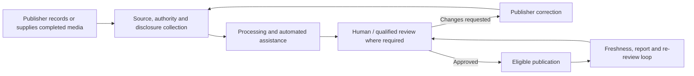
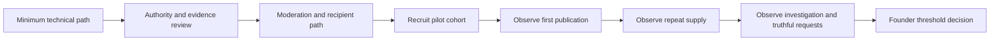
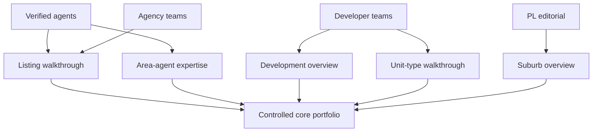
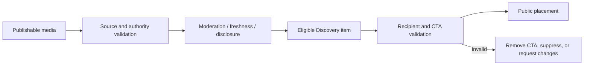
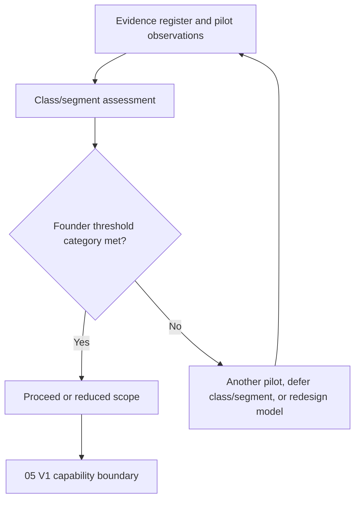

# Explore South African Supply Validation Framework

| Field | Value |
| --- | --- |
| Status | Evidence-led validation draft — subject to market, operational and founder review |
| Product authorities | `00-explore-product-doctrine.md`, `01-explore-content-taxonomy.md`, `02-explore-property-context-graph.md`, `03-explore-user-and-publisher-journeys.md` |
| Scope | South African publisher supply, operating feasibility, and launch-assumption validation for Explore |
| Boundary | Market and operating-model validation; not a legal opinion, implementation design, staffing plan, pricing proposal, or launch decision |

## 1. Purpose and authority

This framework tests whether Explore can recruit, verify, enable, and retain enough accountable South African publishers to sustain useful video-first property media while preserving source linkage, moderation, freshness, and truthful actions. It may challenge launch assumptions, but cannot weaken the four governing product documents. It does not treat existing code, a public account, or a strategically attractive class as proof of repeatable supply.

## 2. Validation status and evidence rules

| Status | Meaning |
| --- | --- |
| `EVIDENCED` | Direct, relevant, cited evidence supports the conclusion. |
| `SUPPORTED` | Several credible indicators support it, but Property Listify has not directly validated it. |
| `HYPOTHESIS` | Plausible proposition requiring validation. |
| `OPEN` | Important question has insufficient evidence. |
| `BLOCKED` | Validation cannot proceed until a dependency, source, or decision exists. |

Every material conclusion below has one of these statuses. Founder belief, generic product logic, competitor behaviour, social-media examples, and legacy code are not proof of supply. Future interviews, surveys, and pilots are specified as methods, not completed evidence.

Evidence also has an independent **domain**. Status describes confidence in a claim; domain describes the kind of claim it can support. Evidence in one domain does not transfer automatically to another.

| Evidence domain | What it can support |
| --- | --- |
| `PRODUCT_AUTHORITY` | Approved product meaning, policy, relationship, and journey requirements. |
| `MARKET_SUPPLY` | Availability of suitable publishers in the relevant market/segment. |
| `PUBLISHER_BEHAVIOUR` | Observed willingness, capability, publishing, update, or retention behaviour. |
| `TECHNICAL_READINESS` | Time-bounded functioning of a defined technical/source/action path. |
| `OPERATING_CAPACITY` | Observed verification, moderation, support, or review capacity. |
| `LEGAL_REGULATORY` | Qualified legal/regulatory evidence or review. |
| `FOUNDER_DECISION` | Explicit approved scope, threshold, or policy decision. |

When a later table does not repeat a domain in every cell, interpret statuses using these conventions; an explicit domain in a row overrides the default.

| Sections or subject | Default evidence domain |
| --- | --- |
| Publisher segments, class supply, capability, motivation and segment assessments | `MARKET_SUPPLY` and/or `PUBLISHER_BEHAVIOUR` |
| Source objects and action workflows | `TECHNICAL_READINESS` |
| Verification, moderation, support and production operations | `OPERATING_CAPACITY` |
| Qualified legal or regulatory requirements | `LEGAL_REGULATORY` |
| Thresholds, launch choices and policy approvals | `FOUNDER_DECISION` |
| Doctrine, taxonomy, graph and journey requirements | `PRODUCT_AUTHORITY` |

For example, the taxonomy is `EVIDENCED` in `PRODUCT_AUTHORITY`; it defines what must be supplied and governed, but provides no `MARKET_SUPPLY` or `PUBLISHER_BEHAVIOUR` evidence.

## 3. Scope and boundaries

This document assesses supply for South Africa without selecting a city, province, language policy, launch cohort, or V1 boundary. It considers accountable publisher and organisation roles separately from the human operator and credited creator. It does not use untracked `docs/research/`; that directory remains non-authoritative until founder approval.

## 4. Core validation question

> Can Property Listify recruit, verify, enable and retain enough accountable South African property publishers to supply useful video-first property media at sufficient quality and frequency, while maintaining truthful source linkage, moderation, freshness and actionable downstream journeys?

| Readiness question | Current assessment | Status / domain | Required evidence |
| --- | --- | --- | --- |
| Publisher supply readiness: is supply available, willing, and capable? | No representative supplier inventory, commitment, or observed behaviour is recorded. | `OPEN` / `MARKET_SUPPLY`, `PUBLISHER_BEHAVIOUR` | Segment mapping, behavioural interviews, survey, pilot acceptance, and repeat publishing. |
| Source-object readiness: does authoritative property context exist? | A tracked Discovery document directly records a listing/search/detail/enquiry path on 2026-07-10; it does not establish current Explore source linkage or supply. | `EVIDENCED` (time-bounded) / `TECHNICAL_READINESS`; current Explore readiness `OPEN` | Current-state validation of public listing, development, unit, location, profile, and authority context. |
| Action-workflow readiness: does a truthful recipient/workflow exist? | The same narrow Discovery evidence covers public enquiry ownership, not Explore contact, WhatsApp, viewing, or development-information workflows. | `EVIDENCED` (time-bounded) / `TECHNICAL_READINESS`; current Explore action readiness `OPEN` | Functional recipient, consent, routing, acknowledgement, failure, and attribution validation. |
| Operating readiness: can verification, moderation, and support be delivered? | Product authorities define requirements, but no observed capacity is recorded. | `BLOCKED` / `OPERATING_CAPACITY` | Controlled review/support measurement and escalation model. |
| Can supply be sustained without uncontrolled cost? | No cadence, retention, support-time, or moderation-time evidence exists. | `OPEN` / `PUBLISHER_BEHAVIOUR`, `OPERATING_CAPACITY` | Pilot cost/time, repeat behaviour, and withdrawal evidence. |
| Which combinations are realistic first? | Core candidates are product-approved, not supply-proven. | `HYPOTHESIS` / `MARKET_SUPPLY`, `PUBLISHER_BEHAVIOUR` | Pilot results and founder threshold decisions. |

**Current validation verdict — `OPEN` in `MARKET_SUPPLY`, `PUBLISHER_BEHAVIOUR`, and `OPERATING_CAPACITY`.** No publisher segment, core content class, or production model is currently supply-validated for public launch. Available evidence supports structured interviews, current-state validation, and a controlled pilot. It does not support treating the preliminary V1 supply portfolio as proven. This is not a rejection of Explore or proof that supply will fail.

A source object does not prove publisher willingness; publisher willingness does not prove source truth; a valid source does not prove a functional CTA; and a pilot upload does not prove scalable verification or moderation.

## 5. Publisher-segment model

| Segment | Role in supply | Initial status | Validation emphasis |
| --- | --- | --- | --- |
| Individual estate agents | Listing walkthrough and area expertise publishers | `HYPOTHESIS` | Mandate authority, filming cadence, response ownership. |
| Agency administrators and teams | Organisation publishing, brand governance, operator delegation | `HYPOTHESIS` | Approval chains, channel ownership, agent departure, repeatability. |
| Property developers | Development/unit media and information recipients | `HYPOTHESIS` | Development authority, inventory/status accuracy, render disclosures. |
| Property Listify editorial | Curated location/education cold-start support | `HYPOTHESIS` | Editorial capacity, source checks, qualified contributors. |
| Platform-approved property creators | Bounded future location/property perspective | `OPEN` | Approval criteria, claim boundaries, sustainable incentive. |
| Architects, contractors, construction professionals, service providers | Later professional/service content | `OPEN` | Credentials, project evidence, client permission, quote readiness. |
| Finance and legal professionals | Later regulated education | `BLOCKED` | Qualified review, legal/advertising policy, source/claim controls. |
| Tax, cost, and valuation professionals | Future specialist classes only | `OPEN` | Specialist evidence, review rules, viable supply. |

## 6. South African market segmentation

Validation must segment, rather than average, franchise agencies, independent agencies, solo agents, small teams, large groups, residential/rental/commercial agents, development sales teams, emerging/established developers, metropolitan and secondary markets, high- and low-stock areas, major provinces/markets, and English/multilingual publishing requirements. No tracked evidence supports a province, city, language, or segment launch priority. **Status: `OPEN`.** Sampling must record geography, stock context, category, organisation size, and language/accessible-caption needs before any priority is declared.

## 7. Content-class supply priorities

| Priority | Class | Product status | Supply-validation status |
| --- | --- | --- | --- |
| Core proof | `listing_walkthrough` | Preliminary V1 candidate | `HYPOTHESIS` |
| Core proof | `development_overview` | Preliminary V1 candidate | `HYPOTHESIS` |
| Core proof | `unit_type_walkthrough` | Preliminary V1 candidate | `HYPOTHESIS` |
| Core proof | `suburb_overview` | Preliminary V1 candidate | `HYPOTHESIS` |
| Core proof | `area_agent_expertise` | Preliminary V1 candidate | `HYPOTHESIS` |
| Conditional | `listing_highlight_teaser` | Preliminary V1 candidate | `HYPOTHESIS` |
| Conditional | `rental_tour` | Preliminary V1 candidate | `HYPOTHESIS` |
| Conditional | `price_availability_update` | Preliminary V1 candidate | `HYPOTHESIS` |
| Conditional | `professional_introduction` | Preliminary V1 candidate | `HYPOTHESIS` |

All other taxonomy classes remain later-stage unless evidence materially changes readiness.

## 8. Per-class supply assessment

No row forecasts volume or willingness. “Likely” identifies a validation cohort, not an assertion that it will supply content. In this table, `EVIDENCED` requirements are in `PRODUCT_AUTHORITY`; supplier capability, willingness, and repeatability statuses are in `MARKET_SUPPLY` and/or `PUBLISHER_BEHAVIOUR`; source/action validation belongs in `TECHNICAL_READINESS`.

| Class | Eligible/likely supplier; required source and authority | Production, quality, disclosure and freshness burden | Action/incentive/frequency/bottleneck | Evidence and recommendation |
| --- | --- | --- | --- | --- |
| `listing_walkthrough` | Verified agent or agency representative; `SRC_LISTING`; `AUTH_OWNER`/`AUTH_REPRESENTATIVE`. Likely cohort: residential and commercial agents. | Smartphone/completed video may be sufficient if understandable; occupied-property/privacy, rights, price/availability, transcript and representation disclosure required. Freshness is high. | Listing open/contact/WhatsApp/viewing where valid. Incentive may be listing exposure and attributable enquiry; repeat frequency depends on stock and workflow. Bottleneck: mandate, filming time, update and recipient response. | Product requirements `EVIDENCED` by taxonomy; supplier capability/willingness `OPEN`. Pilot before launch; **core test candidate**. |
| `development_overview` | Developer or authorised agency representative; `SRC_DEVELOPMENT`; ownership/representation authority. Likely cohort: developer marketing/sales teams. | Moderate production; existing/planned amenity, render/model-unit, status and disclosure burden. Freshness high for status/inventory claims. | Development open/information request. Incentive may be qualified interest and brand visibility. Bottleneck: approval chain, reliable status and recipient routing. | Requirements `EVIDENCED`; supply and operations `OPEN`. **Core test candidate**, conditional on developer evidence. |
| `unit_type_walkthrough` | Developer/authorised development representative; `SRC_UNIT_TYPE` attached to development, optional phase; authority required. | Moderate/high: unit access or accurate model/render distinction; captions and specifications. Freshness tied to development/phase. | Compare units/development information. Incentive may be unit education. Bottleneck: governed unit data, availability, marketing approval. | Requirements `EVIDENCED`; current source readiness `OPEN / TECHNICAL_READINESS`. **Core test candidate** only with source proof. |
| `suburb_overview` | Editorial, verified agent/agency representative, or approved creator within scope; `SRC_LOCATION`; professional/editorial authority. | Moderate; location integrity, balanced viewpoint, captions; market/inventory claims require governed source. Freshness medium/high where reports are used. | Open location, save content, follow, related content. Incentive may be area authority/audience value. Bottleneck: credible neutral research, policy review, no direct location-save action yet. | No supply or editorial-capacity evidence. `OPEN`. **Core test candidate** only through controlled editorial/verified-publisher pilot. |
| `area_agent_expertise` | Verified agent/agency representative; `SRC_PROFESSIONAL_PROFILE` + `SRC_LOCATION`; current affiliation/professional scope. | Basic-to-moderate; accurate local boundaries, disclosure, captions; high claim-risk if market/legal/financial assertions appear. | Open profile/contact/WhatsApp; no default viewing. Incentive may be professional visibility/seller acquisition. Bottleneck: affiliation evidence, response reliability, claim moderation. | Requirements `EVIDENCED`; willingness/capability `OPEN`. **Core test candidate**. |
| `listing_highlight_teaser` | Verified agent/agency representative; current listing and representation authority. | Lower production burden than walkthrough; same rights, price, availability and freshness discipline. | Same listing actions when valid. Incentive may be reuse from existing marketing. Bottleneck: teaser must not mislead by omission. | `HYPOTHESIS`; **conditional candidate** after walkthrough validation. |
| `rental_tour` | Verified rental agent/agency representative; current listing/authority. | Moderate; tenant/occupant consent, availability and terms increase burden. | Listing/contact/viewing when valid. Incentive may be tenant acquisition. Bottleneck: privacy, rapid turnover, update discipline. | `OPEN`; **conditional candidate** pending rental-policy and cohort evidence. |
| `price_availability_update` | Agent/agency/developer with subject-specific authority; listing or development/unit type. | Low media difficulty but highest factual freshness burden; must bind claim to governed timestamp/source. | Open subject, valid requests where applicable. Incentive may be timely demand generation. Bottleneck: stale/incorrect claim and re-review overhead. | `HYPOTHESIS`; **conditional candidate**, only after source-state automation/operations are proven. |
| `professional_introduction` | Verified professional/organisation within class scope; professional profile and organisation/service context. | Low-to-moderate; credentials, scope and disclosure critical. | Open profile/contact/WhatsApp/other taxonomy-permitted action. Incentive may be visibility. Bottleneck: credential/affiliation verification and recipient readiness. | `HYPOTHESIS`; **conditional candidate** after profile/authority validation. |

## 9. Publisher capability assessment

| Capability | Unaided expectation | Requires templates/education | Requires Property Listify tooling | Requires human support | Unrealistic for V1 without proof |
| --- | --- | --- | --- | --- | --- |
| Smartphone/camera, basic filming, completed-video upload | `HYPOTHESIS`; test by segment | Shot lists and recording guidance | Reliable upload/progress/resume | Assisted production for selected cases | Requiring professional production from every publisher. |
| Editing, captions, metadata, rights-compliant audio | Varies; no evidence | Captions/disclosure/rights checklists | Metadata prompts and validation | Review/editing assistance | Assuming public social-media content is rights-ready. |
| Subject selection, authority evidence, disclosures | Not safely assumed | Class-specific examples | Source picker, evidence/disclosure collection | Authority review/escalation | Asking publishers to infer legal/professional scope. |
| Timely updates/re-review and response destination | Not safely assumed | Freshness/recipient training | Change prompts and status visibility | Follow-up/escalation | Treating upload as permanent publication. |
| Sustainable cadence and acceptable quality | No evidence | Content calendars/prompt library | Measurement and feedback | Cohort support | Uniform high-frequency output across all segments. |

## 10. Publisher motivation and incentives

| Segment | Plausible value proposition | Evidence status | What must be proven before relying on it |
| --- | --- | --- | --- |
| Agents | Listing exposure, area authority, seller acquisition, measurable enquiry, reusable content | `HYPOTHESIS` | Time cost, authority friction, repeat publishing, response value. |
| Agencies | Brand governance, agent distribution, organisation analytics, seller/developer positioning | `HYPOTHESIS` | Approval willingness, channel ownership, perceived differentiation. |
| Developers | Development education, lead generation, unit explanation, construction/launch narrative | `HYPOTHESIS` | Status-data effort, marketing approval, recipient response value. |
| Editorial | Consumer trust, cold-start coverage, strategic subject quality | `HYPOTHESIS` | Budget/capacity, qualified contributor access, repeatable source checks. |
| Approved creators/professionals | Audience, portfolio demonstration, service visibility, future commercial benefit | `OPEN` | Why they would publish without proven attributable value; no payout is assumed. |

## 11. Supply barriers

| Barrier | Category | Likely consequence | Validation/mitigation question |
| --- | --- | --- | --- |
| Time, camera discomfort, editing, platform learning | Publisher-side | Low activation or repeat rate | Which minimum support changes completed submission behaviour? |
| Mandates, organisation approval, developer chains | Organisation-side | Assets cannot be published or become stale | What evidence/delegation is available at submission and renewal? |
| Upload quality, data cost, connectivity | Platform/publisher-side | Failed processing or exclusion | What environments and file sizes are workable by cohort? |
| Privacy, occupied homes, tenant/owner consent, rights/music | Legal/regulatory and operational | Takedown/rejection risk | What evidence/disclosures and qualified review are required? |
| Incorrect price/availability, weak source records | Source-data | Misleading media/invalid CTAs | Can source changes trigger correction/re-review reliably? |
| Moderation delay, fear of public error, unclear benefit | Operational/market-adoption | Abandonment | What turnaround and support level supports repeat publication? |
| Recipient non-response, unclear lead ownership | Downstream-action | Conversion promise loses trust | Can every CTA be routed, acknowledged, and truthfully failed? |
| Language/accessibility and low-quality/misleading media | Publisher/platform-side | Unequal supply and trust harm | What caption, language, quality, and review policy is workable? |

## 12. Verification and authority feasibility

| Validation target | Likely evidence and supplier | Reviewer/expiry/revocation | Burden and unresolved requirement |
| --- | --- | --- | --- |
| Agent identity and credential | Identity/credential evidence supplied by agent | Verification process; credential expiry/suspension | `OPEN`: accepted South African evidence and review owner. |
| Agency affiliation/delegation | Organisation membership, role/delegation supplied by agency | Organisation authority manager; departure/revocation | `HYPOTHESIS`: test time-bound delegation burden. |
| Listing mandate/representation | Mandate or authorised representation evidence supplied by accountable party | Source/authority reviewer; withdrawal/dispute | `OPEN`: evidence accessibility, privacy and renewal process. |
| Developer organisation/representative | Organisation and development authority evidence supplied by developer | Organisation/source reviewer; project/status change | `OPEN`: ownership/representation source and escalation rules. |
| Professional/service credentials | Credential and affiliation supplied by professional/provider | Qualified verifier; expiry/suspension | `BLOCKED` for broad regulated classes until policy/legal review. |
| Creator approval | Platform-reviewed identity, scope, rights and conduct evidence | Creator-approval process; suspension/revocation | `HYPOTHESIS`: approval standard and review cost. |
| Portfolio/project/editorial contributor | Client/project permission, evidence, consent, editorial source record | Reviewer/editor; correction/withdrawal | `OPEN`: evidence sufficiency and dispute handling. |

Verification confirms evidence/status; it does not automatically grant the authority needed for a class, source, claim, or CTA.

## 13. Source-object readiness

| Source object | Assessment | Status | Required validation |
| --- | --- | --- | --- |
| Listings | `docs/DISCOVERY_ENGINE_MVP_READINESS_2026-07-10.md` directly evidences a public listing/search/detail/enquiry contract on 2026-07-10, not Explore linkage. | `EVIDENCED` / `TECHNICAL_READINESS` (time-bounded); current Explore readiness `OPEN` | Current public listing truth, media linkage, and authority readiness for Explore. |
| Developments | Product/domain records appear in tracked implementation materials, but no current Explore-ready source proof was collected. | `OPEN / TECHNICAL_READINESS` | Public status, ownership, recipient, and freshness. |
| Development phases/unit types | Taxonomy/graph require them; current readiness is unproven. | `OPEN / TECHNICAL_READINESS` | Lifecycle, availability and development attachment. |
| Locations | The 2026-07-10 Discovery document directly evidences a public location-catalog fallback, not neutral Explore location intelligence. | `EVIDENCED` / `TECHNICAL_READINESS` (time-bounded); current Explore readiness `OPEN` | Governed hierarchy, content source and market-report integration. |
| Professional profiles/organisations | Required by graph; current identity/affiliation readiness is unproven. | `OPEN / TECHNICAL_READINESS` | Verification, time-bound affiliation, public profile state. |
| Contact/viewing/development recipients | The 2026-07-10 Discovery document directly evidences public listing-enquiry ownership; Explore action routing remains unproven. | `EVIDENCED` / `TECHNICAL_READINESS` (time-bounded); current Explore readiness `OPEN` | Functional recipient/channel/workflow and acknowledgement. |

No upload may become the source of canonical listing, development, price, availability, location, or professional truth.

## 14. Action and recipient readiness

| Action | Readiness test | Current status |
| --- | --- | --- |
| Listing/development/unit/location/profile opening | Current, public canonical subject and truthful context must exist. | Listing opening has time-bounded `EVIDENCED` / `TECHNICAL_READINESS` from 2026-07-10; all current Explore integrations remain `OPEN`. |
| Contact | Verified recipient, consented route, clear owner, failure handling and snapshot required. | `BLOCKED` until current Explore action validation. |
| WhatsApp handoff | Recipient opt-in, channel/privacy rules, handoff tracking, and evidence limit required; click is not message proof. | `OPEN`. |
| Viewing/development-information request | Current actionable subject, recipient, routing, acknowledgement and duplicate/failure path required. | `BLOCKED` until current workflows are validated. |
| Save/follow/report | Persistence, consent, safety handling and truthful return state required. | `HYPOTHESIS`; current state must be validated. |

A content supplier without a functional accountable recipient cannot expose a lead-generating CTA.

## 15. Moderation and operating capacity

| Work | Automation can assist | Human/qualified responsibility | Current status |
| --- | --- | --- | --- |
| Standard metadata/rights/disclosure checks | Completeness, transcription, duplicate/synthetic flags | Class, source, publisher, action and policy decision | `BLOCKED`: capacity/model not evidenced. |
| Identity/authority/listing/development checks | Evidence collection and expiry prompts | Verification and dispute judgment | `BLOCKED`. |
| Synthetic media, occupied-property privacy, location/community claims | Flagging and disclosure detection | Safety, representation, equality/privacy escalation | `BLOCKED`; qualified review requirements open. |
| Change requests, re-review, reports, takedowns, appeals | Queueing, reminders, audit support | Decision, escalation and restoration/takedown | `BLOCKED`. |
| Publisher support | Guided prompts and status reminders | Training, exception handling, relationship management | `OPEN`: support demand unknown. |

## 16. Media-production operating models

| Model | Scalability/cost/burden | Quality/trust/turnaround | Core-V1 suitability |
| --- | --- | --- | --- |
| Publisher self-production | Potentially scalable, low platform cost, high publisher burden; unproven. | Variable quality; authority/disclosure still required. | `HYPOTHESIS` for listing walkthrough/area expertise. |
| Guided publisher production | Template/education cost, lower publisher uncertainty. | More consistent metadata/disclosures if prompts are effective. | `HYPOTHESIS`; suitable pilot comparison. |
| Assisted production | Higher operational cost and limited scale. | Higher consistency; can support complex development/location media. | `HYPOTHESIS`; use only controlled pilot/exception assessment. |
| Editorial production | Controlled quality/trust but recurring internal cost. | Stronger source-check governance; capacity unproven. | `HYPOTHESIS` for bounded suburb cold start. |

No pricing, staffing, or production commitment follows from this comparison.

## 17. Cross-posting and reuse

Publishers may prefer to reuse completed media from Instagram, TikTok, YouTube, or WhatsApp, or export material elsewhere. This is a `HYPOTHESIS`, not evidence of willingness. Each reused asset still needs original-media/audio rights, watermark policy, captions/accessibility, retained disclosures, canonical source linkage, freshness checks, and Explore-specific truthful CTAs. Public availability elsewhere is not permission, source authority, or suitability proof.

## 18. Agent supply assessment

Individual agents are the most direct proposed supplier for `listing_walkthrough` and `area_agent_expertise`; this is a **launch-supply hypothesis**, not demonstrated supply. Validate by residential/rental/commercial role, geography, stock, organisation affiliation, mandate evidence, filming workflow, language, editing/support need, recipient response, stale-update behaviour, and second/third publication. Evidence status: `OPEN`.

## 19. Agency supply assessment

Agencies may reduce individual production friction through administration, brand governance, delegated operators, shared media support, and accountable channels. These are product-model possibilities, not evidence that agencies will permit or manage them. Validate delegation, channel ownership, agent representation, departure handling, approval time, brand standards, reusable content, analytics expectation, and concentration/fairness risk. Status: `OPEN`.

## 20. Developer supply assessment

Developers may be an appropriate source for development/unit material where they can verify project status, render/model-unit distinction, availability, and recipient routing. Neither existing marketing material nor a development record proves operational willingness or truthful update capacity. Validate emerging and established developers separately, including internal marketing, sales-agent roles, approval chain, unit/phase data access, construction update evidence, and information-request response. Status: `OPEN`.

## 21. Editorial supply assessment

Property Listify editorial could provide bounded cold-start suburb/location material and selected education, but no tracked evidence establishes editorial staffing, research budget, contributor availability, or review capacity. Editorial containers cannot substitute for source or qualified evidence. Validate commissioning effort, source provenance, correction workflow, language/caption requirements, qualified contributor access, and sustained cadence. Status: `OPEN`.

## 22. Approved-creator supply assessment

Approved creators are conditional, not a generic creator pool. Test whether a bounded approval programme can attract creators who accept source linkage, disclosure, enhanced review, no implied professional status, and no guaranteed monetisation. Validate opinion/fact boundaries, location integrity, rights, suspension/revocation, and repeat motivation. Status: `OPEN`; exclude from first supply dependency unless later evidence supports it.

## 23. Later professional-publisher assessment

Architects, contractors, service providers, finance/legal professionals, and future tax/cost/valuation specialists require separate validation, not a combined “creator” assumption. Project evidence, credentials, qualified claims, client consent, service offering/recipient readiness, and South African legal/advertising review are prerequisites. Broad regulated financial/legal content is `BLOCKED` for V1. Other professional segments are `OPEN` and later-stage.

## 24. Publisher interview framework

Interview cohorts: solo agents; agency administrators and principals; developer marketing teams and development-sales agents; Property Listify editorial operators; later architects, service providers, finance/legal professionals, and approved creators. Interviews test behaviour rather than enthusiasm:

1. What video was produced in the last relevant period, for which platform, property class, and language?
2. Who recorded, edited, approved, captioned, and updated it; how long did each step take?
3. What prevents a new video, source linkage, authority evidence, or price/availability update?
4. Who may publish under an organisation and who owns the recipient response?
5. Which content classes, frequency, and completed-video reuse are realistic—not aspirational?
6. What moderation delay, disclosure, and re-review burden is tolerated?
7. Which outcomes, enquiries, attribution, or reuse value would justify continued participation?
8. What would make the publisher stop after the first asset?

No interview has been conducted under this framework. Status: `OPEN`.

## 25. Publisher survey framework

A concise survey must record publisher type; organisation size; property category; geography; language; current frequency/platforms; skill/equipment/editing/upload constraints; approval process; content classes and sustainable cadence; authority-evidence availability; desired outcomes; moderation tolerance; recipient ownership; reuse preferences; and pilot willingness. It must not substitute stated intent for observed pilot behaviour. No results exist. Status: `OPEN`.

## 26. Pilot validation framework

Run a small, evidence-led cohort pilot only after founder approval. A proposed cohort composition is a **hypothesis**, not a commitment: limited verified agents, a small set of agencies, selected developer teams, and bounded internal editorial supply. Compare self-production, guided production, and only where justified assisted/editorial production.

Before interpreting publisher behaviour, follow this sequence: (1) minimum technical-path validation; (2) authority and evidence-review validation; (3) moderation and recipient-path validation; (4) publisher recruitment; (5) first-publication observation; (6) repeat-supply observation; (7) viewer investigation and truthful-request observation; and (8) founder threshold decision. Publisher abandonment cannot be attributed to unwillingness while upload, source objects, review turnaround, recipients, or CTAs are incomplete or unreliable.

| Pilot hypothesis | Evidence to collect | Decision consequence |
| --- | --- | --- |
| Approved publishers can complete governed first publication | Onboarding, verification, draft/submission, authority/source/disclosure completeness | Continue, simplify onboarding, or defer segment. |
| Content can pass review without uncontrolled support | Changes/rejection, time-to-publish, reviewer/support time, re-review | Alter operating model or narrow classes. |
| Sources/actions remain truthful | Link accuracy, freshness, recipient/action validation, failed requests | Block affected CTAs/classes until corrected. |
| Publishers repeat | Second/third assets, cadence, stated stop reasons, reuse behaviour | Expand, assist, or reduce dependence on segment. |
| Viewers investigate and submit valid requests | Qualified views, opens, requests, acknowledgement, evidence-limited lead creation | Validate value; do not infer business outcomes without downstream proof. |

For every invitation and observed publisher, record the recruitment denominator; invitation and response; selection criteria; segment; organisation size; geography; language; content class; incentive; training/templates; assisted filming/editing; platform support; moderation support; first, second, and third publication where duration permits; withdrawal and reason; and whether failure arose from publisher behaviour, platform path, source object, or recipient/action workflow. Repeat behaviour is stronger evidence than first-publication completion.

The pilot may use controlled manual moderation. It must measure reviewer time per asset, publisher-support time, qualified specialist escalation, evidence checks, changes requested, resubmissions, re-review, reports, takedowns, and appeal/correction handling. Successful manual review proves controlled-pilot operability only; it does not prove launch-scale moderation capacity.

Pilot findings apply only to the tested publisher segment, geography and language, content classes, production model, support level, and authority/moderation model. A selected or assisted cohort cannot prove national South African supply, multilingual viability, low-stock-area viability, independent-agent viability when agencies dominate, self-service supply, or scalable operating cost.

## 27. Supply metrics

Measure without arbitrary targets: invited publishers; onboarding starts; verification completion; approved publishers; first draft/submission/approval/publication; assets per active publisher; approved assets; changes/rejection rate; time to publication; class distribution; repeat publishing; source-link/authority/disclosure completeness; stale/report/takedown/re-review rate; items with valid recipients/actions; failed requests; recipient acknowledgement; evidenced request-to-lead creation; publisher retention/cadence; support time per publisher; moderation time per asset; and proportion requiring assisted production.

## 28. Launch threshold categories

Founder-approved thresholds are required for: minimum verified publisher supply; approved inventory; geographic/category coverage; stale-content tolerance; moderation service level; authority completion; recipient/action validity; publisher repeat; and support/moderation burden. Values are intentionally unset. **Status: `OPEN`.**

## 29. Decision gates

At each evidence review, the founder may: proceed; proceed with reduced scope; run another pilot; defer a segment; defer a class; block a launch dependency; or redesign the operating model. A gate must state the evidence reviewed, confidence/status, unresolved risk, threshold category, and accountable decision owner. No unsupported hypothesis may pass as launch readiness.

## 30. Preliminary V1 supply hypothesis

The strongest *hypothesis* is a controlled portfolio of verified agents with current listings, agencies able to coordinate selected agent content, developers with marketing teams, and limited Property Listify editorial supply. The five core proof classes could demonstrate the Property Media Network only if the pilot verifies authority, source freshness, moderation, action recipients, and repeat behaviour. This is not evidence of supply, a final launch mix, or a commitment to editorial production. Status: `HYPOTHESIS`.

## 31. Content cold-start analysis

| Risk | Status | Potential mitigation to test, not commit |
| --- | --- | --- |
| Too little media/few publishers/repetitive listings | `HYPOTHESIS` | Controlled cohort, agency/developer partnerships, editorial commissioning, delayed public launch. |
| One agency/province/city dominates | `HYPOTHESIS` | Geographic sequencing, cohort caps, diversity/quality policy, narrow surfaces. |
| Insufficient development/location media | `HYPOTHESIS` | Selected developer partnerships; bounded editorial supply; defer affected rail. |
| Low-quality/stale/non-actionable content | `HYPOTHESIS` | Minimum gates, prompts, re-review, recipient validation, delayed placement. |

## 32. Supply concentration and fairness

Risks include dominant agencies or large developers overwhelming independents, paid/high-volume supply displacing usefulness, low-stock regions becoming invisible, popularity overriding authority, and language/geographic exclusion. These are `HYPOTHESIS` risks requiring cohort composition, content distribution, geographic/language coverage, publisher concentration, and action-quality measurement. The doctrine’s organic/editorial/sponsored separation and trust requirements remain binding; no ranking weights are specified.

## 33. Evidence register

| ID | Question | Segment/class | Evidence/source/date | Domain | Finding and limitation | Confidence/status | Contribution to supply conclusion | Owner and next action |
| --- | --- | --- | --- | --- | --- | --- | --- | --- |
| EV-01 | What is an approved Explore class and authority requirement? | All/core classes | `00-explore-product-doctrine.md` and `01-explore-content-taxonomy.md`, July 2026 | `PRODUCT_AUTHORITY` | Direct product-policy authority; does not prove supplier availability. | High / `EVIDENCED` | Defines validation requirement only | Product; use as pilot acceptance criteria. |
| EV-02 | What identity/source/action relationships are required? | All segments | Context Graph, `02-explore-property-context-graph.md`, July 2026 | `PRODUCT_AUTHORITY` | Direct architecture authority; no operational evidence. | High / `EVIDENCED` | Defines validation requirement only | Architecture; use for evidence checklist. |
| EV-03 | What journeys/actions must be functional? | Core journeys | Journeys, `03-explore-user-and-publisher-journeys.md`, July 2026 | `PRODUCT_AUTHORITY` | Direct journey authority; no technical readiness proof. | High / `EVIDENCED` | Defines validation requirement only | Product; validate each pilot action. |
| EV-04 | Was a public listing/search/detail/enquiry path evidenced on its audit date? | Listing source/action | `docs/DISCOVERY_ENGINE_MVP_READINESS_2026-07-10.md` | `TECHNICAL_READINESS` | Direct local evidence recorded for Discovery on 2026-07-10; not current Explore integration or publisher supply. | Medium / `EVIDENCED` (time-bounded) | Historical technical context only; no supply evidence | Engineering; perform current-state validation. |
| EV-05 | What did the prior Explore audit observe? | Explore | `docs/EXPLORE_ENGINE_AUDIT_2026-03-19.md` | `TECHNICAL_READINESS` | Historical audit identified fragmented paths and broken/miswired actions on 2026-03-19; not current truth or supply evidence. | Medium / `EVIDENCED` (time-bounded) | Historical technical context only; no supply evidence | Engineering/product; use only to scope validation. |
| EV-06 | Can agents/agencies/developers/editorial supply repeatedly? | Core segments/classes | No completed interview, survey, or pilot | `MARKET_SUPPLY`, `PUBLISHER_BEHAVIOUR` | No direct evidence. | Low / `OPEN` | No supply evidence | Founder/market lead; run research and pilot. |

## 34. Assumption register

| Assumption | Risk if false | Evidence/method required | Evidence type | Decision impact |
| --- | --- | --- | --- | --- |
| Agents publish consistently | Empty/repetitive feed | Cohort first-use, then repeat behaviour and stop reasons | Observed repeat behaviour | Reduce agent dependence or add support. |
| Agencies permit organisation publishing | No scalable agency channel | Principal/admin interviews and delegated pilot | Stated interview evidence + observed operating behaviour | Emphasise individuals or defer agency identity. |
| Developers supply reliable unit/status information | Misleading development media | Source/recipient/freshness pilot | Operational evidence + observed repeat behaviour | Defer unit/development classes. |
| Publishers accept authority verification | Activation friction | Onboarding completion and abandonment | Observed first-use behaviour | Simplify evidence or reduce segments. |
| Publishers update stale media | Trust/CTA failure | Change/re-review behaviour | Observed repeat behaviour + operational evidence | Tighten expiry or defer dynamic classes. |
| Publishers tolerate moderation | Low retention | Turnaround/change-request pilot | Observed first-use/repeat behaviour + operating evidence | Change model or class mix. |
| Contact recipients respond | Broken conversion promise | Recipient acknowledgement/request routing evidence | Downstream recipient evidence | Remove CTAs or block launch dependency. |
| WhatsApp handoff is measurable | False attribution | Channel/integration evidence trial | Downstream recipient evidence | Treat as interaction only or defer. |
| Editorial can supply locations | Cold-start gap | Editorial production/source-check pilot | Operational evidence + observed repeat behaviour | Commission, narrow scope, or defer location rail. |
| Support burden is manageable | Uncontrolled operating cost | Time-per-publisher/asset observation | Operating-capacity evidence | Narrow cohort/classes or redesign production. |
| Users value non-listing media | Low investigation/retention | Viewer research and measured pilot behaviour | Viewer-demand evidence | Defer non-listing supply. |

## 35. Risk register

| Risk | Category | Status | Evidence/response needed |
| --- | --- | --- | --- |
| Supply shortage or low repeat publishing | Market-adoption | `OPEN` | Cohort recruitment and longitudinal pilot. |
| Verification friction/authority fraud | Trust/operational | `OPEN` | Evidence review trial, disputes and expiry workflow. |
| Stale facts, synthetic deception, rights infringement | Source/trust | `HYPOTHESIS` | Freshness, disclosure, rights, and takedown validation. |
| Moderation/support bottleneck | Operating | `BLOCKED` | Capacity model and observed queue/support time. |
| Recipient non-response/no downstream value | Conversion | `BLOCKED` | Functional action and acknowledgement validation. |
| Geographic imbalance/agency concentration | Fairness | `HYPOTHESIS` | Cohort/distribution measurement and founder policy. |
| Weak location credibility | Trust | `OPEN` | Editorial/publisher evidence and governed source pilot. |
| Selection bias, incentive distortion, or assistance masking self-service difficulty | Pilot validity | `HYPOTHESIS` | Record recruitment denominator, incentives, assistance, segment, geography/language, and tested model. |
| Geographic/language overgeneralisation | Pilot validity | `HYPOTHESIS` | Limit conclusions to tested cohort and explicitly record coverage gaps. |
| Platform failure mistaken for publisher unwillingness | Pilot validity | `HYPOTHESIS` | Classify upload, source, moderation, recipient, and CTA failures separately. |

## 36. Evidence gaps

Missing evidence includes: representative South African segment map; publisher interviews; survey responses; pilot commitments; actual filming/editing/upload capability; content cadence; authority evidence availability; agency/developer approval practice; editorial/moderation capacity; rights/privacy policy; source freshness; recipient response; WhatsApp measurement; language/accessibility needs; support cost; viewer demand for non-listing media; and equitable geographic coverage. These gaps mean no segment or class is launch-ready based on this document.

## 37. Founder decisions required

The founder must decide or approve: launch segments; geography; class mix; whether editorial cold-start supply is required; agency versus individual emphasis; developer partnership model; assisted-production level; moderation operating model; accepted authority evidence; pilot scope; launch threshold categories; lead-recipient response expectations; and whether direct location saving merits a taxonomy amendment. Each decision requires recorded evidence status and impact.

## 38. Relationship to V1 capability boundary

Before direct supply evidence exists, `05-explore-v1-capability-boundary.md` may define a provisional capability boundary, a pilot-capable subset, blocked dependencies, pilot and launch gates, and the distinction between pilot readiness and public-launch readiness. It may not promote an untested publisher-supply hypothesis into launch-ready fact. `06-explore-current-state-and-remediation.md` must identify technical and operating capability gaps against the selected boundary. No roadmap may promote an unsupported supply hypothesis to launch-ready fact.

## 39. Non-negotiable instructions for future validation and implementation

Do not fabricate interest, capacity, commitments, conversion, willingness to pay, legal compliance, or volumes. Do not use a content class, a public account, competitor behaviour, or current code as supply proof. Do not create UI, schema, APIs, pricing, payouts, or revenue-sharing from this framework. Preserve taxonomy/graph/journey authority, keep publisher segments distinct, record evidence limitations, maintain organic/editorial/sponsored separation, and keep `docs/research/` untouched unless separately approved.

