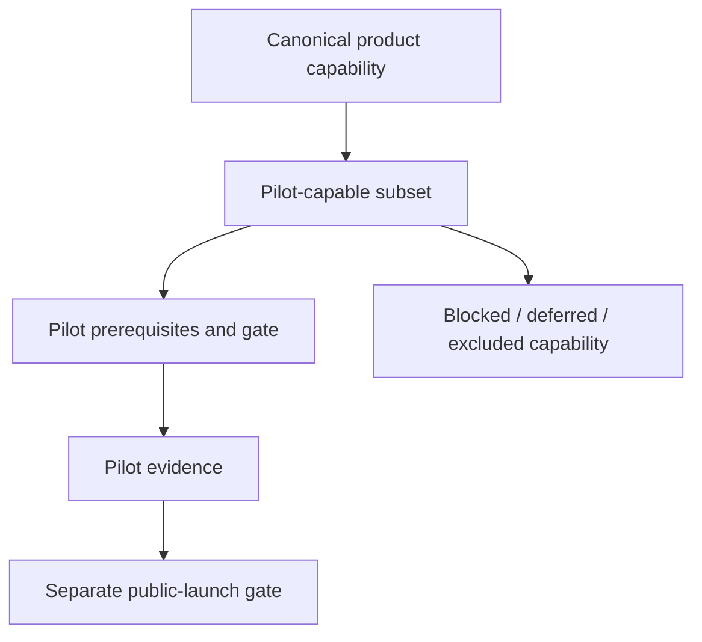
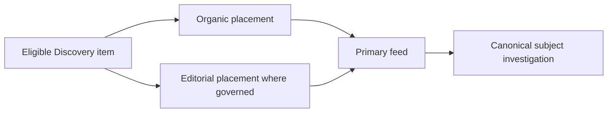
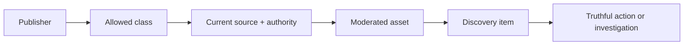
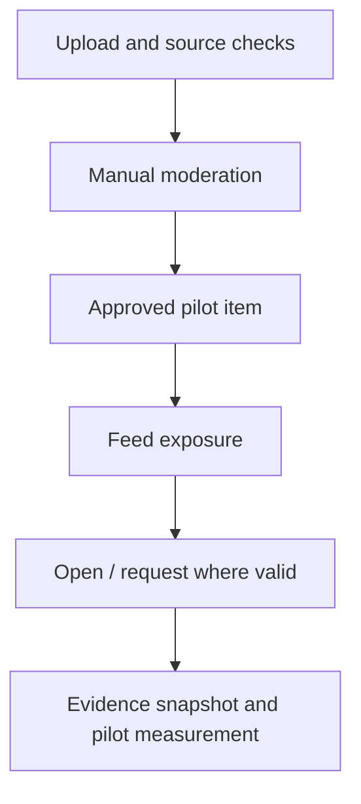
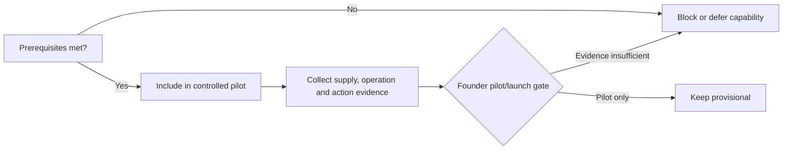
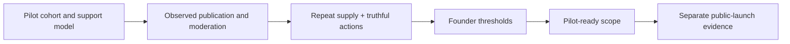

# Explore V1 Capability Boundary

| Field | Value |
| --- | --- |
| Status | Provisional V1 capability boundary — subject to pilot evidence and founder approval |
| Authorities | Documents 00–04 in this directory |
| Scope | Smallest coherent controlled-pilot capability set for the Property Media Network |
| Boundary | Not public-launch approval, implementation design, supply proof, or operating-scale commitment |

## 1. Purpose and authority

This document selects a pilot-capable subset of the canonical Explore proposition. It preserves the doctrine, taxonomy, Context Graph, journeys, and supply-validation evidence rules. Current code and audits may expose dependencies, but never define the target.

## 2. Status and decision rules

The pilot proposition is a hypothesis. It can validate a tested cohort and operating model; it cannot prove national supply, scalable moderation, or public-launch readiness. Founder approval is required for pilot and launch gates separately.

## 3. Scope and boundaries

This boundary distinguishes canonical capability, pilot subset, prerequisites, pilot readiness, public-launch readiness, blocked capability, deferred capability, and explicit exclusions. It creates no screen, table, route, payload, ranking weight, or commercial model.

## 4. Governing V1 principles

Video must lead into real context, accountable publishing, trustworthy actions, and evidence-limited attribution. The pilot must include moderation and authority invalidation, avoid unproven operating scale, regulated/sensitive content, sponsored dependence, consumer publishing, and interface-led concealment of missing capability.

## 5. Core pilot proposition

> Verified South African property professionals and organisations can publish useful video-first media connected to real listings, developments, unit types, locations and professional profiles, and viewers can move from discovery to truthful investigation or a valid request.

This is a `HYPOTHESIS`, not a public-launch promise.

**Initial Option A floor.** The provisional floor tests whether verified agents can publish governed listing walkthroughs linked to current canonical listings, and whether viewers can move from video discovery to truthful listing investigation and, where independently validated, a recipient-backed request. It does not validate developer or unit-type supply, location-media supply, editorial cold-start capacity, or the complete Property Media Network proposition.

## 6. Capability-status model

| Status | Meaning |
| --- | --- |
| `IN_PILOT_BOUNDARY` | Required for the controlled pilot. |
| `PILOT_PREREQUISITE` | Must be available or validated before a journey is tested. |
| `CONDITIONAL_PILOT` | Include only when source, publisher, recipient, and operations are proven. |
| `BLOCKED` | Needed for the proposition but not currently pilot-ready. |
| `DEFERRED` | Valuable later; not required for proof. |
| `EXCLUDED` | Intentionally outside the V1 direction. |

## 7. Readiness model

Capability status is separate from readiness: `CONCEPTUALLY_READY`, `REQUIRES_CURRENT_STATE_VALIDATION`, `REQUIRES_OPERATING_VALIDATION`, `REQUIRES_SUPPLY_VALIDATION`, `REQUIRES_FOUNDER_DECISION`, or `NOT_READY`.

## 8. Publisher boundary

| Publisher | Status/readiness | Allowed pilot classes and evidence |
| --- | --- | --- |
| Verified individual agent | `IN_PILOT_BOUNDARY` / `REQUIRES_CURRENT_STATE_VALIDATION`, `REQUIRES_OPERATING_VALIDATION`, `REQUIRES_SUPPLY_VALIDATION`, `REQUIRES_FOUNDER_DECISION` | Listing walkthrough; identity, professional profile, listing authority, moderation and source proof. Required by selected design, not operationally ready. |
| Authorised agency representative and verified agency organisation | `CONDITIONAL_PILOT` / `REQUIRES_CURRENT_STATE_VALIDATION`, `REQUIRES_OPERATING_VALIDATION`, `REQUIRES_SUPPLY_VALIDATION`, `REQUIRES_FOUNDER_DECISION` | Listing/area content only if the founder selects an organisation publisher; delegation and agency evidence required. |
| Verified developer organisation and representative | `CONDITIONAL_PILOT` / `REQUIRES_CURRENT_STATE_VALIDATION`, `REQUIRES_OPERATING_VALIDATION`, `REQUIRES_SUPPLY_VALIDATION` | Development overview/unit type; organisation/development authority and status evidence. |
| Tightly controlled Property Listify editorial | `CONDITIONAL_PILOT` / `REQUIRES_OPERATING_VALIDATION`, `REQUIRES_FOUNDER_DECISION` | Bounded suburb overview; editor, source checks and editorial container. |
| Approved creators; architects; contractors; services; finance/legal/tax/cost/valuation | `DEFERRED` or `BLOCKED` for regulated scope | No generic creator role; later authority, supply, specialist-review evidence required. |
| Ordinary consumers | `EXCLUDED` | No public publishing. |

## 9. Content-class boundary

| Class | Pilot decision, dependency and failure behaviour |
| --- | --- |
| `listing_walkthrough` | `IN_PILOT_BOUNDARY`: current `SRC_LISTING`, verified agent, authority, disclosure, freshness and moderation. Readiness: `REQUIRES_CURRENT_STATE_VALIDATION`, `REQUIRES_OPERATING_VALIDATION`, `REQUIRES_SUPPLY_VALIDATION`, `REQUIRES_FOUNDER_DECISION`. A recipient is not required to publish; remove unsupported lead CTAs while retaining `ACT_OPEN_LISTING`. |
| `development_overview` | `CONDITIONAL_PILOT`: developer authority, `SRC_DEVELOPMENT`, render/status disclosure, information recipient. Suppress/re-review on status change. |
| `unit_type_walkthrough` | `CONDITIONAL_PILOT`: development + current `SRC_UNIT_TYPE`, optional phase, model/render disclosure and recipient. Block if unit truth is unavailable. |
| `suburb_overview` | `CONDITIONAL_PILOT`: `SRC_LOCATION`, bounded editorial/verified viewpoint, governed source for market claims. No unsupported neutral-intelligence claim. |
| `area_agent_expertise` | `CONDITIONAL_PILOT`: professional profile + location, current affiliation and claim boundary; no default viewing request. |
| Listing teaser, rental tour, price/availability update, professional introduction | `DEFERRED` pending the same source/authority/recipient conditions plus tenancy or higher freshness risk. |

Each core candidate is conceptually ready but requires supply, technical, and operating validation. None enters merely because it is attractive.

## 10. Source-object boundary

| Source | Boundary and truth/journey |
| --- | --- |
| `SRC_LISTING`, `SRC_PROFESSIONAL_PROFILE` | `PILOT_PREREQUISITE`; Option A listing/source and agent authority context. |
| `SRC_ORGANISATION` | `CONDITIONAL_PILOT`; activated by agency publisher or affiliation surface. |
| `SRC_DEVELOPMENT`, `SRC_UNIT_TYPE`, `SRC_LOCATION`, `SRC_DEVELOPMENT_PHASE` | `CONDITIONAL_PILOT`; activated by Option B; phase only where unit scope needs it. |
| `SRC_EVENT_OCCURRENCE`, `SRC_MARKET_REPORT`, `SRC_SERVICE_CATEGORY`, `SRC_SERVICE_OFFERING`, `SRC_VERIFIED_PROJECT`, `SRC_PROPERTY_TOPIC`, `SRC_PROPERTY_TOOL` | `DEFERRED`; market report becomes conditional only if Option B suburb media makes governed market claims. |

## 11. Identity and authority boundary

The pilot preserves accountable publisher, publishing organisation, human operator, represented professional, credited creator, identity/organisation/affiliation verification, source authority, expiry, revocation, and audit history. Independent agent: agent is publisher/professional. Agency: agency is publisher, administrator operates, agent is professional. Developer: developer publishes, marketing user operates, authorised representative supports authority. Editorial: Property Listify editorial publishes, editor operates, recorded sources support the asset. These identities must not collapse.

## 12. Media capability boundary

`IN_PILOT_BOUNDARY`: completed-video upload, progress/failure recovery, processing/playable variant, poster, transcript/caption and accessibility metadata, orientation handling, rights attestation, draft/processing state, replacement, and synthetic-media disclosure. Publisher-uploaded completed videos only. Lightweight editing, advanced editing, music catalogue, livestreaming, AI media or voice generation are `DEFERRED` or `EXCLUDED`.

## 13. Publishing workflow boundary

Required: authenticated operator; publisher/class/source selection; represented-professional/creator attribution; authority confirmation; upload; caption/metadata/disclosures; rights attestation; submission; review; changes/approval; publication eligibility; freshness/re-review; withdrawal/suppression. Specialist contributor review is `CONDITIONAL_PILOT`; no workflow step may be skipped merely for pilot speed.

## 14. Moderation boundary

`PILOT_PREREQUISITE`: controlled manual review for identity/organisation, source/authority, class, rights, privacy, inventory/development claims, synthetic disclosure, caption/transcript, CTA validity, approval/changes/rejection, suppression/takedown, re-review, and authority expiry. Automation may assist; specialist and founder/policy escalation remain conditional. Measure manual burden; it is not launch-scale proof.

## 15. Discovery-item boundary

A governed item is `IN_PILOT_BOUNDARY`: eligible content asset; class; source references; publisher/professional; trust/disclosure/freshness/moderation state; valid actions; basic ranking inputs; placement context. One asset produces one Discovery item in the pilot—the narrowest safe rule. Multiple subject framings are deferred.

## 16. Surface boundary

One primary canonical feed is `IN_PILOT_BOUNDARY`. Supporting investigation surfaces are canonical listing, development, location, and professional views, only where functional. Shorts-style viewing and Home rail are `CONDITIONAL_PILOT` adaptations of the same items. Publisher profile, related-content, editorial collection are deferred; public Map is excluded. No parallel content system is permitted.

## 17. Placement boundary

`PLACE_ORGANIC` is required; tightly governed `PLACE_EDITORIAL` is conditional for editorial suburb supply. `PLACE_SPONSORED`, campaigns, billing, targeting, and sponsor reporting are `DEFERRED`; paid placement cannot be foundational.

## 18. Ranking boundary

Basic deterministic relevance may use class, source type, location relevance, freshness, moderation eligibility, and publisher/subject diversity; privacy-permitted interaction can be observed but need not rank. Opaque AI personalisation, collaborative filtering, weights, and pay-to-rank are deferred. Sophisticated recommendation is not product proof.

## 19. Consumer-action boundary

| Action | Pilot status; exact permitted pilot classes | Subject/destination, recipient/consent/freshness | Failure and attribution |
| --- | --- | --- | --- |
| `ACT_OPEN_LISTING` | `IN_PILOT_BOUNDARY`; `listing_walkthrough` | Current `SRC_LISTING`; no recipient; public actionability. | Remove CTA if unavailable; interaction. |
| `ACT_OPEN_DEVELOPMENT` | `CONDITIONAL_PILOT`; development overview/unit type | Current `SRC_DEVELOPMENT`; no recipient. | Remove CTA; interaction. |
| `ACT_COMPARE_UNIT_TYPES` | `CONDITIONAL_PILOT`; development overview/unit type | Current development/unit type; no recipient. | Remove CTA; interaction. |
| `ACT_OPEN_LOCATION` | `CONDITIONAL_PILOT`; suburb overview/area-agent expertise | Current `SRC_LOCATION`; no recipient. | Remove CTA; interaction. |
| `ACT_OPEN_PROFESSIONAL_PROFILE` | `CONDITIONAL_PILOT`; area-agent expertise | Verified current profile; no recipient. | Remove CTA; interaction. |
| `ACT_OPEN_ORGANISATION_PROFILE` | `CONDITIONAL_PILOT`; only classes taxonomy permits when surface exists | Verified organisation; no recipient. | Remove CTA; interaction. |
| `ACT_CONTACT_PROFESSIONAL` | `CONDITIONAL_PILOT`; listing walkthrough/area-agent expertise | Valid recipient, consent and form; current source. | Remove CTA; request only on successful submission. |
| `ACT_WHATSAPP_PROFESSIONAL` | `CONDITIONAL_PILOT`; same permitted classes as contact | Recipient opt-in and consent; current source. | Remove CTA; handoff interaction only absent downstream evidence. |
| `ACT_REQUEST_VIEWING` | `CONDITIONAL_PILOT`; listing walkthrough | Current actionable listing, recipient/workflow/consent. | Remove CTA; request attribution on submission. |
| `ACT_REQUEST_DEVELOPMENT_INFORMATION` | `CONDITIONAL_PILOT`; development overview/unit type | Current development, verified recipient/workflow/consent. | Remove CTA; request attribution on submission. |
| `ACT_SAVE_CONTENT` | `CONDITIONAL_PILOT`; listing walkthrough, conditional classes as taxonomy permits | Saveable asset; authenticated durable state/consent. | Do not promise persistence; engagement only. |
| `ACT_SAVE_SOURCE_OBJECT` | `CONDITIONAL_PILOT`; listing walkthrough; not suburb overview | Saveable current source; authenticated durable state/consent. | Do not promise persistence; engagement only. |
| `ACT_FOLLOW_PUBLISHER` | `CONDITIONAL_PILOT`; listing walkthrough and permitted classes | Eligible publisher; authenticated durable state/consent. | Do not promise persistence; engagement only. |
| `ACT_SHARE` | `CONDITIONAL_PILOT`; listing walkthrough and permitted classes | Rights/privacy policy; no recipient. | Fail safely; interaction only. |
| `ACT_CONTINUE_RELATED_CONTENT` | `CONDITIONAL_PILOT`; listing walkthrough and permitted classes | Eligible related item; no recipient. | Omit link; interaction. |

Content reporting, hide/unhide, and not-interested/preference reset are safety or engagement events, not `ACT_*` actions. Direct canonical-location saving remains a future taxonomy amendment; area-agent expertise does not gain organisation-profile opening merely through this boundary.

## 20. Contact and WhatsApp boundary

Contact form is `CONDITIONAL_PILOT` and only creates a request after successful submission. WhatsApp is also conditional: selection/application open is an interaction snapshot, not proof of a message, request, or lead. Include either channel only after recipient readiness and truthful measurement are validated; otherwise remove it.

## 21. Viewing and development-request boundary

Viewing/development-information requests are conditional. They require current actionable listing/development/unit context, accountable recipient, request record, downstream handoff, acknowledgement, duplicate handling, source-change response, and request attribution. Agency/listing/developer engines retain work-item ownership; scheduling is not designed here.

## 22. Engagement boundary

Required: impression, view start, qualified view, progress/completion, open source/profile, report, and evidence-safe share. Conditional: save/unsave, follow/unfollow, replay, hide/unhide, not-interested/reset. Like/unlike is deferred. This is not a social-network requirement.

## 23. Viewer identity and privacy boundary

Anonymous/guest viewing is permitted where policy allows. Authentication is required for durable save/follow and request behaviour. Guest sessions require consent and certainty; guest-to-authenticated reconciliation and cross-device identity are deferred. Reporting privacy is required.

## 24. Attribution boundary

Interaction, request/lead, and business-outcome attribution remain distinct. Snapshot for attributable actions captures session certainty, placement, item, asset, publisher/organisation/professional, sources/effective version, displayed price/availability where relevant, disclosures, CTA, and time. Views/saves/follows do not create leads; requests do not prove outcomes; outcome evidence is downstream; revenue attribution is excluded.

## 25. Publisher analytics boundary

Pilot reporting is limited to published assets, impressions, qualified views/completion, opens, saves/follows where enabled, contact selections, evidenced submitted requests/lead creation, and freshness/moderation notices. No earnings, benchmarks, competitor intelligence, or claims that WhatsApp messages/outcomes occurred.

## 26. Freshness and invalidation boundary

Withdrawal/sale, rental/price/status/unit changes, affiliation/credential expiry, authority revocation, suspension, correction, and disclosure change must suppress items, expire placements, remove CTAs, trigger re-review/notification, and preserve historical records. Events are conditional only if included.

## 27. Notification boundary

Required conceptual notifications: processing failure, changes requested, approval/rejection, authority/source change, suppression, request acknowledgement, recipient failure, and report/takedown outcome where appropriate. Channels/templates are deferred.

## 28. Operating-model boundary

Pilot operations require onboarding, verification/authority review, moderation, support, correction/re-review, report/takedown handling, recipient-path assessment under `REQUIRES_CURRENT_STATE_VALIDATION`, and measurement. Manual operations are acceptable only when measured. Automation needed before public launch is determined by pilot evidence; specialist review and founder escalation remain explicit dependencies.

## 29. Evidence-collection boundary

Collect only decision-relevant evidence: recruitment denominator; onboarding/verification; first/second/third publication; support and production model; moderation burden; source accuracy/staleness; action/recipient validity; requests, withdrawal, platform failure, investigation, and non-listing-media demand. Do not add vanity analytics.

## 30. Pilot-readiness gate

Before pilot: controlled cohort identified; minimum sources and authority paths available; completed upload functional; manual moderation staffed; one primary feed functional; subject-opening actions working; request CTAs either functioning or absent; snapshots, report/suppression, support owner, and measurement plan available. Founder threshold placeholders must be approved before recruitment.

## 31. Public-launch-readiness gate

Beyond pilot: repeat publishing, acceptable support/moderation burden, sustainable verification, freshness, useful supply, concentration/geographic coverage, action and recipient reliability, takedown operability, viewer investigation value, privacy/legal review, and founder-approved launch thresholds. One successful asset or manual-review cohort is insufficient.

## 32. Capability decision matrix

| Capability | Product necessity | Pilot status | Readiness | Evidence domain | Dependency | Failure if absent | Pilot decision | Public-launch implication |
| --- | --- | --- | --- | --- | --- | --- | --- | --- |
| Accountable publisher identity | Required | `IN_PILOT_BOUNDARY` | `REQUIRES_CURRENT_STATE_VALIDATION` | `TECHNICAL_READINESS` | Agent | No accountable asset | Required | Prerequisite |
| Publishing organisation identity | Conditional | `CONDITIONAL_PILOT` | `REQUIRES_FOUNDER_DECISION` | `FOUNDER_DECISION` | Agency option | No agency publisher | Defer A | Later scale |
| Human operator | Required | `IN_PILOT_BOUNDARY` | `REQUIRES_CURRENT_STATE_VALIDATION` | `TECHNICAL_READINESS` | Authentication | No submission | Required | Prerequisite |
| Represented professional | Required | `IN_PILOT_BOUNDARY` | `REQUIRES_OPERATING_VALIDATION` | `OPERATING_CAPACITY` | Profile | Unsupported claim | Required | Prerequisite |
| Authority evidence | Required | `PILOT_PREREQUISITE` | `REQUIRES_OPERATING_VALIDATION` | `OPERATING_CAPACITY` | Review | Block asset | Required | Sustainable later |
| Source linkage | Required | `PILOT_PREREQUISITE` | `REQUIRES_CURRENT_STATE_VALIDATION` | `TECHNICAL_READINESS` | Listing | No investigation | Required | Prerequisite |
| Completed-video upload | Required | `IN_PILOT_BOUNDARY` | `REQUIRES_CURRENT_STATE_VALIDATION` | `TECHNICAL_READINESS` | Processing | No supply test | Required | Reliability |
| Media processing | Required | `PILOT_PREREQUISITE` | `REQUIRES_CURRENT_STATE_VALIDATION` | `TECHNICAL_READINESS` | Variants | Suppress asset | Required | Reliability |
| Manual moderation | Required | `PILOT_PREREQUISITE` | `REQUIRES_OPERATING_VALIDATION` | `OPERATING_CAPACITY` | Reviewer | No pilot publication | Required | Scale evidence |
| Listing media | Required | `IN_PILOT_BOUNDARY` | `REQUIRES_SUPPLY_VALIDATION` | `MARKET_SUPPLY` | Agent/listing | No A floor | Required | Repeat evidence |
| Development media | Broader proof | `CONDITIONAL_PILOT` | `REQUIRES_CURRENT_STATE_VALIDATION` | `TECHNICAL_READINESS` | Development | Defer B | Gated | Later |
| Unit-type media | Broader proof | `CONDITIONAL_PILOT` | `REQUIRES_CURRENT_STATE_VALIDATION` | `TECHNICAL_READINESS` | Unit type | Defer B | Gated | Later |
| Location media | Broader proof | `CONDITIONAL_PILOT` | `REQUIRES_OPERATING_VALIDATION` | `OPERATING_CAPACITY` | Source/editorial | Defer B/C | Gated | Coverage |
| Professional media | Broader proof | `CONDITIONAL_PILOT` | `REQUIRES_SUPPLY_VALIDATION` | `PUBLISHER_BEHAVIOUR` | Affiliation | Defer B | Gated | Profile evidence |
| Discovery item | Required | `IN_PILOT_BOUNDARY` | `CONCEPTUALLY_READY` | `PRODUCT_AUTHORITY` | Eligible asset | No distribution | Required | Canonical |
| Primary feed | Required | `IN_PILOT_BOUNDARY` | `REQUIRES_CURRENT_STATE_VALIDATION` | `TECHNICAL_READINESS` | Surface | No discovery | Required | Canonical |
| Supporting subject surfaces | Required | `PILOT_PREREQUISITE` | `REQUIRES_CURRENT_STATE_VALIDATION` | `TECHNICAL_READINESS` | Listing page | No investigation | Required A | Expand later |
| Contact | Optional request | `CONDITIONAL_PILOT` | `REQUIRES_CURRENT_STATE_VALIDATION` | `TECHNICAL_READINESS` | Recipient | Remove CTA | Gated | Response proof |
| WhatsApp | Optional request | `CONDITIONAL_PILOT` | `REQUIRES_CURRENT_STATE_VALIDATION` | `LEGAL_REGULATORY` | Consent/evidence | Interaction only | Gated | No overclaim |
| Viewing request | Optional request | `CONDITIONAL_PILOT` | `REQUIRES_OPERATING_VALIDATION` | `OPERATING_CAPACITY` | Workflow | Remove CTA | Gated | Routing proof |
| Development-information request | B only | `CONDITIONAL_PILOT` | `NOT_READY` | `TECHNICAL_READINESS` | Recipient | Remove CTA | B only | Routing proof |
| Save/follow | Optional learning | `CONDITIONAL_PILOT` | `REQUIRES_FOUNDER_DECISION` | `LEGAL_REGULATORY` | Consent | No state | Gated | Privacy |
| Reporting and suppression | Required | `IN_PILOT_BOUNDARY` | `REQUIRES_OPERATING_VALIDATION` | `OPERATING_CAPACITY` | Safety owner | Unsafe pilot | Required | Takedown proof |
| Attribution and context snapshots | Required | `PILOT_PREREQUISITE` | `REQUIRES_CURRENT_STATE_VALIDATION` | `TECHNICAL_READINESS` | Snapshot | No evidence | Required | Limits retained |
| Publisher analytics | Useful | `CONDITIONAL_PILOT` | `REQUIRES_CURRENT_STATE_VALIDATION` | `TECHNICAL_READINESS` | Events | Limit reports | Basic | No overclaim |
| Organic placement | Required | `IN_PILOT_BOUNDARY` | `CONCEPTUALLY_READY` | `PRODUCT_AUTHORITY` | Eligibility | No feed | Required | Canonical |
| Editorial placement | Conditional | `CONDITIONAL_PILOT` | `REQUIRES_FOUNDER_DECISION` | `FOUNDER_DECISION` | Editorial role | Defer C | Gated | Cold start |
| Sponsored placement | Not needed | `DEFERRED` | `NOT_READY` | `FOUNDER_DECISION` | Commercial policy | None | Exclude | Later |
| Approved-creator publishing | Not needed | `DEFERRED` | `REQUIRES_SUPPLY_VALIDATION` | `MARKET_SUPPLY` | Approval | None | Later | Later |
| Service-provider publishing | Not needed | `DEFERRED` | `NOT_READY` | `LEGAL_REGULATORY` | Credentials | None | Later | Later |
| Livestreaming | Not needed | `EXCLUDED` | `NOT_READY` | `OPERATING_CAPACITY` | Live safety | None | Exclude | Not V1 |
| Advanced recommendation | Not needed | `DEFERRED` | `NOT_READY` | `TECHNICAL_READINESS` | Ranking | Basic order | Defer | Later |

## 33. V1 package options

| Option | Demonstration and conditions | Blind spot/risk |
| --- | --- | --- |
| A. Listing-led pilot | Verified individual agent, `listing_walkthrough`, `SRC_LISTING`/`SRC_PROFESSIONAL_PROFILE`, completed video, moderation, primary feed and `ACT_OPEN_LISTING`; requests only if independently ready. | Does not prove agencies, development/location network, or recipient conversion. |
| B. Property-network proof pilot | A plus agency/developer/conditional source activation for development, unit, suburb and agent expertise; each source/action must validate. | Highest source/moderation/supply dependency. |
| C. Controlled editorial-supported pilot | B plus founder-approved measured editorial suburb supply. | Editorial assistance may mask organic supply. |

## 34. Provisional recommendation

Recommend **Option A as the initial pilot-capable floor**, with deliberately gated additions from Option B only after their source, recipient, moderation, and publisher evidence passes. Option C is a founder decision where cold-start evidence justifies measured editorial support. This is a `REQUIRES_FOUNDER_DECISION`, not a launch recommendation.

## 35. Explicit exclusions

Open consumer publishing; public livestreaming; music catalogue; creator/referral payouts; self-service sponsored campaigns; paid ranking; sensitive documentaries; broad finance/legal and automated valuation publishing; public Map; advanced cross-device identity; full service marketplace; advanced AI recommendation; and general social posting are excluded from the pilot foundation.

## 36. Blocked dependencies

| Dependency | Affected capability | Evidence domain | Accountable owner | Validation action | Effect on Option A pilot | Effect on Option B/C | Effect on public launch |
| --- | --- | --- | --- | --- | --- | --- | --- |
| Minimum listing-source path | Listing investigation | `TECHNICAL_READINESS` | Engineering | Validate current public listing | Blocks A | Blocks B/C listing | Blocks launch |
| Agent identity/professional profile | Publisher | `TECHNICAL_READINESS` | Product/engineering | Validate profile path | Blocks A | Blocks agent media | Blocks launch |
| Listing authority evidence | Publication | `OPERATING_CAPACITY` | Operations | Manual evidence review | Blocks A | Blocks listing classes | Blocks launch |
| Manual moderation path | Publication | `OPERATING_CAPACITY` | Operations | Staff/measure review | Blocks A | Blocks all | Blocks launch |
| Publisher supply | Listing media | `MARKET_SUPPLY` | Founder/market | Recruit/observe repeat | Blocks cohort | Blocks expansion | Blocks launch |
| Listing opening | Investigation | `TECHNICAL_READINESS` | Engineering | Verify action | Blocks proof | Affects related | Blocks launch |
| Contact routing | Contact CTA | `TECHNICAL_READINESS` | Owner | Verify recipient | Remove CTA | Remove CTA | Blocks action coverage |
| Viewing-request routing | Viewing CTA | `OPERATING_CAPACITY` | Lead owner | Verify workflow | Remove CTA | Remove CTA | Blocks action coverage |
| WhatsApp evidence | WhatsApp CTA | `LEGAL_REGULATORY` | Product | Verify consent/evidence | Interaction only | Interaction only | No message claim |
| Agency delegation | Agency publisher | `OPERATING_CAPACITY` | Agency | Verify delegation | Not needed A | Blocks agency option | Scale dependency |
| Development source readiness | Development media | `TECHNICAL_READINESS` | Domain owner | Validate source | Not needed A | Blocks B | Expansion dependency |
| Unit-type source readiness | Unit media | `TECHNICAL_READINESS` | Domain owner | Validate unit truth | Not needed A | Blocks B | Expansion dependency |
| Location-content source model | Location media | `OPERATING_CAPACITY` | Editorial/product | Validate source policy | Not needed A | Blocks B/C | Coverage dependency |
| Professional affiliation | Agent expertise | `OPERATING_CAPACITY` | Operations | Validate expiry | Not needed A | Blocks B | Trust dependency |
| Guest persistence/privacy | Save/follow | `LEGAL_REGULATORY` | Founder/product | Approve policy | Optional off | Optional off | Privacy gate |
| Historical context snapshots | Attribution | `TECHNICAL_READINESS` | Engineering | Validate snapshots | Blocks evidence | Blocks evidence | Attribution limit |
| Report/suppression path | Safety | `OPERATING_CAPACITY` | Operations | Test handling | Blocks A | Blocks all | Blocks launch |
| Pilot thresholds | Pilot decision | `FOUNDER_DECISION` | Founder | Approve gate | Blocks start | Blocks start | Inputs launch |
| Public-launch thresholds | Launch decision | `FOUNDER_DECISION` | Founder | Approve gate | No effect | No effect | Blocks launch |

## 37. Founder decisions

Pilot option; publisher/geography/class mix; editorial cold start; direct location saving; contact/WhatsApp emphasis; viewing/development requests; manual moderation; accepted authority evidence; guest persistence; pilot/public-launch thresholds; and public-launch surface mix require founder decision.

## 38. Canonical invariants

1. No capability enters the pilot merely because it exists in current code.
2. No content class enters without a valid publisher, source, moderation path and action boundary.
3. No CTA appears without a functioning destination.
4. No WhatsApp click is treated as a message or lead.
5. No save, follow or open becomes a lead.
6. No request is treated as a business outcome.
7. No source truth is owned by uploaded media.
8. No publisher role bypasses authority evidence.
9. No manual pilot success is treated as proof of launch-scale operations.
10. No first publication is treated as proof of repeat supply.
11. No pilot cohort is generalised beyond its tested segment and support model.
12. No public launch is approved without founder thresholds.
13. No sponsored or paid capability bypasses trust or moderation.
14. No current implementation limitation weakens the canonical target.
15. No Document 06 remediation silently expands the approved V1 boundary.

## 39. Non-negotiable instructions for current-state remediation

Document 06 may close pilot prerequisites incrementally, but may not add classes, publishers, actions, placements, or commercial capability outside this boundary without an approved canonical amendment. It must distinguish current evidence from target state and preserve source, authority, moderation, privacy, and attribution boundaries.

## 40. Relationship to Document 06

`06-explore-current-state-and-remediation.md` maps this provisional boundary to current technical and operating evidence, identifies missing pilot prerequisites, and proposes verified increments. It cannot represent this boundary as public-launch readiness or validated supply.

