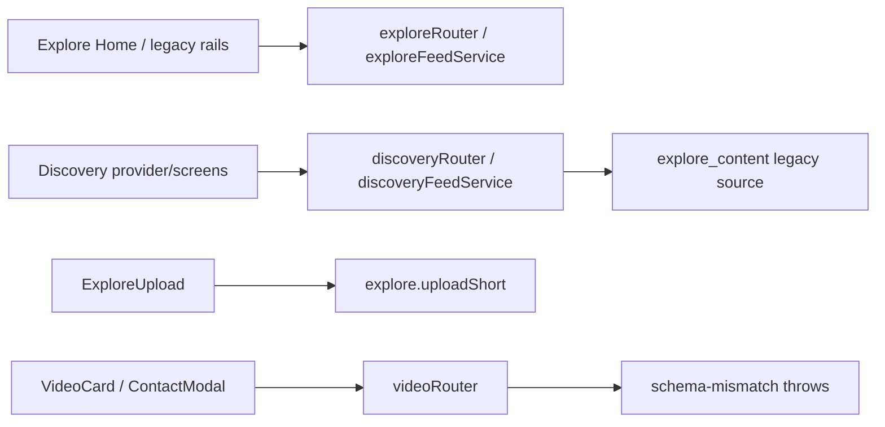
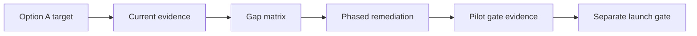
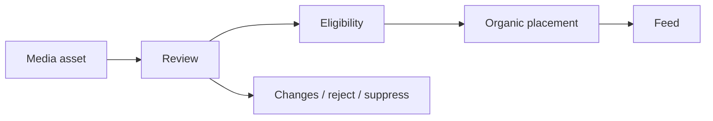
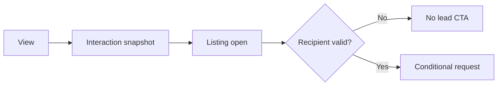
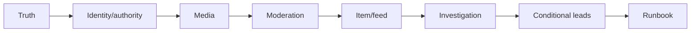
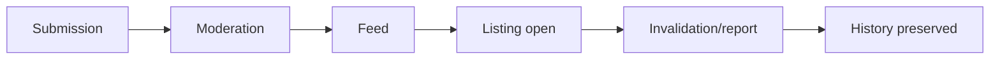
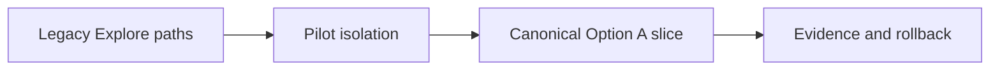
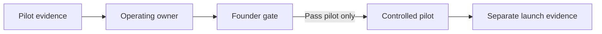
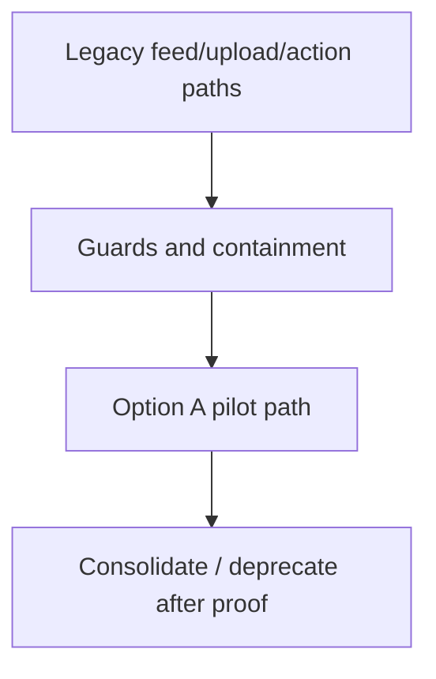

# Explore Current-State and Remediation Map

| Field | Value |
| --- | --- |
| Status | Current-state evidence and provisional remediation map — subject to implementation verification and founder approval |
| Target | Document 05 Option A listing-led pilot floor |
| Boundary | Repository assessment and remediation sequence; not pilot or launch approval |

## 1. Purpose and authority

This map compares repository evidence with the approved Option A floor. Documents 00–05 govern target meaning; code, routes, tables, tests, UI, and historical audits are evidence only.

## 2. Status and evidence rules

Statuses: `PROVEN_CURRENT`, `PRESENT_UNVERIFIED`, `PARTIAL`, `FRAGMENTED`, `MISALIGNED`, `UNSAFE`, `MISSING`, `DEFERRED_BY_BOUNDARY`, `UNKNOWN`. Domains: `PRODUCT_AUTHORITY`, `MARKET_SUPPLY`, `PUBLISHER_BEHAVIOUR`, `TECHNICAL_READINESS`, `OPERATING_CAPACITY`, `LEGAL_REGULATORY`, `FOUNDER_DECISION`. Static code is not executed proof.

## 3. Scope and boundaries

Assessment covers Option A only: verified agent, listing walkthrough, canonical listing/profile, authority, completed video, controlled moderation, primary feed, listing open, engagement/snapshot, report/suppression, freshness and pilot evidence. Contact, WhatsApp, and viewing are conditional CTAs.

## 4. Approved Option A target

The fixed target is the 18-step Option A path in Document 05. A current listing, accountable verified agent, authority, governed media and Discovery item, moderation, one feed, and `ACT_OPEN_LISTING` are minimum. Recipient absence removes lead CTAs, not listing investigation.

## 5. Assessment methodology

Findings use static code, contract/test, executed-test, historical-audit, or operating evidence. Each finding records path, observed behaviour, status/domain, confidence, target gap, risk, and consequence. No successful runtime was fabricated.

## 6. Evidence hierarchy

Executed acceptance > persisted/contract test > static code > historical audit > operating assertion. Historical documents are time-bounded: `docs/EXPLORE_ENGINE_AUDIT_2026-03-19.md` found fragmentation/miswired actions; `docs/DISCOVERY_ENGINE_MVP_READINESS_2026-07-10.md` records a Discovery listing/detail/enquiry path, not Explore readiness.

## 7. Repository investigation scope

Inspected tracked Explore/Discovery pages, routers, services, schemas, upload/video code, engagement/analytics, and relevant tests returned by repository search. Runtime database, S3, and production operations remain `UNKNOWN`.

## 8. Historical evidence reviewed

The March document is a historical audit (2026-03-19) that reported fragmentation and miswired actions at that date; its current-state status is `UNKNOWN` until revalidated. The July document is historical executed-readiness evidence (2026-07-10) for Discovery listing/search/detail/enquiry; current Explore readiness is `UNKNOWN` until revalidated. Neither document provides publisher-supply or operating-capacity evidence.

## 9. Current subsystem landscape

Static evidence shows a newer Discovery layer alongside active `explore`, `video`, upload, analytics and legacy source paths: `FRAGMENTED` / `TECHNICAL_READINESS`.

## 10. Route and surface map

Static route evidence does not demonstrate that a route is reachable or successful. `MISSING` rows record the search scope used, rather than inventing a route.

| Surface ID | User-facing route or route family | Repository-relative path | Owning component | Data source or backend procedure | Static evidence | Executed evidence | Current-state status | Option A relevance | Duplicate or competing path | Remediation direction | Next verification |
| --- | --- | --- | --- | --- | --- | --- | --- | --- | --- | --- | --- |
| RS-01 | Discovery primary feed | `client/src/domains/discovery/screens/DiscoveryFeedScreen.tsx` | `DiscoveryFeedScreen` | `trpc.discovery.getFeed` | provider query call | None | `PARTIAL` | Primary candidate | Explore feed/Home | Consolidate behind governed item source | Browser and persisted feed test |
| RS-02 | Discovery Shorts | `client/src/domains/discovery/screens/DiscoveryShortsScreen.tsx` | `DiscoveryShortsScreen` | `DiscoveryFeedProvider` | screen consumes provider | None | `FRAGMENTED` | Not required | primary feed | Remove from initial pilot path | Confirm isolation |
| RS-03 | Explore Home | `client/src/pages/ExploreHome.tsx` | `ExploreHome` | legacy Explore hooks | static page | None | `FRAGMENTED` | Excluded | Discovery feed | Remove from pilot path | Route ownership review |
| RS-04 | Legacy Explore feed | `client/src/pages/ExploreFeed.tsx` | `ExploreFeed` | legacy Explore APIs | static page | None | `FRAGMENTED` | Excluded | Discovery feed | Isolate/deprecate decision | Compatibility test |
| RS-05 | Upload/publishing | `client/src/pages/ExploreUpload.tsx` | `ExploreUpload` | `trpc.explore.uploadShort` | mutation use | None | `UNSAFE` | Required primitive only | video/upload routes | Replace immediate publication semantics | Submission lifecycle acceptance |
| RS-06 | Listing-detail destination | `client/src/pages/ListingTemplate.tsx` | `ListingTemplate` | listing router/data | static listing page | Historical audit only | `PRESENT_UNVERIFIED` | Required `ACT_OPEN_LISTING` destination | legacy listing pages | Reuse with guards | Current browser acceptance |
| RS-07 | Listing media section | `client/src/components/media/VideoThumbnailGrid.tsx` | `VideoThumbnailGrid` | media props | static component | None | `PRESENT_UNVERIFIED` | Supporting only | Explore cards | Reuse only after listing-source proof | Listing-media integration test |
| RS-08 | Development media surface | `client/src/components/developer/DeveloperBrandProfile.tsx` | `DeveloperBrandProfile` | developer profile data | static component | None | `DEFERRED_BY_BOUNDARY` | Option B only | development pages | Keep outside pilot | Reassess for Option B |
| RS-09 | Location media surface | `client/src/pages/ExploreMap.tsx` | `ExploreMap` | map/feed state | static page | None | `DEFERRED_BY_BOUNDARY` | Option B/C only | Map preview | Keep outside pilot | Founder option decision |
| RS-10 | Professional/creator profile | `client/src/pages/AgentPublicProfile.tsx` | `AgentPublicProfile` | agent/profile query | static page | None | `PRESENT_UNVERIFIED` | Profile source prerequisite | Partner profile | Validate profile identity | Current profile acceptance |
| RS-11 | Publisher profile | `client/src/pages/PartnerProfile.tsx` | `PartnerProfile` | partner data | static page | None | `DEFERRED_BY_BOUNDARY` | Agency expansion only | agent profile | Do not use as agent publisher proof | Agency-option validation |
| RS-12 | Explore moderation/admin | `client/src/pages/admin/DiscoveryOpsPage.tsx` | `DiscoveryOpsPage` | operations data | static page only | None | `MISSING` | Required controlled path | listing oversight | Build pilot queue; screen alone is not evidence | Queue/reviewer acceptance |
| RS-13 | Reports/takedown surface | `client/src/components/explore/ContactAgentModal.tsx` and `client/src/pages/admin/DiscoveryOpsPage.tsx` | search scope | no report procedure found | `rg` under `client/src`, `server` | None | `MISSING` | Required | generic admin pages | Build report/suppression path | Report scenario |
| RS-14 | Analytics | `client/src/pages/agent/ExploreAnalytics.tsx` | `ExploreAnalytics` | Explore analytics router | static page | None | `PRESENT_UNVERIFIED` | Pilot evidence only | admin analytics | Reuse with evidence limits | Permission/metric test |
| RS-15 | Map | `client/src/pages/ExploreMap.tsx` | `ExploreMap` | map feed sync | static page | None | `DEFERRED_BY_BOUNDARY` | Excluded | location surfaces | Isolate | Confirm no pilot entry |
| RS-16 | Related content | `client/src/components/explore-discovery/TrendingVideosSection.tsx` | `TrendingVideosSection` | local/discovery content props | static component | None | `DEFERRED_BY_BOUNDARY` | Not needed for floor | Home/Shorts | Keep outside pilot | Later governed-item test |

## 11. Backend procedure and service map

| Backend ID | Repository-relative path | Symbol, procedure or service | Authentication assumption | Current input/source model | Current output or mutation | Canonical concept approximated | Identity and authority handling | Action or trust risk | Evidence type | Executed evidence | Current-state status | Reuse decision | Required verification |
| --- | --- | --- | --- | --- | --- | --- | --- | --- | --- | --- | --- | --- | --- |
| BE-01 | `server/domains/discovery/router.ts` | `getFeed` | public | discovery query | feed response | feed contract | none shown | source eligibility external | static code | None | `PARTIAL` | `REUSE_WITH_GUARDS` | approved-only query |
| BE-02 | `server/domains/discovery/services/discoveryFeedService.ts` | `getDiscoveryFeed` | service | query + legacy adapter | normalized feed | Discovery assembly | none | legacy data provenance | static code | service tests, not current execution | `PARTIAL` | `CONSOLIDATE` | governed-item contract |
| BE-03 | `server/domains/discovery/services/discoveryLegacyFeedSource.ts` | legacy source | service | `exploreContent.isActive` | legacy candidates | feed-source adapter | none | active is not moderation | static code | unit test only | `MISALIGNED` | `REMOVE_FROM_PILOT_PATH` | source replacement |
| BE-04 | `server/domains/discovery/router.ts` | `engage` | public | client event | engagement write | interaction event | session supplied/derived | public event semantics | static code | None | `PARTIAL` | `REPLACE` | idempotent consent-aware event test |
| BE-05 | `server/domains/discovery/services/discoveryEngagementService.ts` | `recordEngagement` | service | action/session | persisted interaction | engagement | device default `mobile` | fabricated device context | static code | unit test only | `MISALIGNED` | `REPLACE` | session/device proof |
| BE-06 | `server/exploreRouter.ts` | `uploadShort` | protected | upload metadata | active explore content | upload/publication | role-derived creator | immediate public eligibility | static code | None | `UNSAFE` | `REPLACE` | draft/review lifecycle |
| BE-07 | `server/exploreVideoUploadRouter.ts` | upload/signing procedures | protected | media input | upload/process response | media primitive | no publisher authority shown | ungoverned reuse | static code | None | `PRESENT_UNVERIFIED` | `REUSE_WITH_GUARDS` | upload/process execution |
| BE-08 | `server/services/videoProcessingService.ts` | processing service | service | uploaded media | processing state/output | transcoding | no moderated lifecycle | output not eligibility | static code | None | `PRESENT_UNVERIFIED` | `REUSE_WITH_GUARDS` | playable-variant evidence |
| BE-09 | `server/exploreRouter.ts` | `recordInteraction` | public/protected mix | content + timestamp session | interaction record | interaction attribution | `session-${Date.now()}` | false identity certainty | static code | None | `UNSAFE` | `REPLACE` | durable-session test |
| BE-10 | `server/services/exploreInteractionService.ts` | interaction service | service | user/content/action | analytics interaction | engagement | `user-${userId}`, mobile default | collapsed identity/device | static code | None | `MISALIGNED` | `REPLACE` | persisted context test |
| BE-11 | `server/exploreRouter.ts` | `saveProperty` | protected | property id | saved state | legacy save | property only | not content/source taxonomy action | static code | None | `MISALIGNED` | `DEFER_DECISION` | durable semantics |
| BE-12 | `server/videoRouter.ts` | `contactAgent` | public | contact fields | throws schema mismatch | contact request | no verified recipient | CTA cannot succeed | static code | None | `UNSAFE` | `REMOVE_FROM_PILOT_PATH` | recipient/request test |
| BE-13 | `server/videoRouter.ts` | viewing/request search scope | n/a | `rg` in `server/{videoRouter,exploreRouter,domains}` | no Explore procedure found | viewing request | absent | no truthful request path | static search | None | `MISSING` | `DEFER_DECISION` | downstream ownership validation |
| BE-14 | `server/exploreRouter.ts` and `server/domains/discovery/router.ts` | moderation search scope | n/a | `rg` procedures | no review procedure found | moderation | absent | unreviewed publication | static search | None | `MISSING` | `REPLACE` | manual queue test |
| BE-15 | `server/exploreRouter.ts` and `server/domains/discovery/router.ts` | report/takedown search scope | n/a | `rg` procedures | no Explore safety mutation found | report/suppression | absent | no safety response | static search | None | `MISSING` | `REPLACE` | report/takedown scenario |
| BE-16 | `server/exploreAnalyticsRouter.ts` | analytics/recompute procedures | protected | interaction aggregates | metrics/recompute | pilot analytics | not publisher/outcome proof | overclaiming risk | static code | None | `PRESENT_UNVERIFIED` | `REUSE_WITH_GUARDS` | permission and metric test |

## 12. Data-model map

| Data ID | Repository-relative path | Table or persisted record | Apparent current purpose | Canonical concept approximated | Concepts currently collapsed | Canonical concepts missing | Current writers | Current readers | Evidence type | Current-state status | Compatibility concern | Future design consequence |
| --- | --- | --- | --- | --- | --- | --- | --- | --- | --- | --- | --- | --- |
| DM-01 | `drizzle/schema/explore.ts` | `exploreContent` | published Explore record | content asset/post | asset, class, publication | governed asset | `exploreRouter.uploadShort` | legacy feed | static schema | `MISALIGNED` | active means publish | separate concept later |
| DM-02 | `drizzle/schema/explore.ts` | `exploreContent` | Explore post | Discovery item candidate | post and eligibility | Discovery item | upload router | legacy adapter | static schema | `MISALIGNED` | no moderation/placement | do not reuse as canonical |
| DM-03 | `drizzle/schema/explore.ts` | `exploreContent.creatorType` | creator label | creator identity | creator/publisher/professional | accountable publisher | upload router | feed | static schema | `FRAGMENTED` | inferred role | explicit identities later |
| DM-04 | `drizzle/schema/explore.ts` | no publisher record | n/a | accountable publisher | absent | publisher identity | none found | none found | static search | `MISSING` | cannot prove accountability | design required later |
| DM-05 | `drizzle/schema/agencies.ts` | agency records | organisation data | organisation | organisation/publisher relation absent | channel authority | agency routers | profile pages | static schema | `PARTIAL` | no publishing relation | validate affiliation path |
| DM-06 | `drizzle/schema/core.ts` | users | authenticated user | human operator | operator/publisher inferred | operator audit | auth flows | routers | static schema | `PARTIAL` | identity not publication authority | retain auth separately |
| DM-07 | `drizzle/schema/agencies.ts` | agent records | agent profile data | represented professional | profile/authority not linked | represented professional in publication | agency paths | profile pages | static schema | `PRESENT_UNVERIFIED` | source-specific scope absent | validate profile |
| DM-08 | `drizzle/schema/explore.ts` | `referenceType`/`referenceId` | polymorphic reference | source-object link | subject/type/authority | canonical source relation | upload router | legacy feed | static schema | `PARTIAL` | copied/generic linkage | governed linkage later |
| DM-09 | `drizzle/schema/listings.ts` | listing records | listing truth | `SRC_LISTING` | listing truth separate from media | publication authority link | listing router | listing pages | static schema | `PRESENT_UNVERIFIED` | no Explore validation shown | reuse listing authority |
| DM-10 | `drizzle/schema/developments.ts` | development records | development truth | development source | not Option A | governed publication relation | development routers | developer pages | static schema | `DEFERRED_BY_BOUNDARY` | Option B only | defer |
| DM-11 | `drizzle/schema/explore.ts` | `exploreEngagements` | event storage | engagement event | action/session/device context | qualified view/snapshot | engagement services | analytics | static schema | `PARTIAL` | session semantics unsafe | replace event context |
| DM-12 | `drizzle/schema/explore.ts` | likes fields/records search | like state | like | reaction/event unclear | governed like state | legacy routers | legacy UI | static search | `UNKNOWN` | not pilot requirement | defer |
| DM-13 | `drizzle/schema/explore.ts` | saved-property search | save-content state | save source | property/content conflated | content vs source save | `exploreRouter.saveProperty` | legacy UI | static code | `MISALIGNED` | taxonomy mismatch | defer until durable |
| DM-14 | `drizzle/schema/explore.ts` | no source-save record found | n/a | save-source state | absent | `ACT_SAVE_SOURCE_OBJECT` | none found | none found | static search | `MISSING` | conditional action unavailable | defer |
| DM-15 | `drizzle/schema/explore.ts` | follow search | follow state | follow publisher | absent/unclear | organisation/individual decision | no credible writer | no credible reader | static search | `UNKNOWN` | policy unresolved | defer |
| DM-16 | `drizzle/schema/explore.ts` | no report record found | n/a | report | absent | safety record | none found | none found | static search | `MISSING` | no safety route | pilot build later |
| DM-17 | `drizzle/schema/explore.ts` | no moderation decision record found | n/a | moderation decision | absent | decision/audit/reviewer | none found | none found | static search | `MISSING` | approval cannot be proven | pilot build later |
| DM-18 | `drizzle/schema/explore.ts` | no placement record found | n/a | placement | absent | organic/editorial placement | none found | feed services | static search | `MISSING` | feed cannot prove context | governed item later |
| DM-19 | `drizzle/schema/explore.ts` | no contact/request record found | n/a | request | absent | request/recipient | `videoRouter` throws | none found | static search | `MISSING` | CTA unsafe | conditional only |
| DM-20 | `drizzle/schema/listings.ts` | viewing request search scope | n/a | viewing request | downstream unknown | Explore request linkage | no Explore writer | no Explore reader | static search | `UNKNOWN` | ownership unresolved | validate downstream |
| DM-21 | `drizzle/schema/analytics.ts` | analytics events | analytics | downstream lead/work item | analytics/work item distinct | lead ownership | analytics services | dashboards | static schema | `UNKNOWN` | no Explore linkage | do not infer lead |
| DM-22 | `drizzle/schema/explore.ts` | no attribution record found | n/a | attribution record | absent | interaction/request attribution | none found | none found | static search | `MISSING` | overclaiming risk | snapshot later |
| DM-23 | `drizzle/schema/explore.ts` | no context snapshot record found | n/a | historical snapshot | absent | displayed context/provenance | none found | none found | static search | `MISSING` | history rewritten risk | pilot blocker |
| DM-24 | `drizzle/schema/explore.ts` | video/URL fields | media variants | playable output | asset/variant lifecycle | variant provenance | upload/processing | cards | static schema | `PRESENT_UNVERIFIED` | execution unknown | verify processing |
| DM-25 | `server/services/videoProcessingService.ts` | processing state/service | processing | media processing | service/state relation unclear | governed processing lifecycle | processing service | upload paths | static code | `PRESENT_UNVERIFIED` | no review link | reuse with guards |
| DM-26 | `drizzle/schema/explore.ts` | `isActive` | active flag | eligibility | active/moderation/freshness | lifecycle decision | upload router | legacy feed | static schema | `UNSAFE` | immediate eligibility | replace semantics |

## 13. Identity and authority map

| Identity/authority ID | Canonical concept | Repository-relative path | Symbol, field or table | Current derivation | Explicit, inferred, hardcoded or absent | Evidence type | Current-state status | Option A risk | Remediation consequence | Next verification |
| --- | --- | --- | --- | --- | --- | --- | --- | --- | --- | --- |
| IA-01 | authenticated user | `server/exploreRouter.ts` | protected procedures | request auth | explicit auth | static code | `PARTIAL` | auth is not publisher authority | retain authentication | execution test |
| IA-02 | human operator | `server/exploreRouter.ts` | `ctx.user.id` | caller | inferred audit identity | static code | `PARTIAL` | actor not recorded as operator | add audit distinction later | persisted audit test |
| IA-03 | accountable publisher | `drizzle/schema/explore.ts` | `creatorType` | role label | inferred | static schema | `MISALIGNED` | false accountability | explicit publisher relationship | publication review |
| IA-04 | publishing organisation | `drizzle/schema/agencies.ts` | agency records | agency data | explicit organisation, absent channel link | static schema | `PARTIAL` | no organisation publisher choice | conditional agency path | affiliation test |
| IA-05 | represented professional | `drizzle/schema/agencies.ts` | agent records | agent relation | inferred for Explore | static schema | `FRAGMENTED` | no professional attribution | link profile separately | profile acceptance |
| IA-06 | credited creator | `drizzle/schema/explore.ts` | creator fields | generic creator | inferred | static schema | `MISSING` | credit conflated with publisher | defer/explicit later | publication record test |
| IA-07 | verified agent | `server/exploreRouter.ts` | role lookup | role-based | inferred | static code | `PARTIAL` | role does not prove verification | accepted evidence path | operations review |
| IA-08 | professional profile | `client/src/pages/AgentPublicProfile.tsx` | `AgentPublicProfile` | public profile data | explicit surface, linkage unknown | static code | `PRESENT_UNVERIFIED` | profile may not match publisher | validate canonical profile | browser test |
| IA-09 | organisation affiliation | `drizzle/schema/agencies.ts` | agent/agency relationships | agency data | explicit affiliation, time bounds unknown | static schema | `PARTIAL` | employment is not authority | validate effective periods | database inspection |
| IA-10 | listing ownership | `drizzle/schema/listings.ts` | listing fields | listing data | inferred | static schema | `PRESENT_UNVERIFIED` | ownership ≠ publication authority | validate exact meaning | listing contract |
| IA-11 | listing representation | `server/listingRouter.ts` | listing procedure search | listing access | absent for Explore | static search | `UNKNOWN` | no mandate proof | establish evidence policy | source review |
| IA-12 | authority evidence | `server/exploreRouter.ts` | search scope | no evidence record | absent | static search | `MISSING` | unauthorised media | pilot-blocking review | authority scenario |
| IA-13 | authority effective period | `drizzle/schema/explore.ts` | search scope | no effective dates | absent | static search | `MISSING` | stale authority | add lifecycle later | expiry test |
| IA-14 | authority expiry | `server/exploreRouter.ts` | search scope | no expiry hook | absent | static search | `MISSING` | invalid media remains | re-review/suppress | invalidation scenario |
| IA-15 | authority revocation | `server/exploreRouter.ts` | search scope | no revocation path | absent | static search | `MISSING` | no removal response | suppress workflow | revocation scenario |
| IA-16 | verifier/reviewer identity | `client/src/pages/admin/DiscoveryOpsPage.tsx` | admin screen only | UI presence | absent as evidence | static code | `MISSING` | review unaccountable | controlled reviewer record | queue test |
| IA-17 | authority audit history | `drizzle/schema/explore.ts` | search scope | no audit record | absent | static search | `MISSING` | cannot explain decisions | audit history later | persisted audit |

## 14. Media lifecycle map

| Media ID | Repository path and symbol | Observed static behaviour | Evidence type | Current-state status | Canonical requirement | Gap | Risk | Remediation consequence |
| --- | --- | --- | --- | --- | --- | --- | --- | --- |
| ML-01 | `client/src/pages/ExploreUpload.tsx:ExploreUpload` | invokes upload mutation | static code | `PRESENT_UNVERIFIED` | upload initiation | no executed upload | failed pilot intake | test primitive |
| ML-02 | `server/exploreVideoUploadRouter.ts` upload signing procedures | signing code exists | static code | `PRESENT_UNVERIFIED` | signed upload | no runtime proof | storage failure unknown | reuse with guards |
| ML-03 | `client/src/components/media/UploadProgressBar.tsx` | visual progress component | static component | `PRESENT_UNVERIFIED` | progress | wiring unknown | false progress | execute upload test |
| ML-04 | `client/src/pages/ExploreUpload.tsx` | error handling not proven | static code | `UNKNOWN` | failure recovery | no acceptance evidence | publisher abandonment | test recovery |
| ML-05 | `server/exploreVideoUploadRouter.ts` validation | validates upload inputs | static code | `PARTIAL` | media validation | not class/rights validation | unsafe asset | governed validation |
| ML-06 | `server/services/videoProcessingService.ts` | processing service exists | static code | `PRESENT_UNVERIFIED` | processing | execution/status link unknown | no playable guarantee | execution proof |
| ML-07 | `server/services/videoProcessingService.ts` | output handling service | static code | `PRESENT_UNVERIFIED` | playable output | no acceptance playback | dead video | playback test |
| ML-08 | `drizzle/schema/explore.ts` video fields | variant fields/URLs only | static schema | `PARTIAL` | media variants | provenance unclear | wrong rendition | verify output |
| ML-09 | `client/src/components/media/VideoThumbnailGrid.tsx` | thumbnail display | static component | `PRESENT_UNVERIFIED` | poster/thumbnail | source/output unknown | misleading poster | media test |
| ML-10 | `client/src/components/explore-discovery/VideoPlayer.tsx` | player component | static component | `PRESENT_UNVERIFIED` | orientation | orientation handling unproven | poor playback | device test |
| ML-11 | `server/exploreRouter.ts:uploadShort` | metadata accepted | static code | `PARTIAL` | caption | no required governed caption | inaccessible claim | review field |
| ML-12 | `server/exploreRouter.ts` search scope | no transcript record found | static search | `MISSING` | transcript | no transcript lifecycle | inaccessible/unchecked claims | pilot requirement |
| ML-13 | `server/exploreRouter.ts` search scope | no accessibility metadata found | static search | `MISSING` | accessibility metadata | absent | exclusion | design later |
| ML-14 | `server/exploreRouter.ts` search scope | no rights attestation found | static search | `MISSING` | rights attestation | absent | infringement | review evidence |
| ML-15 | `server/exploreRouter.ts:uploadShort` | creates active record | static code | `UNSAFE` | draft | immediate activation | unreviewed exposure | replace lifecycle |
| ML-16 | `server/exploreRouter.ts` search scope | no submission state | static search | `MISSING` | submission | absent | no review gate | add state later |
| ML-17 | `server/exploreRouter.ts` search scope | no replacement relation | static search | `MISSING` | replacement | absent | stale media | lifecycle support |
| ML-18 | `server/exploreRouter.ts` search scope | no withdrawal procedure | static search | `MISSING` | withdrawal | absent | stale claims | suppress path |
| ML-19 | `server/exploreRouter.ts` search scope | no suppression procedure | static search | `MISSING` | suppression | absent | unsafe exposure | moderation path |
| ML-20 | `server/exploreRouter.ts` search scope | no synthetic disclosure field | static search | `MISSING` | synthetic disclosure | absent | deceptive media | disclosure review |

## 15. Content and source-linkage map

| Source-link ID | Repository path and symbol | Observed static behaviour | Evidence type | Current-state status | Canonical requirement | Gap | Risk | Remediation consequence |
| --- | --- | --- | --- | --- | --- | --- | --- | --- |
| SL-01 | `drizzle/schema/explore.ts:exploreContent.referenceId` | generic reference id | static schema | `PARTIAL` | listing link | canonical semantics unproven | copied truth | validate source selection |
| SL-02 | `client/src/pages/AgentPublicProfile.tsx` | profile surface exists | static component | `PRESENT_UNVERIFIED` | professional-profile link | publication link absent | wrong professional | profile binding |
| SL-03 | `drizzle/schema/agencies.ts` | agency data exists | static schema | `PARTIAL` | organisation link | publisher relation absent | false brand | conditional agency only |
| SL-04 | `drizzle/schema/developments.ts` | development model exists | static schema | `DEFERRED_BY_BOUNDARY` | development link | Option B only | scope creep | defer |
| SL-05 | `drizzle/schema/developments.ts` unit-type search scope | no Explore relation proven | static search | `DEFERRED_BY_BOUNDARY` | unit-type link | Option B only | scope creep | defer |
| SL-06 | `client/src/pages/ExploreMap.tsx` | location presentation | static component | `DEFERRED_BY_BOUNDARY` | location link | no canonical relation shown | false location | defer |
| SL-07 | `drizzle/schema/explore.ts` | generic reference type | static schema | `MISALIGNED` | primary subject | no explicit primary designation | CTA ambiguity | governed item |
| SL-08 | `drizzle/schema/explore.ts` | no subjects array/relation found | static search | `MISSING` | secondary subjects | absent | confusing context | later graph design |
| SL-09 | `server/domains/discovery/services/discoveryLegacyFeedSource.ts` | wraps metadata from active content | static code | `MISALIGNED` | source truth | metadata may stand in for source | stale facts | read canonical listing |
| SL-10 | `server/domains/discovery/services/discoveryLegacyFeedSource.ts` | active filter only | static code | `MISSING` | source freshness | no listing effective-state check | stale CTA | freshness gate |
| SL-11 | `server/exploreRouter.ts:uploadShort` | upload accepts reference | static code | `PARTIAL` | publication-time validation | authority/listing check not proven | invalid publish | validation gate |
| SL-12 | `server/domains/discovery/router.ts:getFeed` | returns feed candidates | static code | `MISSING` | action-time validation | destination freshness unproven | dead CTA | action guard |

## 16. Discovery-item and feed map

| Discovery ID | Repository path and symbol | Observed static behaviour | Evidence type | Current-state status | Canonical requirement | Gap | Risk | Remediation consequence |
| --- | --- | --- | --- | --- | --- | --- | --- | --- |
| DI-01 | `shared/discovery/contracts.ts` | typed feed contract | static contract | `PARTIAL` | content asset representation | asset/provenance incomplete | misleading item | reuse contract with guards |
| DI-02 | `server/domains/discovery/router.ts:getFeed` | typed response | static code | `PARTIAL` | Discovery item | response is not governed item | no eligibility | consolidate adapter |
| DI-03 | `server/domains/discovery/services/discoveryFeedService.ts` | assembles feed | static code | `PARTIAL` | feed response | legacy candidates | unsafe reuse | replace source |
| DI-04 | `server/domains/discovery/services/discoveryLegacyFeedSource.ts` | active content adapter | static code | `MISALIGNED` | legacy source adapter | active equals eligible | unreviewed feed | remove path |
| DI-05 | `shared/discovery/contracts.ts` | card fields | static contract | `PARTIAL` | source context | canonical listing context unproven | wrong facts | explicit source reference |
| DI-06 | `drizzle/schema/explore.ts:creatorType` | creator context | static schema | `MISALIGNED` | publisher context | accountable publisher absent | trust claim | explicit identity |
| DI-07 | `server/domains/discovery/services/discoveryFeedService.ts` | no trust decision input shown | static code | `MISSING` | trust signals | verification/moderation absent | unsafe display | eligibility gate |
| DI-08 | `server/domains/discovery/services/discoveryLegacyFeedSource.ts` | `isActive` filtering | static code | `MISSING` | moderation eligibility | no decision lifecycle | public exposure | manual review |
| DI-09 | `server/domains/discovery/services/discoveryFeedService.ts` | no source revalidation shown | static code | `MISSING` | freshness | source state absent | stale item | revalidation |
| DI-10 | `shared/discovery/contracts.ts` | action/card shape | static contract | `PARTIAL` | valid actions | recipient validation absent | dead CTA | action gates |
| DI-11 | `server/domains/discovery/services/discoveryRankingService.ts` | ranking service | static code | `PRESENT_UNVERIFIED` | organic placement | placement record absent | opaque distribution | deterministic pilot ordering |
| DI-12 | `client/src/domains/discovery/providers/DiscoveryFeedProvider.tsx` | reusable provider | static code | `PARTIAL` | primary feed ownership | competing surfaces | divergence | single pilot provider |
| DI-13 | `client/src/domains/discovery/screens/DiscoveryFeedScreen.tsx` | screen consumes provider | static code | `PARTIAL` | cross-surface reuse | Shorts/Home compete | parallel systems | one feed first |

## 17. Moderation map

| Moderation ID | Repository path and symbol | Observed static behaviour | Evidence type | Current-state status | Canonical requirement | Gap | Risk | Remediation consequence |
| --- | --- | --- | --- | --- | --- | --- | --- | --- |
| MO-01 | `server/exploreRouter.ts` review search scope | no submission queue | static search | `MISSING` | submission queue | absent | unreviewed media | pilot queue |
| MO-02 | `client/src/pages/admin/DiscoveryOpsPage.tsx` | admin screen only | static component | `MISSING` | reviewer identity | no media review record | unaccountable review | reviewer audit |
| MO-03 | `server/exploreRouter.ts` source-review search | no source check | static search | `MISSING` | source review | absent | false listing context | review checklist |
| MO-04 | `server/exploreRouter.ts` authority-review search | no authority check | static search | `MISSING` | authority review | absent | unauthorised publish | evidence review |
| MO-05 | `server/exploreRouter.ts` rights-review search | no rights check | static search | `MISSING` | rights review | absent | infringement | attestation review |
| MO-06 | `server/exploreRouter.ts` disclosure search | no disclosure decision | static search | `MISSING` | disclosure review | absent | deceptive claims | review field |
| MO-07 | `server/exploreRouter.ts` changes search | no changes-requested state | static search | `MISSING` | changes requested | absent | forced rejection/unsafe publish | lifecycle state |
| MO-08 | `server/exploreRouter.ts` resubmission search | no resubmission | static search | `MISSING` | resubmission | absent | no correction path | lifecycle state |
| MO-09 | `drizzle/schema/explore.ts:isActive` | active flag only | static schema | `MISALIGNED` | approval | not a decision | approval overclaim | explicit decision |
| MO-10 | `server/exploreRouter.ts` rejection search | no rejection record | static search | `MISSING` | rejection | absent | no governance | decision history |
| MO-11 | `server/exploreRouter.ts` suppression search | no suppression | static search | `MISSING` | suppression | absent | unsafe media remains | safety control |
| MO-12 | `server/exploreRouter.ts` takedown search | no takedown | static search | `MISSING` | takedown | absent | complaint failure | safety workflow |
| MO-13 | `server/exploreRouter.ts` report search | no report triage | static search | `MISSING` | report triage | absent | reporter harm | report queue |
| MO-14 | `server/exploreRouter.ts` re-review search | no re-review | static search | `MISSING` | material re-review | absent | stale claims | change gate |
| MO-15 | `server/exploreRouter.ts` invalidation search | no authority invalidation | static search | `MISSING` | authority invalidation | absent | invalid publisher remains | suppress hook |
| MO-16 | `drizzle/schema/explore.ts` audit search | no decision audit | static search | `MISSING` | audit history | absent | no accountability | audit record |
| MO-17 | `client/src/pages/admin/DiscoveryOpsPage.tsx` | UI no staffing evidence | static component | `UNKNOWN` | operating ownership | unknown | pilot cannot run | founder owner |

## 18. Engagement and viewer-identity map

| Event ID | Repository path and symbol | Observed static behaviour | Evidence type | Current-state status | Canonical requirement | Gap | Risk | Remediation consequence |
| --- | --- | --- | --- | --- | --- | --- | --- | --- |
| EV-01 | `server/domains/discovery/router.ts:engage` | accepts engagement | static code | `PARTIAL` | impression | exposure semantics unproven | false impressions | define event |
| EV-02 | `server/domains/discovery/services/discoveryEngagementService.ts` | writes interactions | static code | `PARTIAL` | view start | threshold absent | inflated views | event contract |
| EV-03 | `server/domains/discovery/services/discoveryEngagementService.ts` | generic action handling | static code | `MISSING` | qualified view | no qualification rule | false quality | persistence rule |
| EV-04 | `server/domains/discovery/services/discoveryEngagementService.ts` | generic events | static code | `PARTIAL` | watch progress | semantics unverified | invalid analytics | test event |
| EV-05 | `server/domains/discovery/services/discoveryEngagementService.ts` | generic events | static code | `PARTIAL` | completion | completion proof absent | overclaim | test event |
| EV-06 | `server/domains/discovery/services/discoveryEngagementService.ts` | generic events | static code | `UNKNOWN` | replay | no distinct evidence | wrong ranking | defer |
| EV-07 | `server/exploreRouter.ts:saveProperty` | saves property | static code | `MISALIGNED` | save | property/content conflated | taxonomy mismatch | conditional only |
| EV-08 | `client/src/components/explore-discovery/FollowButton.tsx` | follow UI component | static component | `PRESENT_UNVERIFIED` | follow | persistence unknown | false durable state | defer |
| EV-09 | `client/src/components/agent/ShareProfileModal.tsx` | share UI | static component | `PRESENT_UNVERIFIED` | share | attribution unknown | overclaim | interaction only |
| EV-10 | `server/exploreRouter.ts` report search | no report event | static search | `MISSING` | report | safety record absent | no triage | build safety path |
| EV-11 | `client/src/pages/ListingTemplate.tsx` | listing page surface | static component | `PRESENT_UNVERIFIED` | source open | Explore event link absent | lost investigation evidence | action event |
| EV-12 | `client/src/pages/AgentPublicProfile.tsx` | profile surface | static component | `PRESENT_UNVERIFIED` | profile open | Explore event link absent | lost evidence | action event |
| EV-13 | `server/exploreRouter.ts:recordInteraction` | timestamp session | static code | `UNSAFE` | guest session | not durable/consented | fabricated identity | approved session model |
| EV-14 | `server/services/exploreInteractionService.ts` | `user-${userId}` | static code | `MISALIGNED` | authenticated viewer | prefixed id not confidence model | attribution error | explicit certainty |
| EV-15 | `server/exploreRouter.ts:recordInteraction` | `Date.now()` session | static code | `UNSAFE` | session generation | timestamp-generated | false dedupe | session policy |
| EV-16 | `server/domains/discovery/services/discoveryEngagementService.ts` | device `mobile` default | static code | `MISALIGNED` | device detection | hardcoded assumption | biased analytics | remove default |
| EV-17 | `server/exploreRouter.ts` consent search | no consent state | static search | `MISSING` | consent state | absent | privacy risk | legal/technical gate |
| EV-18 | `server/domains/discovery/services/discoveryEngagementService.ts` | no dedupe shown | static code | `MISSING` | deduplication | absent | event inflation | idempotency strategy |
| EV-19 | `server/domains/discovery/router.ts:engage` | no key shown | static code | `MISSING` | idempotency | absent | duplicate actions | contract test |
| EV-20 | `server/exploreRouter.ts` reconciliation search | no guest merge path | static search | `MISSING` | guest-to-auth reconciliation | absent | privacy/identity issue | defer |

## 19. Consumer-action and request map

| Action ID | Taxonomy action | Repository-relative path | Current component/procedure | Current destination | Recipient dependency | Successful submission proven? | Current failure behaviour | Attribution recorded | False-positive risk | Current-state status | Option A treatment | Validation required |
| --- | --- | --- | --- | --- | --- | --- | --- | --- | --- | --- | --- | --- |
| AC-01 | `ACT_OPEN_LISTING` | `client/src/pages/ListingTemplate.tsx` | listing page | listing detail | none | n/a | Explore link unproven | generic/unknown | medium | `PRESENT_UNVERIFIED` | Required | browser + snapshot |
| AC-02 | `ACT_CONTACT_PROFESSIONAL` | `client/src/components/explore/ContactAgentModal.tsx`; `server/videoRouter.ts:contactAgent` | modal/mutation | contact form | verified recipient | No | mutation throws schema mismatch | none proven | high | `UNSAFE` | Remove until valid | recipient/request test |
| AC-03 | `ACT_WHATSAPP_PROFESSIONAL` | `client/src/components/explore/ContactAgentModal.tsx` | channel UI search | handoff unknown | verified recipient/channel consent | No | no reliable handoff evidence | interaction not proven | high | `UNKNOWN` | Conditional; click only | integration evidence |
| AC-04 | `ACT_REQUEST_VIEWING` | `server/videoRouter.ts`; `server/exploreRouter.ts` | search scope | no Explore route | verified recipient/workflow | No | no procedure found | none | high | `MISSING` | Absent until valid | downstream route test |
| AC-05 | `ACT_SAVE_CONTENT` | `server/exploreRouter.ts:saveProperty` | save mutation | property state | authenticated viewer | No content-save proof | property-only semantics | unknown | medium | `MISALIGNED` | Conditional | taxonomy persistence test |
| AC-06 | `ACT_SAVE_SOURCE_OBJECT` | `server/exploreRouter.ts` search | no source-save procedure | absent | authenticated viewer | No | no path found | none | medium | `MISSING` | Deferred | source-save design |
| AC-07 | `ACT_FOLLOW_PUBLISHER` | `client/src/components/explore-discovery/FollowButton.tsx` | UI component | publisher unknown | authenticated viewer | No | persistence unknown | unknown | medium | `PRESENT_UNVERIFIED` | Conditional | identity/follow test |
| AC-08 | `ACT_SHARE` | `client/src/components/agent/ShareProfileModal.tsx` | share UI | external/share flow | none | n/a | destination unknown | unknown | low | `PRESENT_UNVERIFIED` | Deferred | interaction test |
| AC-09 | `ACT_CONTINUE_RELATED_CONTENT` | `client/src/components/explore-discovery/TrendingVideosSection.tsx` | trending module | content props | none | n/a | governed eligibility unknown | unknown | medium | `DEFERRED_BY_BOUNDARY` | Excluded floor | later item test |

## 20. Attribution map

| Attribution ID | Repository path and symbol | Observed static behaviour | Evidence type | Current-state status | Canonical requirement | Gap | Risk | Remediation consequence |
| --- | --- | --- | --- | --- | --- | --- | --- | --- |
| AT-01 | `server/domains/discovery/services/discoveryEngagementService.ts` | event has no placement proof | static code | `MISSING` | placement identity | absent | cannot explain exposure | snapshot field |
| AT-02 | `shared/discovery/contracts.ts` | feed item id | static contract | `PARTIAL` | Discovery item | not governed identity | false item claim | governed item id |
| AT-03 | `drizzle/schema/explore.ts` | content id | static schema | `PARTIAL` | content asset | asset/provenance collapsed | weak attribution | asset relation |
| AT-04 | `drizzle/schema/explore.ts:creatorType` | creator label | static schema | `MISALIGNED` | publisher | no accountable publisher | false credit | explicit publisher |
| AT-05 | `drizzle/schema/agencies.ts` | organisation data unrelated | static schema | `MISSING` | organisation | no event link | false brand credit | snapshot |
| AT-06 | `drizzle/schema/agencies.ts` | agent records unrelated | static schema | `MISSING` | represented professional | no event link | false expertise | snapshot |
| AT-07 | `drizzle/schema/explore.ts:referenceId` | generic reference | static schema | `PARTIAL` | listing | canonical effective version absent | stale attribution | source snapshot |
| AT-08 | `drizzle/schema/listings.ts` | price fields | static schema | `MISSING` | displayed price | display not captured | rewritten history | snapshot |
| AT-09 | `drizzle/schema/listings.ts` | availability fields | static schema | `MISSING` | displayed availability | display not captured | misleading request context | snapshot |
| AT-10 | `server/exploreRouter.ts` | generic metadata | static code | `MISSING` | disclosure | disclosure not captured | undisclosed influence | snapshot |
| AT-11 | `client/src/components/explore/ContactAgentModal.tsx` | CTA UI | static component | `MISSING` | CTA | action configuration not captured | false conversion | snapshot |
| AT-12 | `server/exploreRouter.ts:recordInteraction` | timestamp session | static code | `UNSAFE` | viewer/session certainty | fabricated certainty | attribution overclaim | consent model |
| AT-13 | `server/exploreRouter.ts` | interaction timestamp | static code | `PARTIAL` | timestamp | source version missing | weak history | contextual record |
| AT-14 | `server/videoRouter.ts:contactAgent` | disabled mutation | static code | `MISSING` | request | no successful request record | false lead | conditional workflow |
| AT-15 | `server/services/leadRoutingConversionReportService.ts` | downstream reporting service | static code | `UNKNOWN` | downstream work item | Explore linkage unproven | false outcome | integration validation |
| AT-16 | `server/exploreRouter.ts` | no confidence record | static search | `MISSING` | attribution confidence | absent | causal overclaim | explicit confidence |
| AT-17 | `drizzle/schema/explore.ts` | no snapshot record | static search | `MISSING` | historical snapshot | absent | history rewritten | pilot-critical record |

## 21. Operating-capability map

Admin/analytics pages do not evidence staffed verification, moderation, support, recipient validation, takedown escalation, or pilot ownership. All operating capacity is `UNKNOWN` or `MISSING`; do not recruit pilot publishers first.

## 22. Option A gap assessment

Each row is a separately assessable capability. “Static” never means executed proof.

| ID | Capability | Canonical requirement | Current implementation evidence | Repository path and symbol | Evidence type | Current-state status | Evidence domain | Confidence | Risk | Reuse potential | Required remediation | Pilot blocker? | Public-launch blocker? | Validation method |
| --- | --- | --- | --- | --- | --- | --- | --- | --- | --- | --- | --- | --- | --- | --- |
| OA-01 | Verified agent | verified individual agent | role lookup only | `server/exploreRouter.ts:uploadShort` | static | `PARTIAL` | `TECHNICAL_READINESS` | medium | role≠verification | guarded auth | accepted evidence | Yes | Yes | operating review |
| OA-02 | Professional profile | `SRC_PROFESSIONAL_PROFILE` | profile page exists | `client/src/pages/AgentPublicProfile.tsx` | static | `PRESENT_UNVERIFIED` | `TECHNICAL_READINESS` | low | wrong identity | guarded reuse | bind profile | Yes | Yes | browser/persisted |
| OA-03 | Accountable publisher | explicit publisher | generic creator type | `drizzle/schema/explore.ts:exploreContent` | static | `MISALIGNED` | `TECHNICAL_READINESS` | high | false accountability | replace relation | explicit publisher | Yes | Yes | publication test |
| OA-04 | Human operator | operator audit | protected caller only | `server/exploreRouter.ts` | static | `PARTIAL` | `TECHNICAL_READINESS` | medium | actor lost | guarded auth | operator audit | Yes | Yes | persisted audit |
| OA-05 | Listing authority | scoped evidence/expiry | none found | `server/exploreRouter.ts` search | static search | `MISSING` | `OPERATING_CAPACITY` | high | unauthorised media | none | authority review | Yes | Yes | invalidation scenario |
| OA-06 | `SRC_LISTING` | canonical listing selection | generic reference | `drizzle/schema/explore.ts:referenceId` | static | `PARTIAL` | `TECHNICAL_READINESS` | high | copied truth | listing reuse | validate selection | Yes | Yes | integration |
| OA-07 | `listing_walkthrough` | governed class | legacy metadata | `drizzle/schema/explore.ts` | static | `MISALIGNED` | `PRODUCT_AUTHORITY` | high | wrong policy | none | class semantics | Yes | Yes | moderation case |
| OA-08 | Completed-video upload | completed upload | client + mutation | `client/src/pages/ExploreUpload.tsx` | static | `PRESENT_UNVERIFIED` | `TECHNICAL_READINESS` | medium | failed intake | guarded reuse | execute path | Yes | Yes | upload acceptance |
| OA-09 | Media processing | processed media | processing service | `server/services/videoProcessingService.ts` | static | `PRESENT_UNVERIFIED` | `TECHNICAL_READINESS` | low | no output | guarded reuse | prove processing | Yes | Yes | execution |
| OA-10 | Playable variants | playable rendition | fields/service | `drizzle/schema/explore.ts` | static | `PRESENT_UNVERIFIED` | `TECHNICAL_READINESS` | low | dead media | guarded reuse | playback proof | Yes | Yes | device playback |
| OA-11 | Poster/thumbnail | poster output | thumbnail component | `client/src/components/media/VideoThumbnailGrid.tsx` | static | `PARTIAL` | `TECHNICAL_READINESS` | low | misleading card | guarded reuse | validate output | Yes | Yes | render test |
| OA-12 | Caption/transcript | reviewable text | metadata only | `server/exploreRouter.ts:uploadShort` | static | `PARTIAL` | `TECHNICAL_READINESS` | medium | inaccessible claims | none | caption/transcript | Yes | Yes | review scenario |
| OA-13 | Rights attestation | rights evidence | no record | `server/exploreRouter.ts` search | static search | `MISSING` | `LEGAL_REGULATORY` | high | infringement | none | attestation | Yes | Yes | reviewer check |
| OA-14 | Disclosure metadata | class disclosures | generic metadata | `drizzle/schema/explore.ts` | static | `MISALIGNED` | `PRODUCT_AUTHORITY` | high | deceptive media | none | explicit disclosure | Yes | Yes | review scenario |
| OA-15 | Draft/submission lifecycle | draft→review | active insert | `server/exploreRouter.ts:uploadShort` | static | `UNSAFE` | `TECHNICAL_READINESS` | high | instant publish | replace | governed lifecycle | Yes | Yes | lifecycle test |
| OA-16 | Manual moderation | measured review | no queue | `server/exploreRouter.ts` search | static search | `MISSING` | `OPERATING_CAPACITY` | high | unsafe feed | none | pilot queue | Yes | Yes | manual run |
| OA-17 | Changes requested | correction route | absent | `server/exploreRouter.ts` search | static search | `MISSING` | `OPERATING_CAPACITY` | high | no remediation | none | changes state | Yes | Yes | resubmission |
| OA-18 | Approval/rejection | explicit decision | `isActive` only | `drizzle/schema/explore.ts` | static | `MISSING` | `OPERATING_CAPACITY` | high | approval claim | none | decision history | Yes | Yes | reviewer test |
| OA-19 | Suppression/takedown | safety removal | absent | `server/exploreRouter.ts` search | static search | `MISSING` | `OPERATING_CAPACITY` | high | harmful media | none | safety workflow | Yes | Yes | takedown scenario |
| OA-20 | Freshness revalidation | listing state check | active filter | `server/domains/discovery/services/discoveryLegacyFeedSource.ts` | static | `MISSING` | `TECHNICAL_READINESS` | high | stale listing | none | source gate | Yes | Yes | withdrawal scenario |
| OA-21 | Authority invalidation | revoke/suppress | absent | `server/exploreRouter.ts` search | static search | `MISSING` | `OPERATING_CAPACITY` | high | invalid authority | none | re-review hook | Yes | Yes | revoke scenario |
| OA-22 | Discovery item | governed item | contract + legacy source | `shared/discovery/contracts.ts` | static | `PARTIAL` | `TECHNICAL_READINESS` | high | ungoverned feed | guarded contract | governed adapter | Yes | Yes | persisted item |
| OA-23 | Organic placement | approved organic placement | ranking service | `server/domains/discovery/services/discoveryRankingService.ts` | static | `PARTIAL` | `TECHNICAL_READINESS` | medium | unsafe distribution | guarded reuse | eligibility input | Yes | Yes | feed test |
| OA-24 | Primary feed | one pilot surface | provider/screens | `client/src/domains/discovery/providers/DiscoveryFeedProvider.tsx` | static | `PARTIAL` | `TECHNICAL_READINESS` | medium | parallel feeds | guarded reuse | owner/isolation | Yes | Yes | browser acceptance |
| OA-25 | Listing-context presentation | current listing | listing template | `client/src/pages/ListingTemplate.tsx` | historical/static | `PRESENT_UNVERIFIED` | `TECHNICAL_READINESS` | medium | stale context | guarded reuse | current validation | Yes | Yes | current browser |
| OA-26 | `ACT_OPEN_LISTING` | valid listing destination | listing page | `client/src/pages/ListingTemplate.tsx` | static | `PRESENT_UNVERIFIED` | `TECHNICAL_READINESS` | medium | dead link | guarded reuse | action/snapshot | Yes | Yes | acceptance |
| OA-27 | Contact CTA | verified request | mutation throws | `server/videoRouter.ts:contactAgent` | static | `UNSAFE` | `TECHNICAL_READINESS` | high | false request | remove | recipient workflow | No | Yes | request acceptance |
| OA-28 | WhatsApp CTA | evidenced handoff | no proof | `client/src/components/explore/ContactAgentModal.tsx` | static | `UNKNOWN` | `LEGAL_REGULATORY` | high | false lead | absent | channel evidence | No | Yes | integration |
| OA-29 | Viewing request | recipient-backed request | no Explore route | `server/videoRouter.ts` search | static search | `MISSING` | `TECHNICAL_READINESS` | high | false lead | absent | downstream validation | No | Yes | request test |
| OA-30 | Impression/view engagement | atomic event | engage service | `server/domains/discovery/router.ts:engage` | static | `PARTIAL` | `TECHNICAL_READINESS` | medium | inflated metric | replace semantics | event contract | Yes | Yes | persisted event |
| OA-31 | Qualified-view measurement | qualified criterion | generic event | `server/domains/discovery/services/discoveryEngagementService.ts` | static | `MISSING` | `TECHNICAL_READINESS` | medium | false quality | none | criterion | Yes | Yes | event test |
| OA-32 | Save/follow/share | durable truthful state | property save/UI | `server/exploreRouter.ts:saveProperty` | static | `MISALIGNED` | `TECHNICAL_READINESS` | medium | false durable state | defer | separate semantics | No | Yes | identity test |
| OA-33 | Report | safety record | no route | `server/exploreRouter.ts` search | static search | `MISSING` | `OPERATING_CAPACITY` | high | no suppression | none | report flow | Yes | Yes | takedown scenario |
| OA-34 | Viewer/session identity | consent-aware certainty | timestamp/prefix IDs | `server/exploreRouter.ts:recordInteraction` | static | `UNSAFE` | `LEGAL_REGULATORY` | high | attribution harm | replace | approved sessions | Yes | Yes | privacy test |
| OA-35 | Historical context snapshot | immutable display context | no record | `drizzle/schema/explore.ts` search | static search | `MISSING` | `TECHNICAL_READINESS` | high | rewritten history | none | snapshot | Yes | Yes | persisted snapshot |
| OA-36 | Interaction attribution | exposure→action evidence | interaction records | `server/services/exploreInteractionService.ts` | static | `PARTIAL` | `TECHNICAL_READINESS` | high | incomplete context | replace | provenance fields | Yes | Yes | event/snapshot |
| OA-37 | Request attribution | request evidence | no linkage | `server/videoRouter.ts` | static | `MISSING` | `TECHNICAL_READINESS` | high | false lead | absent | conditional only | No | Yes | integrated request |
| OA-38 | Publisher pilot analytics | limited factual metrics | analytics router | `server/exploreAnalyticsRouter.ts` | static | `PRESENT_UNVERIFIED` | `TECHNICAL_READINESS` | medium | overclaim | guarded reuse | metric limits | Yes | Yes | permission/metric |
| OA-39 | Pilot evidence collection | recruitment/operations ledger | no runbook record | `docs/architecture/explore-discovery-engine/04-explore-south-african-supply-validation.md` | product authority | `MISSING` | `OPERATING_CAPACITY` | high | invalid pilot inference | none | instrumentation | Yes | Yes | runbook review |
| OA-40 | Accountable operating owner | named owner | no operating evidence | `client/src/pages/admin/DiscoveryOpsPage.tsx` | static UI | `UNKNOWN` | `OPERATING_CAPACITY` | high | pilot cannot operate | none | founder assignment | Yes | Yes | operating confirmation |

## 23. Reuse/consolidate/replace decisions

| Decision ID | Repository-relative path | Symbol, component or subsystem | Current responsibility | Current-state status | Canonical responsibility | Decision classification | Rationale | Compatibility requirement | Rollback requirement | Option A effect | Public-launch effect |
| --- | --- | --- | --- | --- | --- | --- | --- | --- | --- | --- | --- |
| RC-01 | `shared/discovery/contracts.ts` | Discovery contracts | typed feed shape | `PARTIAL` | governed item contract | `REUSE_WITH_GUARDS` | useful client boundary | version compatibility | retain old contract | supports feed | formalise later |
| RC-02 | `client/src/domains/discovery/providers/DiscoveryFeedProvider.tsx` | provider | feed query state | `PARTIAL` | primary feed client | `REUSE_WITH_GUARDS` | reusable shell | approved source only | feature isolation | supports feed | reusable |
| RC-03 | `client/src/domains/discovery/screens/DiscoveryFeedScreen.tsx` | feed screen | visual feed | `PARTIAL` | primary surface | `REUSE_WITH_GUARDS` | one candidate | governed actions | route switch | supports feed | consolidate |
| RC-04 | `client/src/domains/discovery/screens/DiscoveryShortsScreen.tsx` | Shorts | alternate surface | `FRAGMENTED` | not floor | `REMOVE_FROM_PILOT_PATH` | duplicates feed | preserve route | easy restore | excluded | decide later |
| RC-05 | `server/domains/discovery/services/discoveryLegacyFeedSource.ts` | legacy source | active-content candidates | `MISALIGNED` | governed eligibility | `REMOVE_FROM_PILOT_PATH` | active≠reviewed | read compatibility | adapter flag | prevents unsafe feed | deprecate later |
| RC-06 | `client/src/pages/ExploreHome.tsx` | Explore Home | legacy rails | `FRAGMENTED` | not floor | `REMOVE_FROM_PILOT_PATH` | competing entry | leave public stable | route isolation | excluded | later consolidation |
| RC-07 | `client/src/pages/ExploreUpload.tsx` | upload client | upload UI | `PRESENT_UNVERIFIED` | governed submission | `REUSE_WITH_GUARDS` | primitive useful | no active publish | pilot-only route | supports intake | lifecycle required |
| RC-08 | `server/exploreVideoUploadRouter.ts` | signing primitives | upload/process | `PRESENT_UNVERIFIED` | media primitive | `REUSE_WITH_GUARDS` | no policy semantics | execution proof | fallback upload | supports intake | validate scale |
| RC-09 | `server/exploreRouter.ts:uploadShort` | immediate publication | active record | `UNSAFE` | draft/submission | `REPLACE` | bypasses moderation | preserve legacy writes outside pilot | pilot isolation | blocks until replaced | retire semantics |
| RC-10 | `client/src/pages/ListingTemplate.tsx` | listing destination | listing detail | `PRESENT_UNVERIFIED` | `ACT_OPEN_LISTING` | `REUSE_WITH_GUARDS` | canonical destination candidate | current listing validation | link fallback | supports investigation | maintain listing engine |
| RC-11 | `server/videoRouter.ts:contactAgent` | contact procedure | broken mutation | `UNSAFE` | truthful request | `REMOVE_FROM_PILOT_PATH` | throws mismatch | no CTA | absent CTA | conditional only | replace if approved |
| RC-12 | `server/services/exploreInteractionService.ts` | engagement/session | interaction analytics | `MISALIGNED` | accurate engagement | `REPLACE` | fabricated context | legacy analytics isolation | stop pilot writes | blocks attribution | redesign later |
| RC-13 | `server/exploreAnalyticsRouter.ts` | analytics | aggregate reports | `PRESENT_UNVERIFIED` | limited pilot reporting | `REUSE_WITH_GUARDS` | possible metrics base | no outcome overclaim | disable report view | supports evidence | validate permissions |
| RC-14 | `client/src/pages/ExploreMap.tsx` | Map | location discovery | `DEFERRED_BY_BOUNDARY` | none in floor | `DEFER_DECISION` | not Option A | preserve existing path | no pilot link | excluded | later option |
| RC-15 | `client/src/pages/AgentPublicProfile.tsx` | profile surface | agent display | `PRESENT_UNVERIFIED` | professional profile | `REUSE_WITH_GUARDS` | useful destination | identity validation | fallback profile | source prerequisite | strengthen identity |

## 24. Critical risks

Unauthorised listing media, public unmoderated uploads, broken/false CTAs, stale listing context, inferred publisher identity, fabricated session attribution, rights/privacy failures, report absence, engagement manipulation, synthetic misrepresentation, and legacy-path divergence are pilot-critical risks.

## 25. Remediation principles

Protect listing/lead engines; never duplicate listing truth; make one vertical slice; introduce authority/moderation before wide publishing; isolate pilot/rollback; retain compatibility until proven; measure manual burden; add evidence before completion; keep Option B/C outside initial sequence.

## 26. Phase 0 — repository truth and ownership

Objective: name one Option A route/data owner, baseline tests, duplicate paths and pilot isolation. Exclude production switch. Evidence: route/service ownership inventory and test baseline. Exit: founder/engineering ownership and rollback containment recorded. Risk: accidental legacy traffic.

**Included capabilities:** ownership, isolation. **Explicitly excluded capabilities:** Option B/C. **Prerequisites:** repository inventory. **Current evidence:** static maps. **Required remediation outcome:** one pilot path. **Acceptance criteria:** owner and path recorded. **Automated evidence:** route baseline. **Executed acceptance evidence:** isolation check. **Persisted evidence:** decision record. **Operating evidence:** owner assigned. **Rollback or containment:** flag/allowlist. **Owner type:** founder/engineering. **Primary risks:** legacy traffic. **Exit gate:** containment approved. **Pilot/launch classification:** pilot-critical.

## 27. Phase 1 — identity, source and authority

Objective: authenticated operator, verified agent/profile, accountable publisher, listing selection, authority evidence, expiry/revocation hooks. Exclude agencies/developers. Evidence: persisted authority and invalidation acceptance. Owner: identity/listing/operations. Exit: valid/invalid authority scenarios pass.

**Included capabilities:** agent, listing, authority. **Explicitly excluded capabilities:** agencies/developers. **Prerequisites:** Phase 0. **Current evidence:** `MISSING` authority. **Required remediation outcome:** explicit authority. **Acceptance criteria:** valid/invalid scenario. **Automated evidence:** contract test. **Executed acceptance evidence:** publish eligibility. **Persisted evidence:** authority history. **Operating evidence:** reviewer check. **Rollback or containment:** pilot allowlist. **Owner type:** identity/listing/operations. **Primary risks:** impersonation. **Exit gate:** authority proof. **Pilot/launch classification:** both.

## 28. Phase 2 — governed media asset

Objective: completed upload, processing/playback, poster, caption, rights/disclosure, draft/submission, replacement/withdrawal. Exclude editing/music/live. Evidence: upload failure and replacement persistence. Containment: pilot-only write path.

**Included capabilities:** upload/draft/media. **Explicitly excluded capabilities:** editing/music/live. **Prerequisites:** Phase 1. **Current evidence:** `PARTIAL` primitives. **Required remediation outcome:** governed asset. **Acceptance criteria:** failure/replacement. **Automated evidence:** upload contract. **Executed acceptance evidence:** playable asset. **Persisted evidence:** lifecycle state. **Operating evidence:** rights review. **Rollback or containment:** pilot-only writes. **Owner type:** media/operations. **Primary risks:** unreviewed publication. **Exit gate:** draft asset. **Pilot/launch classification:** pilot-critical.

## 29. Phase 3 — moderation and eligibility

Objective: queue, reviewer, changes, approve/reject, suppression/takedown, re-review, audit and measured burden. Exclude scale automation. Evidence: scenarios 4–5. Exit: no feed eligibility without approval.

**Included capabilities:** manual review/safety. **Explicitly excluded capabilities:** scale automation. **Prerequisites:** Phase 2. **Current evidence:** `MISSING`. **Required remediation outcome:** measured review. **Acceptance criteria:** approved-only feed. **Automated evidence:** state tests. **Executed acceptance evidence:** scenarios 4–5. **Persisted evidence:** decisions/audit. **Operating evidence:** reviewer time. **Rollback or containment:** suppress queue. **Owner type:** moderation. **Primary risks:** safety. **Exit gate:** review path. **Pilot/launch classification:** both.

## 30. Phase 4 — Discovery item and primary feed

Objective: governed item, organic placement, canonical feed, listing/publisher context, freshness and deterministic ordering. Exclude Home/Shorts/Map expansion. Evidence: approved-only persisted feed and withdrawn suppression. Rollback: isolate feed flag.

**Included capabilities:** item/feed/open context. **Explicitly excluded capabilities:** Home/Shorts/Map. **Prerequisites:** Phase 3. **Current evidence:** legacy source `MISALIGNED`. **Required remediation outcome:** approved item. **Acceptance criteria:** withdrawn suppression. **Automated evidence:** feed contract. **Executed acceptance evidence:** feed display. **Persisted evidence:** eligibility. **Operating evidence:** release check. **Rollback or containment:** feed flag. **Owner type:** Discovery. **Primary risks:** legacy divergence. **Exit gate:** canonical feed. **Pilot/launch classification:** pilot-critical.

## 31. Phase 5 — investigation and engagement

Objective: `ACT_OPEN_LISTING`, impression/view/qualified view, report, snapshot; optional durable save/follow/share only after identity/persistence proof. Exclude lead CTAs. Evidence: browser + persisted events without false leads.

**Included capabilities:** listing open/events/report/snapshot. **Explicitly excluded capabilities:** lead CTAs. **Prerequisites:** Phase 4. **Current evidence:** session `UNSAFE`. **Required remediation outcome:** truthful interaction. **Acceptance criteria:** no false lead. **Automated evidence:** event tests. **Executed acceptance evidence:** browser open. **Persisted evidence:** snapshot. **Operating evidence:** report triage. **Rollback or containment:** remove CTA. **Owner type:** Discovery/safety. **Primary risks:** attribution. **Exit gate:** event proof. **Pilot/launch classification:** pilot-critical.

## 32. Phase 6 — conditional lead-generating actions

Objective: contact, WhatsApp, viewing only after recipient/workflow consent and acknowledgement. Unsupported CTAs absent. Evidence: request creation, routing, failure, WhatsApp interaction limits. Owner: downstream lead teams.

**Included capabilities:** validated requests only. **Explicitly excluded capabilities:** unsupported CTAs. **Prerequisites:** Phase 5/recipient proof. **Current evidence:** contact `UNSAFE`; others `UNKNOWN`. **Required remediation outcome:** truthful request. **Acceptance criteria:** acknowledgement/failure. **Automated evidence:** request contract. **Executed acceptance evidence:** conditional handoff. **Persisted evidence:** request/snapshot. **Operating evidence:** recipient response. **Rollback or containment:** absent CTA. **Owner type:** lead teams. **Primary risks:** false leads. **Exit gate:** recipient validation. **Pilot/launch classification:** conditional.

## 33. Phase 7 — pilot instrumentation and operating runbook

Objective: recruitment denominator, verification, cadence, support/moderation time, stale/action evidence, withdrawal/platform failure, founder reporting. Exit: pilot gate evidence, not launch approval.

**Included capabilities:** evidence/runbook. **Explicitly excluded capabilities:** launch claims. **Prerequisites:** operating owner. **Current evidence:** `MISSING`. **Required remediation outcome:** founder ledger. **Acceptance criteria:** complete cohort evidence. **Automated evidence:** metric checks. **Executed acceptance evidence:** pilot run. **Persisted evidence:** records/snapshots. **Operating evidence:** time/withdrawals. **Rollback or containment:** stop gate. **Owner type:** founder/operations. **Primary risks:** false readiness. **Exit gate:** pilot decision. **Pilot/launch classification:** pilot-critical.

## 34. Dependency ordering

Identity -> source -> authority -> media draft -> moderation -> Discovery item -> feed -> listing open -> session/snapshot -> optional durable engagement -> recipient validation -> lead CTAs. Operating owner precedes recruitment.

## 35. Pilot-critical versus launch-critical

Pilot-critical: authority, source, upload, manual moderation, primary feed, listing open, report/suppression, snapshot, operating owner. Both: freshness, invalidation, safety. Launch-critical: sustainable supply/review/support, geography/concentration, legal/privacy review, recipient reliability, founder thresholds.

## 36. Test and evidence strategy

Static: ownership/contracts/schema. Automated: unit/contract/integration/browser. Executed acceptance: submission, review, feed, open, invalidation, report, optional request. Persisted: media/moderation/events/snapshots. Operating: reviewer/support/authority/re-review/failure time. Static presence alone is insufficient.

## 37. Acceptance scenarios

1. Valid agent/listing/authority walkthrough uploads, reviews, appears, opens listing, records interaction.
2. Withdrawn listing suppresses/updates item and preserves history.
3. Revoked authority re-reviews/suppresses asset.
4. Missing rights/disclosure triggers changes/resubmission or rejection.
5. Report triages with privacy, suppression and disposition.
6. Missing contact leaves listing investigation but no false CTA/request.
7. WhatsApp handoff is interaction only absent evidence.
8. Viewing is conditional after workflow validation.

## 38. Migration and compatibility assessment

Existing listing/media records may be readable candidates but authority, moderation, placement, publisher role and snapshots cannot safely be inferred. Isolate legacy `explore_content` feed records; preserve read compatibility where safe; freeze/deprecate conflicting writes after rollback analysis. No migration design is proposed.

## 39. Feature isolation and rollout

Recommend a dedicated pilot route/feed, allowlisted publishers/viewers, pilot moderation queue, hidden/non-indexed surfaces and rollback switch. This is `REQUIRES_FOUNDER_DECISION` / `FOUNDER_DECISION`; deployment configuration is out of scope.

## 40. Security, privacy and abuse risks

Guard impersonation, unauthorised listing media, occupied-property/tenant privacy, exposed contacts, fabricated sessions, attribution overclaim, spam/report abuse, engagement manipulation, malicious/rights-infringing media, stale facts and synthetic/deepfake misrepresentation. Legal sufficiency remains `UNKNOWN` / `LEGAL_REGULATORY`.

## 41. Current-state truth register

| Finding ID | Capability | Repository-relative path | Symbol, route or table | Evidence type | Date verified | Observed behaviour | Current-state status | Evidence domain | Confidence | Canonical requirement | Gap | Risk | Remediation consequence | Accountable owner type | Next verification |
| --- | --- | --- | --- | --- | --- | --- | --- | --- | --- | --- | --- | --- | --- | --- | --- |
| CS-01 | Discovery feed | `server/domains/discovery/router.ts` | `getFeed` | static code | 2026-07-16 | Typed query exists | `PARTIAL` | `TECHNICAL_READINESS` | high | governed feed | governed item absent | unsafe candidates | consolidate source | Discovery engineering | persisted contract |
| CS-02 | Legacy source | `server/domains/discovery/services/discoveryLegacyFeedSource.ts` | legacy adapter | static code | 2026-07-16 | Reads active Explore content | `MISALIGNED` | `TECHNICAL_READINESS` | high | governed item | active is not reviewed | unreviewed feed | isolate source | Discovery engineering | approved-only query |
| CS-03 | Upload publication | `server/exploreRouter.ts` | `uploadShort` | static code | 2026-07-16 | Inserts active content | `UNSAFE` | `TECHNICAL_READINESS` | high | draft/review | immediate publish | public harm | replace pilot path | media engineering | lifecycle acceptance |
| CS-04 | Publisher identity | `drizzle/schema/explore.ts` | `exploreContent.creatorType` | static schema | 2026-07-16 | Generic creator label | `FRAGMENTED` | `TECHNICAL_READINESS` | high | accountable publisher | identities collapsed | false accountability | explicit identity | identity/operations | evidence scenario |
| CS-05 | Listing authority | `server/exploreRouter.ts` | authority search scope | static search | 2026-07-16 | No mandate evidence or expiry | `MISSING` | `OPERATING_CAPACITY` | high | source authority | no evidence lifecycle | unauthorised media | authority gate | operations | invalidation scenario |
| CS-06 | Contact CTA | `server/videoRouter.ts` | `contactAgent` | static code | 2026-07-16 | Throws schema mismatch | `UNSAFE` | `TECHNICAL_READINESS` | high | truthful request | no successful route | false CTA | remove CTA | lead owner | integration test |
| CS-07 | Session identity | `server/exploreRouter.ts` | `recordInteraction` | static code | 2026-07-16 | Timestamp session identifier | `UNSAFE` | `LEGAL_REGULATORY` | high | session certainty | fabricated identifier | privacy/attribution harm | replace model | privacy/engineering | consent test |
| CS-08 | Device context | `server/domains/discovery/services/discoveryEngagementService.ts` | engagement service | static code | 2026-07-16 | Defaults device to mobile | `MISALIGNED` | `TECHNICAL_READINESS` | high | truthful context | hardcoded assumption | biased metrics | correct event model | Discovery engineering | event test |
| CS-09 | Moderation | `server/exploreRouter.ts` | review search scope | static search | 2026-07-16 | No Explore workflow | `MISSING` | `OPERATING_CAPACITY` | high | controlled review | no queue/decision | unsafe publication | manual path | moderation operations | queue test |
| CS-10 | Reports/suppression | `server/exploreRouter.ts` | report search scope | static search | 2026-07-16 | No safety path | `MISSING` | `OPERATING_CAPACITY` | high | report/suppress | absent | unresolved harm | safety path | moderation operations | takedown test |
| CS-11 | Historical snapshot | `drizzle/schema/explore.ts` | snapshot search scope | static search | 2026-07-16 | No provenance record | `MISSING` | `TECHNICAL_READINESS` | high | immutable context | absent | attribution overclaim | snapshot support | Discovery engineering | persisted test |
| CS-12 | Discovery client | `client/src/domains/discovery/providers/DiscoveryFeedProvider.tsx` | `DiscoveryFeedProvider` | static code | 2026-07-16 | Reusable query/client path | `PARTIAL` | `TECHNICAL_READINESS` | medium | primary feed | legacy source remains | feed divergence | reuse with guards | Discovery engineering | browser test |
| CS-13 | Listing destination | `client/src/pages/ListingTemplate.tsx` | `ListingTemplate` | historical audit | 2026-07-16 | Listing surface indicated; unexecuted now | `PRESENT_UNVERIFIED` | `TECHNICAL_READINESS` | medium | `ACT_OPEN_LISTING` | current action unproven | dead destination | current validation | listing engineering | browser acceptance |
| CS-14 | Media primitive | `server/exploreVideoUploadRouter.ts` | upload/signing procedures | static code | 2026-07-16 | Signing code exists | `PRESENT_UNVERIFIED` | `TECHNICAL_READINESS` | medium | upload/process | execution unknown | failed intake | guarded reuse | media engineering | upload test |
| CS-15 | Operating ownership | `client/src/pages/admin/DiscoveryOpsPage.tsx` | admin UI | static code | 2026-07-16 | UI is not staffing evidence | `UNKNOWN` | `OPERATING_CAPACITY` | high | accountable operator | no owner proof | pilot cannot operate | founder assignment | founder/operations | operating confirmation |

## 42. Remediation decision register

| Decision ID | Affected subsystem | Repository-relative path and symbol | Current approach | Canonical requirement | Proposed direction | Classification | Pilot effect | Public-launch effect | Founder decision required? | Blocked dependency | Unresolved evidence | Required decision phase |
| --- | --- | --- | --- | --- | --- | --- | --- | --- | --- | --- | --- | --- |
| RD-01 | feed ownership | `server/domains/discovery/router.ts:getFeed` | typed query with legacy source | one governed feed | consolidate | `CONSOLIDATE` | required | canonical feed later | No | governed item | source execution | 0–4 |
| RD-02 | legacy source | `server/domains/discovery/services/discoveryLegacyFeedSource.ts` | active records | approved eligibility | isolate | `REMOVE_FROM_PILOT_PATH` | prevents unsafe feed | deprecate later | No | compatibility | legacy consumers | 0 |
| RD-03 | upload semantics | `server/exploreRouter.ts:uploadShort` | immediate active publish | draft/review | replace | `REPLACE` | blocks pilot | lifecycle standard | No | moderation | storage behaviour | 2–3 |
| RD-04 | publisher identity | `drizzle/schema/explore.ts:creatorType` | inferred creator | accountable publisher | replace | `REPLACE` | blocks pilot | trust boundary | Yes | evidence acceptance | organisation policy | 1 |
| RD-05 | listing authority | `server/exploreRouter.ts` authority search | absent | scoped authority | replace | `REPLACE` | blocks pilot | sustainable validation | Yes | accepted evidence | mandate source | 1 |
| RD-06 | moderation | `client/src/pages/admin/DiscoveryOpsPage.tsx` | UI only | measured manual review | replace | `REPLACE` | blocks pilot | scale capacity | Yes | operating owner | reviewer capacity | 3 |
| RD-07 | Discovery item | `shared/discovery/contracts.ts` | contract/legacy candidate | governed item | consolidate | `CONSOLIDATE` | blocks safe feed | canonical cross-surface | No | source/freshness | response model | 4 |
| RD-08 | contact | `server/videoRouter.ts:contactAgent` | throws | recipient-backed request | remove | `REMOVE_FROM_PILOT_PATH` | conditional absent CTA | later request path | Yes | recipient routing | channel consent | 6 |
| RD-09 | WhatsApp | `client/src/components/explore/ContactAgentModal.tsx` | UI/handoff unclear | interaction-only evidence | defer | `DEFER_DECISION` | conditional | lead evidence | Yes | evidence/consent | integration capability | 6 |
| RD-10 | viewing | `server/videoRouter.ts` search | no Explore procedure | downstream-owned request | defer | `DEFER_DECISION` | conditional | downstream routing | Yes | lead owner | workflow contract | 6 |
| RD-11 | engagement/session | `server/services/exploreInteractionService.ts` | prefixed/hardcoded context | reliable event context | replace | `REPLACE` | blocks attribution | privacy quality | No | session policy | durable identity | 5 |
| RD-12 | snapshots/attribution | `drizzle/schema/explore.ts` search | absent | historical context | replace | `REPLACE` | blocks evidence | outcome discipline | No | persisted model | source version approach | 5 |
| RD-13 | reporting/suppression | `server/exploreRouter.ts` search | absent | safety workflow | replace | `REPLACE` | blocks pilot | launch safety | Yes | operating owner | triage process | 3 |
| RD-14 | pilot analytics | `server/exploreAnalyticsRouter.ts` | aggregate metrics | bounded factual reporting | reuse guarded | `REUSE_WITH_GUARDS` | evidence collection | dashboard later | No | metric contract | execution/permissions | 7 |
| RD-15 | pilot isolation | `client/src/domains/discovery/screens/DiscoveryFeedScreen.tsx` | public/competing paths | contained pilot | defer decision | `DEFER_DECISION` | containment required | staged rollout | Yes | route/flag choice | isolation mechanism | 0 |

## 43. Blocked and unresolved items

Publisher identity, listing authority, moderation lifecycle, Discovery item, feed ownership, action routing, WhatsApp, viewing ownership, guest sessions, snapshots, analytics, operating owner/cohort/thresholds, and privacy/legal review remain blocked or unresolved until stated validation evidence exists.

## 44. Founder decisions required

Pilot isolation, allowlist, geography, agent versus agency path, authority evidence, moderation owner, feed surface, contact/viewing and WhatsApp treatment, guest engagement, cohort/thresholds, and public-launch gates require founder decision.

## 45. Canonical remediation invariants

1. Current code does not redefine target.
2. No table/route is canonical without assessment.
3. No Option B/C enters first sequence.
4. Media owns no listing truth.
5. Upload alone proves no publisher identity.
6. No publication lacks authority/moderation.
7. No feed consumes unreviewed media.
8. Invalid destination removes CTA.
9. WhatsApp click is not request/lead.
10. Save/follow/open is not lead.
11. Request is not outcome without evidence.
12. Historical audit is revalidated.
13. Static code is not execution proof.
14. Manual success is not scale proof.
15. Phase exit requires evidence.
16. Legacy removal requires rollback/compatibility.
17. Document 06 does not expand Document 05.
18. Founder decisions/blocks precede implementation plan.
19. Remediation does not claim launch readiness.
20. Pilot requires accountable operating owner.

## 46. Non-negotiable instructions for implementation planning

Do not patch code, invent schema/API/UI, broaden Option A, claim supply/pilot/launch readiness, or use legacy records as authority. Future plans must preserve the phases, gates, CTAs, snapshots, evidence and rollback constraints above.

## 47. Completion definition for the canonical foundation

This foundation is complete when Documents 00–06 are committed canonical planning authorities. It does not mean the pilot is ready: Phase exit evidence, operating ownership, supply validation, founder decisions and implementation verification remain required.

