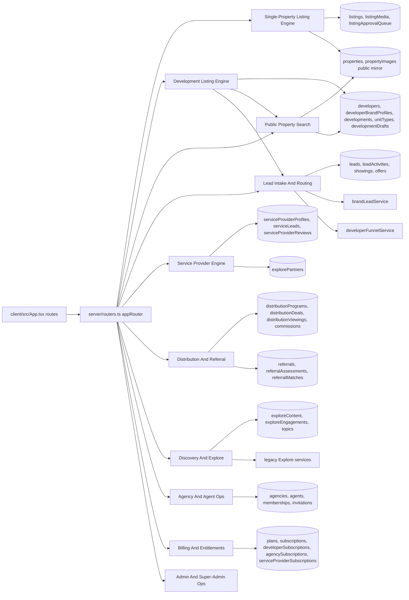
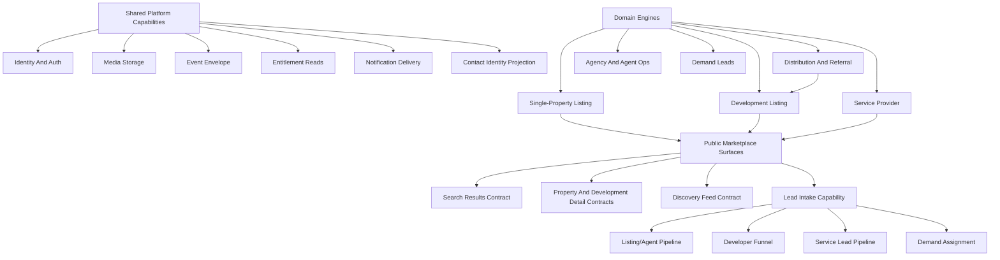

# Context, Data, And State Map

This file maps current contexts, target contexts, data ownership, state machines, route flows, and test coverage.

## Current Context Map

## Target Context Map

The target is not a single platform rewrite. It is a clarified set of boundaries and contracts around the existing engines.

## Boundary Principles

- Engines own write lifecycles. Shared capabilities should provide contracts and infrastructure, not silently take ownership of domain state.
- Public marketplace surfaces read from domain-owned sources or projections, and every result should preserve source metadata.
- A lead capture event is not the same thing as a CRM pipeline item. Capture can be shared; follow-up lifecycle should remain domain-specific.
- Public brand identity is a separate concern from login identity and internal organization membership.
- Projection tables such as `properties` should be named and treated as read models unless a specific write flow proves otherwise.

## Data Ownership Matrix

| Data/table group | Current owner | Source-of-truth classification | Consumers | Notes |
| --- | --- | --- | --- | --- |
| `users`, sessions/auth state | Identity platform | Write source for login/account | All protected routers and route guards | Role is global, but actor capability is domain-specific. |
| `developers` | Development Listing account/profile | Write source for developer account approval/profile | Developer routes, admin developer approval | Contains status/trust-like account fields. |
| `developerBrandProfiles` | Public brand/contact identity | Write source for public brand profile | Developer public pages, development listings, brand lead capture, distribution access | Also supports marketing agency/hybrid identity, so it should not be collapsed into `developers`. |
| `developments`, `unitTypes`, `developmentPhases`, `developmentUnits` | Development Listing Engine | Write source for development inventory | Developer workspace, public development detail, derived search cards, distribution programs | `unitTypes` are the current public inventory driver for development search cards. |
| `developmentDrafts` | Development Listing Engine | Draft source | Development wizard | Stores canonical wizard snapshot and progress. |
| `listings`, `listingMedia`, `listingApprovalQueue` | Single-Property Listing Engine | Write source for single-property listings | Listing workspace, approval queue, public mirror sync | Approval writes into `properties`. |
| `properties`, `propertyImages` | Public Property Catalog | Projection/read model for listing publications; also legacy public property store | Public property detail, property search, search cards | Highest source-of-truth risk. It can look authoritative even when values came from `listings`. |
| `leads`, `leadActivities` | Shared lead intake plus domain overlays | Generic intake source | Developer funnel, agents/agencies, brand lead routing, public lead capture | Funnel semantics differ by stakeholder. |
| `listingLeads` | Single-Property Listing Engine | Domain-local lead-like table | Listing analytics/owner workflows | Duplicates generic lead concepts. |
| `serviceLeads`, `serviceLeadEvents` | Service Provider Engine | Write source for service requests | Service provider dashboard, recommendation/request flows | Keep separate until shared lead adapter exists. |
| `demandCampaigns`, `demandLeads`, `demandLeadMatches`, `demandLeadAssignments` | Demand Lead Engine | Emerging source | Demand router and future campaign/matching flows | Overlaps generic leads and marketing. |
| `distributionPrograms`, `distributionDevelopmentAccess`, `distributionAgentAccess` | Distribution/Referral Engine | Write source for distribution availability and access | Distribution admin, partner/referrer pages, developer distribution dashboard | Program access should remain explicit and not be inferred only from development publication. |
| `distributionDeals`, `distributionViewings`, `distributionDealDocuments`, `distributionCommissionEntries` | Distribution/Referral Engine | Write source for referral/deal pipeline | Agents/referrers, managers, developers, admins | Distinct from generic lead lifecycle. |
| `referrals`, `referralAssessments`, `referralMatches`, `referralDocuments` | Referral/affordability subdomain | Write source for affordability referral workflow | Distribution referral flows | Should stay linked to, not merged into, distribution deals. |
| `serviceProviderProfiles`, `serviceProviderServices`, `serviceProviderLocations` | Service Provider Engine | Write source for provider directory | Services directory, request matching, provider dashboard | Uses `explorePartners` for identity bootstrap. |
| `explorePartners` | Explore/partner identity | Mixed source | Service provider identity, Explore partner/content systems | Needs an ownership decision if services grows independently. |
| `exploreContent`, `exploreEngagements`, topics | Discovery/Explore | Source for feed/content engagement | Explore, discovery feed, analytics | Legacy Explore and new Discovery coexist. |
| `agencies`, `agencyBranding`, `agencyAgentMemberships`, `agents` | Agency and Agent Operations | Write source | Agency/agent dashboards, public profiles, listings | Mature membership model, but not generalized. |
| `plans`, `subscriptions`, billing tables | Billing capability | Shared billing source for selected actors | Billing/subscription routers | Does not cover all entitlement state. |
| `developerSubscriptions`, `agencySubscriptions`, `serviceProviderSubscriptions`, `partnerSubscriptions` | Domain-specific entitlement stores | Domain-local subscription sources | Developer, agency, service, partner flows | Target should be entitlement adapters, not immediate table unification. |
| `analyticsEvents`, `locationAnalyticsEvents`, listing analytics, Explore analytics | Analytics/event capability | Fragmented event sources | Reports and dashboards | Event envelope standardization is safer than report unification. |
| `serviceProviderReviews` and `reviewsRouter` | Service Provider Engine plus thin generic route | Service-specific source; generic route is stub | Service profile pages; generic reviews route | Not yet a shared Reviews engine. |

## Context Ownership Matrix

| Capability | Source-of-truth owner | Upstream dependencies | Downstream consumers | Contract used | Write authority | Read authority | Public projection | Current coupling | Recommended coupling |
| --- | --- | --- | --- | --- | --- | --- | --- | --- | --- |
| Single-Property Listing | Listing Engine | Identity, agency/agent owner, media | Public catalog, search, property detail, leads | Listing create/update/submit/approve payloads | Listing router/db functions and approval authority | Listing owner/admin; public via projection | `properties`, `propertyImages` | Tight coupling to `db.ts` projection writes | Keep projection contract explicit and tested. |
| Development Listing | Development Listing Engine | Identity, developer/brand profile, media, entitlements | Search, development detail, leads, distribution | Wizard payload, development service, public read contract | Developer router/service and admin publisher authority | Developer owner/admin; public approved/published reads | Derived search cards and development detail | Coupled to developer router and brand profile | Preserve engine; clarify brand/owner contracts. |
| Public Search | Public Marketplace Search read model/query capability | Listing projections, developments/unit types, locations | Buyers, tenants, public pages, saved search | Search query/result card contracts | No domain writes | Public read authority | Search result cards | Reads multiple domain sources directly | Require source metadata and per-source adapters. |
| Lead Intake | Shared intake plus domain overlays | Public pages, contact identity, target assets, attribution | Developer funnel, agent/agency, service, demand | Capture payload with target/source/contact | Intake router/services; domain adapters | Domain dashboards and admins | Lead/contact summaries | Many route entry points and status meanings | Centralize capture primitives, keep pipelines separate. |
| Developer Funnel | Developer sales opportunities | Generic leads, developer/brand ownership | Developer workspace, KPIs | Funnel transition/assignment/activity contracts | Developer funnel service | Developer owner/admin | Dashboard read models | Maps generic lead fields to funnel stages | Keep as overlay until dedicated storage needed. |
| Service Provider Engine | Service Provider Engine | Identity, Explore partner, media, billing | Services directory, service request pages, provider dashboard | Provider profile/service/location/lead contracts | Services engine router/service | Public provider reads, provider/admin reads | Directory/profile cards | Depends on Explore partner identity | Decide and document identity dependency. |
| Distribution/Referral | Distribution/Referral Engine | Developments, developer brands, agents/users, documents | Referrer pages, manager pages, developer dashboards, admin | Program/access/deal/referral/commission contracts | Distribution router/services | Role-specific partner/manager/developer/admin reads | Partner program/deal views | Very large router, many subcontexts | Extract sub-boundaries behind same contracts later. |
| Discovery/Explore | Discovery/Explore | Explore content, legacy feed, engagement, media | Explore/discovery screens, ranking, analytics | Feed query/response, engagement event contracts | Discovery/Explore services | Public/user/session reads | Feed items | New domain and legacy services coexist | Build ownership/migration matrix. |
| Agency/Agent Ops | Agency org/membership plus agent profile/CRM capabilities | Identity, membership, billing | Listing owners, public profiles, dashboards | Agency/agent profile/membership contracts | Agency and agent routers/services | Public profile reads, owner/admin reads | Agency/agent profiles | Shares leads/showings with generic tables | Keep agency membership, agent profile, and lead/showing overlays explicit. |
| Billing/Entitlements | Fragmented billing capability | Plans, domain subscriptions, user fields | Feature gates, dashboards, billing pages | Entitlement read adapter target | Domain billing services and billing router | Stakeholder/admin reads | Plan/limit displays | Multiple subscription sources | Add read adapters before unification. |
| Reviews/Trust | Service-specific plus thin generic route | Service providers, future target profiles | Service profile pages, future public profiles | No generic contract yet | Service engine for provider reviews | Service profile reads | Provider review summaries | Generic route stub | Keep service-local until target model exists. |

## State Machine Inventory

| Lifecycle | State values observed | Current owner | Notes |
| --- | --- | --- | --- |
| Listing status | `draft`, `pending_review`, `approved`, `published`, `rejected`, `archived`, `sold`, `rented` | Single-Property Listing Engine | Approval and publication are related but stored separately via status and approval status. |
| Listing approval | Approval queue plus `approvalStatus` | Single-Property Listing Engine | Approval creates or updates public `properties` projection. |
| Property projection status | `available`, `sold`, `rented`, `pending`, `draft`, `published`, `archived` | Public Property Catalog | Values are not identical to listing status values. |
| Development approval/publication | `approvalStatus` plus `isPublished` and `publishedAt` | Development Listing Engine | Public development queries require approved and published. |
| Development commercial status | `launching-soon`, `selling`, `sold-out` and legacy/construction fields | Development Listing Engine | This is product/inventory status, not moderation status. |
| Unit type status | Active/inventory/rental/auction/status fields | Development Listing Engine | Unit type is the main development search-card unit. |
| Developer approval/trust | `developers.status`, `isTrusted`, brand visibility/contact verification | Development account and brand profile | Approval, public visibility, and trust are separate dimensions. |
| Generic lead status | `new`, `contacted`, `qualified`, `converted`, `closed`, `viewing_scheduled`, `offer_sent`, `lost` | Shared lead intake plus domain overlays | Generic values do not fully match developer funnel canonical stages. |
| Developer funnel stage | `new`, `contacted`, `qualified`, `viewing_scheduled`, `viewing_completed`, `offer_made`, `deal_in_progress`, `closed_won`, `closed_lost`, `spam`, `duplicate`, `archived` | Developer funnel overlay | `developerFunnelService` maps to/from generic lead fields. |
| Service lead status | `new`, `accepted`, `quoted`, `won`, `lost`, `expired` | Service Provider Engine | Separate service request lifecycle. |
| Distribution deal stage | `viewing_scheduled`, `viewing_completed`, `application_submitted`, `contract_signed`, `bond_approved`, `commission_pending`, `commission_paid`, `cancelled` | Distribution/Referral Engine | Stage transitions and commission status are domain-specific. |
| Distribution viewing status | `scheduled`, `completed`, `no_show`, `cancelled` | Distribution/Referral Engine | Separate validation/attribution lock state exists. |
| Commission status | `not_ready`, `pending`, `approved`, `paid`, `cancelled` | Distribution/Referral Engine | Triggered by deal stage and program rules. |
| Referral status | `quick`, `awaiting_documents`, `under_review`, `verified`, `submitted`, `viewing_booked` | Referral/affordability subdomain | Distinct from distribution deal stage. |
| Referral readiness | `quick_estimate`, `awaiting_documents`, `under_review`, `verified_estimate`, `matched_to_development`, `submitted_to_partner` | Referral/affordability subdomain | Confidence and document status add more dimensions. |
| Service provider verification/profile | Moderation, directory active, Explore creator active, dashboard active | Service Provider Engine | Trust/review fields are local to services. |
| Reviews | No generic state confirmed | Generic reviews route is thin | Service reviews have schema; shared reviews do not. |

## State Machine Detail Matrix

| State machine | Transitions and authority | Invariants | Persistence | Consumers | Duplicated or missing states | Classification |
| --- | --- | --- | --- | --- | --- | --- |
| Development draft and publication | Draft saved by developer/super-admin publisher; create/update via developer router; publish/unpublish via development service | Public reads require approved and published; draft is not public source | `developmentDrafts`, `developments.approvalStatus`, `isPublished`, `publishedAt` | Developer workspace, public detail, search, distribution | Draft progress and publish status are separate; approval queue semantics are lighter than listing queue | Established |
| Single-property listing lifecycle | Create/update by owner; submit for review; approve/reject by authorized reviewer; archive/delete by owner/authority | Approval publishes to public `properties` mirror; readiness gates submission | `listings`, `listingApprovalQueue`, `properties`, `propertyImages` | Listing workspace, admin/review, public property detail/search | Listing status differs from public property status | Established |
| Approval and moderation | Listing approval queue; developer approval/status; service moderation; content approval queue | Authority is domain/admin-specific | Listing approval tables, `developers.status`, service/explore moderation tables | Admin dashboards, public visibility gates | No single approval model fits all | Shared pattern, domain-owned |
| Development availability | Unit active/inventory/status and development commercial status | Unit type availability drives public development cards | `developments`, `unitTypes` | Developer workspace, search, detail | Development status and unit inventory status differ | Established within Development Listing |
| Property enquiry | Capture by public form; owner routing through lead service | Must preserve property/source/owner | `leads`, possibly `listingLeads` | Agent/agency/listing workflows | Exact property enquiry pipeline owner is mixed | Emerging overlay |
| Development enquiry | Public/developer route capture; brand routing; funnel transitions by developer owner | Must preserve development and brand identity | `leads`, `leadActivities` | Developer workspace/funnel | Generic lead status differs from developer funnel stage | Established overlay |
| Viewing request | Generic showing/viewing and distribution viewing flows | Scheduled/completed/no-show meanings depend on domain | `showings`, `scheduledViewings`, `distributionViewings` | Agent dashboard, distribution manager/referrer | Multiple viewing tables/lifecycles | Mixed/domain-specific |
| Service request | Create from journey; provider updates status | Provider ownership and category/location context required | `serviceLeads`, `serviceLeadEvents` | Services results/provider dashboard | Separate from generic leads by design | Established/emerging |
| Referral opportunity | Referral assessment, matching, submission, distribution deal creation | Program eligibility/access and document readiness gate submissions | `referrals`, `referralAssessments`, `distributionDeals`, required docs | Referrer, manager, developer, admin | Referral readiness and deal stage are separate | Established |
| Verification | Developer, brand, agency, provider, partner verification statuses | Verification rules are stakeholder-specific | `developers`, `developerBrandProfiles`, `agencies`, provider/partner tables | Public trust badges, admin gates | No universal verification state should be assumed | Domain-owned shared pattern |
| Subscription | Platform subscriptions plus domain subscriptions | Entitlement must be read from stakeholder-appropriate source | Billing tables, developer/agency/service/partner subscription tables, `users` fields | Dashboards, feature gates | Multiple subscription sources | Fragmented shared capability |
| Campaign | Demand campaign status, marketplace boost campaign status, marketing surfaces | Owner/objective/budget semantics differ | `demandCampaigns`, `boostCampaigns` | Campaign/demand/marketing surfaces | No single campaign engine established | Emerging |
| Review | Service provider reviews exist; generic reviews route is stubbed | Target model and moderation not generic | `serviceProviderReviews`; generic route returns empty | Service provider profile | Generic review state missing | Thin |
| Recruitment/application | Distribution referrer applications and team registrations | Admin review controls status | `distributionReferrerApplications`, `platformTeamRegistrations` | Distribution admin/onboarding | Separate from buyer lead lifecycle | Established inside Distribution onboarding |
| Auction participation | Auction fields and dates exist; bidding/registration lifecycle not confirmed | Do not invent bidding states | Listing/development/unit auction fields | Public listing/development surfaces | Auction registration/bidding state missing | Partial feature fields |

## Route To Router To Storage Map

| User flow | Client surface | tRPC/router | Service layer | Storage/read model |
| --- | --- | --- | --- | --- |
| Public property search | `SearchResults.tsx`, property-for-sale/rent routes | `properties.search`, `properties.searchDevelopmentListings` in `server/routers.ts` | `propertySearchService`, `developmentDerivedListingService` | `properties`, `propertyImages`, `developments`, `unitTypes`, `developerBrandProfiles`, agents/agencies |
| Public property detail | `/property/:id` | `properties.getById` | Inline router/db access plus enrichment | `properties`, `propertyImages`, linked `listings`, development/brand enrichment |
| Listing creation/review | `/listings/create` and listing workflow components | `server/listingRouter.ts` | `db.createListing`, `db.updateListing`, `db.submitListingForReview`, `db.approveListing` | `listings`, `listingMedia`, `listingApprovalQueue`, `properties` mirror |
| Developer workspace | `/developer/*` | `server/developerRouter.ts` | `developerService`, `developmentService`, `developerSubscriptionService`, `developerFunnelService` | `developers`, `developerBrandProfiles`, `developments`, `developmentDrafts`, `unitTypes`, `leads` |
| Development wizard | `/developer/create-development`, `/development-wizard` | `developer.saveDraft`, `developer.createDevelopment`, `developer.updateDevelopment`, `developer.publishDevelopment`, `superAdminPublisher.*` | `developmentService`, payload builders | `developmentDrafts`, `developments`, `unitTypes`, brand profile references |
| Public development detail | `/development/:slug`, `/development/:slug/unit/:unitId` | `developer.getPublicDevelopmentBySlug` | `developmentService.getPublicDevelopmentBySlug` | `developments`, `unitTypes`, `developerBrandProfiles` |
| Development qualification lead | `/development/:slug/qualification` | `developer.createLead` | `capturePublicLead` | `leads`, brand lead routing, development ownership |
| Developer brand profile | `/developer/:slug` public route | `developer.getPublicDeveloperBySlug`, `developer.getPublicDevelopmentsForProfile` | Developer/brand profile services | `developerBrandProfiles`, `developments` |
| Lead capture | Public lead dialogs/forms | `leads.create`, `developer.createLead`, `brandProfile.captureLead` | `publicLeadCaptureService`, `brandLeadService` | `leads`, `leadActivities`, owner references |
| Developer lead funnel | Developer leads pages | `developer.getLeads`, `assignLead`, `transitionLead`, `logLeadActivity`, `setLeadNextAction` | `developerFunnelService` | `leads`, `leadActivities` |
| Service provider request | Services request/results/profile pages | `servicesEngine.createLeadFromJourney`, `recommendProviders`, `directorySearch` | `servicesEngineService` | `serviceProviderProfiles`, `serviceProviderServices`, `serviceProviderLocations`, `serviceLeads` |
| Distribution partner/referral | `/distribution/*` pages | `server/distributionRouter.ts` | Distribution access, referral, affordability, document, commission services | `distribution*` tables and `referrals*` tables |
| Discovery/Explore feed | Explore/discovery screens | `discovery.getFeed`, `discovery.engage`, Explore routers | `discoveryFeedService`, `discoveryEngagementService`, legacy Explore services | `exploreContent`, `exploreEngagements`, discovery caches |
| Agency/agent onboarding and dashboard | Agency/agent pages | `agencyRouter`, `agentRouter` | Agent onboarding and entitlement services | `agencies`, `agents`, memberships, invitations, subscriptions |
| Demand campaign/lead capture | Demand surfaces | `demandRouter` | Router-local and future demand services | `demandCampaigns`, `demandLeads`, matches, assignments |

## Source-Of-Truth Conflicts To Watch

| Conflict | Why it matters | Current recommendation |
| --- | --- | --- |
| `listings` versus `properties` | Single-property approval maps authored listing data into public catalog rows. Reads can accidentally treat `properties` as authoring truth. | Preserve `sourceListingId` and source metadata in public responses. |
| `developments` versus public search cards | Development cards are derived from `unitTypes`, not stored as normal `properties` rows. | Keep derived development result contracts explicit. |
| `developers` versus `developerBrandProfiles` | Account approval, public brand profile, claimable brand, and marketing agency identity are different concepts. | Treat brand profile as public commercial identity. |
| Generic `leads` versus service/demand/distribution pipelines | Different pipelines need different statuses and ownership rules. | Share capture attribution, not all downstream workflow state. |
| `users.role` versus domain identities | A user role does not fully describe agency membership, developer brand ownership, service provider identity, or distribution referrer identity. | Use role as coarse gate, then domain-specific identity lookup. |
| Billing tables versus domain subscriptions | Entitlement state is distributed and sometimes copied onto `users`. | Build read adapters first. |
| Explore partner versus service provider profile | Service providers depend on Explore partner identity. | Make the dependency explicit or split provider identity when needed. |
| Reviews router versus service provider reviews | Generic reviews route exists but is stubbed. | Avoid using it as a product promise until implemented. |

## Test Coverage Map

| Area | Representative tests | Coverage reading |
| --- | --- | --- |
| Single-property listing lifecycle | `server/__tests__/contract.listing-lifecycle.test.ts`, `contract.listing-lifecycle-db.test.ts`, listing workflow tests | Strong lifecycle and payload coverage. |
| Public property search | `server/__tests__/contract.properties-search.test.ts`, `server/services/__tests__/propertySearchService.property.test.ts`, `client/src/lib/__tests__/searchBlend.test.ts` | Strong enough to protect public result contracts. |
| Development listing lifecycle/search | `developmentService.test.ts`, `developmentDerivedListingService.test.ts`, `contract.properties-search-development-listings.test.ts`, development payload/wizard tests | Strong current target for next contract-hardening slice. |
| Developer funnel | `server/services/__tests__/developerFunnelService.contract.test.ts` | Good targeted contract coverage. |
| Services engine | Services request/results/profile/onboarding component tests | Strong frontend workflow coverage; server coverage should be checked before deeper changes. |
| Distribution/referral | Many `distribution*.test.ts`, affordability and required document tests, distribution page tests | Deep coverage exists; boundary and router size are the larger risks. |
| Discovery | `server/domains/discovery/services/__tests__/*`, client discovery tests | New domain has clear service tests. |
| Reviews | No meaningful generic reviews coverage observed | Treat as thin/stubbed. |
| Campaign/marketing/demand | Location campaigns and demand schema/router evidence, but no single campaign-engine test suite identified | Emerging capability. |

## Current Versus Target Summary

| Area | Current | Target |
| --- | --- | --- |
| Listings | Two distinct listing engines plus shared public search | Keep engines distinct; standardize public result source metadata. |
| Leads | Several lead-like pipelines | Shared intake attribution contract plus domain-specific lifecycle adapters. |
| Profiles | Stakeholder-specific profile tables plus candidate actor abstraction | Keep current profiles; define public contact identity projection. |
| Billing | Multiple subscription stores | Entitlement read interface per stakeholder; defer schema merge. |
| Discovery | Legacy Explore and new Discovery coexist | Explicit migration/ownership map before deleting or expanding either side. |
| Distribution | Large implemented engine in one router | Keep behavior; document and then extract sub-boundaries gradually. |
