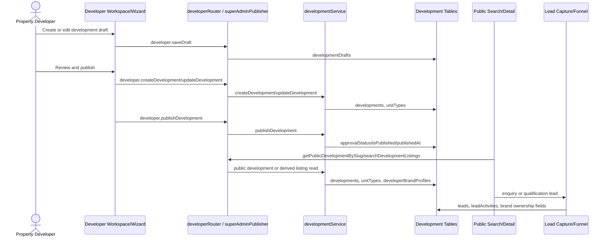
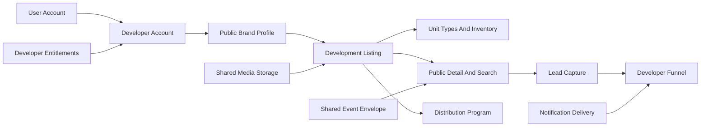

# Developer Journey Architecture

The developer journey is the strongest end-to-end vertical in the current codebase. It connects account/profile state, brand identity, private authoring, public search/detail surfaces, lead capture, funnel work, subscription limits, and distribution.

## Current Developer Journey

## Developer Source-Of-Truth Route Verification

| Stage | Current source of truth | Owning module/table | Canonical revalidation evidence | Drift or missing-contract risk |
| --- | --- | --- | --- | --- |
| Developer registration and identity | `users` account and global `property_developer` role | Identity/auth plus `users` | `users.role`, `RequireRole`, `DeveloperRoutes.tsx`, auth role-normalization tests | Role alone does not prove brand or team permissions. |
| Developer organisation/profile | Developer account/profile and approval state | `developers`, `developerRouter`, `developerService` | `developerRouter.createProfile`, admin developer endpoints, `developers.status`, `isTrusted` | Can be confused with public brand identity. |
| Public developer brand | Public commercial identity and contact surface | `developerBrandProfiles`, `brandProfileRouter`, brand profile services | `DeveloperBrandProfilePage.tsx`, `brandLeadService`, public developer/profile endpoints | Legal organisation, marketing publisher, and claimable public brand can overlap. |
| Development wizard and client state | Canonical wizard snapshot and step-owned fields | `useDevelopmentWizard`, `DevelopmentWizard`, `WizardEngine`, `developmentPayloadOwnership` | `developmentSubmitPayload.ts`, `developmentCanonicalSelectors`, `developmentPayloadOwnership.ts`, wizard/payload tests | Partial updates can erase fields if step ownership is bypassed. |
| Canonical validation and payload | Submit/update payload and server validation | `developmentSubmitPayload`, `developmentTransactionPayload`, `developmentService` | transaction normalisers, `validateDevelopmentStrict`, readiness helpers, development service tests | Public contract needs tests that span payload to search/detail/lead. |
| tRPC procedure | Developer create/update/publish/draft procedures | `developerRouter` | `saveDraft`, `createDevelopment`, `updateDevelopment`, `publishDevelopment`, `unpublishDevelopment`, `createLead` | Super-admin publisher context must keep brand ownership explicit. |
| Development service and persistence | Development aggregate and unit inventory | `developmentService`, `developments`, `unitTypes`, `developmentDrafts` | create/update/publish service paths, `persistUnitTypes`, unit type schema, development tests | Unit types are the public inventory driver and must not drift into `properties`. |
| Readiness and publication | `approvalStatus`, `isPublished`, `publishedAt`, readiness score | Development Listing Engine | public reads require approved/published in list/search paths; publish/update service code | Approval and publication are separate dimensions. |
| Public search projection | Derived development unit search cards | `developmentDerivedListingService`, `properties.searchDevelopmentListings` | source `development`, `unitTypeId`, `developmentId`, `developerBrand`, href, transaction/pricing fields, contract tests | Search card and detail identity can drift without end-to-end assertions. |
| Public development detail | Approved/published development detail and unit types | `DevelopmentDetail`, `developer.getPublicDevelopmentBySlug`, `developmentService.getPublicDevelopmentBySlug` | public route, service read, unit and brand attachment code | Detail must agree with search card source, unit, brand, and transaction fields. |
| Development enquiry capture | Captured lead with development and brand attribution | `developer.createLead`, `leads.create`, `brandProfile.captureLead`, `capturePublicLead`, `brandLeadService` | `DevelopmentLeadDialog`, `DevelopmentQualificationPage`, lead schemas/routes/services | Server-side lead attribution contract remains the key missing executable guardrail. |
| Assignment and follow-up | Developer funnel overlay over generic leads | `developerFunnelService`, `shared/developerFunnel`, `leads`, `leadActivities` | funnel stages, allowed transitions, SLA contract tests, developer lead endpoints | Funnel owns rules over shared lead storage; it is not a separate lead table. |
| Analytics and attribution | Fragmented event/counter sources plus lead UTM/source fields | `analyticsEvents`, `locationAnalyticsEvents`, listing/development counters, lead source/UTM fields | analytics schema, route counters, lead source/UTM fields, dashboard/KPI endpoints | Event envelope and target ids are not yet standardized across public search/detail/lead/funnel. |

## Developer Current-State Architecture Matrix

| Stage | Route/frontend/state | API/service/storage | State/tests/public consumer | Gaps and risks | Recommended owner and confidence |
| --- | --- | --- | --- | --- | --- |
| Registration | Developer setup routes, role-gated developer workspace | Auth/user creation, `users.role`, developer onboarding endpoints | Role gate tests and auth role normalization tests | Registration path was not fully traced end-to-end in this audit | Identity platform for account; Development account for developer profile. Confidence: Strong inference |
| Account identity | `DeveloperRoutes.tsx`, `RequireRole` patterns | `users`, auth service, protected procedures | `auth.role-normalization.test.ts` | Role is coarse and does not prove brand/team access | Identity platform. Confidence: Verified in canonical worktree |
| Developer organisation | Developer setup/profile flows | `developerRouter.createProfile`, `developers` table | Admin developer approval endpoints | `developers` can be mistaken for public brand or team org | Development account/profile owner. Confidence: Verified in canonical worktree |
| Team membership and permissions | Developer settings/team route names, subscription limits | No mature developer membership table confirmed | No dedicated developer team tests identified | Team access can become ad hoc if added through UI only | Future Developer Organization Membership, not Development Listing Engine. Confidence: Partial evidence |
| Verification | Developer admin approval, brand contact visibility/verification | `developers.status`, `developers.isTrusted`, `developerBrandProfiles.isContactVerified` | Developer admin endpoints | Account approval, public brand visibility, and contact verification are separate | Developer account plus Brand Profile trust signals. Confidence: Verified in canonical worktree |
| Developer profile | Developer workspace/profile endpoints | `developers`, `developerService` | Developer profile reads | Profile overlaps naming with public brand | Developer account/profile. Confidence: Verified in canonical worktree |
| Public Developer Showcase | `/developer/:slug`, `DeveloperBrandProfilePage.tsx` | `developer.getPublicDeveloperBySlug`, `getPublicDevelopmentsForProfile`, `developerBrandProfiles` | Public consumer page | Public route can be confused with private `/developer/*` workspace | Public Brand Profile experience reading Development Listing. Confidence: Verified in canonical worktree |
| Development creation | `/developer/create-development`, `/development-wizard`, `DevelopmentWizard.tsx` | `developer.createDevelopment`, `developmentService.createDevelopment` | Development service and payload tests | Super-admin publisher and normal developer flows must preserve identity | Development Listing Engine. Confidence: Verified in canonical worktree |
| Phases and unit types | Wizard phases/components, `WizardEngine`, unit type phase | `unitTypes`, `developmentPhases`, `developmentUnits`, payload builders | Unit service/tests, development payload tests | Unit types are core inventory and should not drift into generic listing model | Development Listing Engine. Confidence: Verified in canonical worktree |
| Pricing and inventory | Unit type forms and canonical wizard data | `unitTypes` price/rent/auction/inventory fields | `developmentDerivedListingService.test.ts` | Public search depends on accurate unit type projection | Development Listing Engine. Confidence: Verified in canonical worktree |
| Media | Wizard media phase, upload/media helpers | Development media JSON fields, unit media, shared upload infrastructure | Payload tests and UI tests | Media storage is shared but lifecycle is domain-owned | Shared Media infrastructure plus Development Listing attachment ownership. Confidence: Strong inference |
| Readiness and submission | `FinalisationPhase.tsx`, readiness utilities | `developmentService`, readiness score fields | `FinalisationPhase.test.tsx`, `developmentService.test.ts` | Readiness logic must not duplicate in workspace-only UI | Development Listing Engine. Confidence: Verified in canonical worktree |
| Review and approval | Publish flow, admin/super-admin publisher context | `developments.approvalStatus`, approval queue evidence | Super-admin publishing smoke test | Super-admin bypass/context can misattribute brand | Development Listing Engine plus Admin authority. Confidence: Strong inference |
| Publication | `developer.publishDevelopment`, `developmentService.publishDevelopment` | `developments.isPublished`, `publishedAt`, `approvalStatus` | Public development queries require approved/published | Published state and approval state are distinct | Development Listing Engine. Confidence: Verified in canonical worktree |
| Search and discovery | `SearchResults.tsx`, development listing search route | `properties.searchDevelopmentListings`, `developmentDerivedListingService` | `contract.properties-search-development-listings.test.ts` | Development listings are derived and must carry source metadata | Public Search reads Development Listing. Confidence: Verified in canonical worktree |
| Development detail page | `/development/:slug`, `/development/:slug/unit/:unitId`, `DevelopmentDetail.tsx` | `developer.getPublicDevelopmentBySlug`, `developmentService.getPublicDevelopmentBySlug` | Public page and development detail tests/components | Detail must agree with search card identity/inventory | Public experience reading Development Listing. Confidence: Verified in canonical worktree |
| Lead or enquiry capture | `DevelopmentLeadDialog`, qualification page | `developer.createLead`, `leads.create`, `publicLeadCaptureService`, `brandLeadService` | `DevelopmentLeadDialog.test.tsx`, lead routing tests | Lead can enter through multiple routes; attribution can drift | Shared Lead Intake plus Developer Sales overlay. Confidence: Verified in canonical worktree |
| Assignment and follow-up | Developer leads/funnel pages | `developer.getLeads`, `assignLead`, `transitionLead`, `developerFunnelService` | `developerFunnelService.contract.test.ts` | Generic lead statuses differ from developer funnel stages | Developer Funnel. Confidence: Verified in canonical worktree |
| Marketing and campaign distribution | Developer campaigns route names, marketing/demand surfaces | `marketingRouter`, `demandRouter`, distribution enablement endpoints | Location/demand/campaign tests are mixed | Campaign meaning is not yet one mature engine | Emerging Demand/Campaign workflow; Distribution for referral distribution. Confidence: Partial evidence |
| Analytics and intelligence | Developer dashboard/KPI endpoints, analytics panels | Analytics tables/events, developer KPIs, funnel KPIs | Analytics/search/card tests, developer funnel KPIs | Event identifiers differ by domain | Shared analytics envelope plus domain reports. Confidence: Strong inference |
| Subscriptions and billing | Developer subscription/plans routes and panels | `developerSubscriptions`, limits/usage, `developerSubscriptionService` | `developerSubscriptionService.test.ts` | Separate from shared billing tables | Developer Entitlement adapter over developer subscription data. Confidence: Verified in canonical worktree |

## Stage Map

| Stage | Current code path | Current data | Maturity | Architecture notes |
| --- | --- | --- | --- | --- |
| Account and role gate | `users.role = property_developer`, `DeveloperRoutes.tsx`, `RequireRole` patterns | `users`, onboarding fields | Established | User role is a coarse platform gate only. |
| Developer profile setup | `server/developerRouter.ts` `createProfile`, admin approval endpoints | `developers` | Established | `developers.status` and `isTrusted` shape approval/trust. |
| Public brand identity | `developerBrandProfiles`, `DeveloperBrandProfilePage.tsx`, `brandProfileRouter.ts` | `developerBrandProfiles` | Established but ambiguous | Public brand profile can be claimable, subscriber-backed, marketing-agency-like, and contact-verified. |
| Workspace routing | `client/src/pages/DeveloperRoutes.tsx` | Route and guard state | Established | Developer workspace blocks pending/rejected states and requires publisher brand context for super-admin publisher flows. |
| Draft authoring | `DevelopmentWizard.tsx`, `useDevelopmentWizard.ts`, `developer.saveDraft` | `developmentDrafts.draftData`, wizard store | Established | Draft is canonical wizard snapshot plus progress. |
| Payload construction | `developmentSubmitPayload.ts`, `developmentTransactionPayload.ts`, `developmentPayloadOwnership.ts` | Canonical step data and unit type data | Established | Field ownership is documented in shared code; protect with contracts. |
| Development creation/update | `developer.createDevelopment`, `developer.updateDevelopment`, `developmentService` | `developments`, `unitTypes` | Established | Create/update flow must preserve brand/profile and transaction fields. |
| Publication | `FinalisationPhase.tsx`, `developer.publishDevelopment`, `developmentService.publishDevelopment` | `approvalStatus`, `isPublished`, `publishedAt` | Established | Public reads require approved and published. Super-admin publisher has bypass/context behavior. |
| Public detail | `DevelopmentDetail.tsx`, `developer.getPublicDevelopmentBySlug` | `developments`, `unitTypes`, `developerBrandProfiles` | Established | Detail page is the primary public development inspection surface. |
| Public search cards | `properties.searchDevelopmentListings`, `developmentDerivedListingService` | `developments`, `unitTypes` | Established | Development results are derived, not copied into `properties` as normal rows. |
| Lead capture | `DevelopmentLeadDialog`, `DevelopmentQualificationPage`, `developer.createLead`, `leads.create`, `publicLeadCaptureService` | `leads`, brand ownership fields | Established | Lead owner attribution must preserve development, brand, source, and qualification context. |
| Funnel management | `developer.getLeads`, `assignLead`, `transitionLead`, `developerFunnelService` | `leads`, `leadActivities` | Established overlay | Developer funnel maps generic lead fields to canonical funnel stages. |
| Analytics and KPIs | Developer dashboard/KPI endpoints, analytics/event services | Analytics tables and computed lead/development counts | Partial-to-established | Metrics exist, but event/report ownership is fragmented. |
| Billing/subscription | `developerSubscriptionService`, `developerSubscriptions`, limits/usage tables | Developer subscription tables | Partial-to-established | Developer entitlement is separate from platform billing tables. |
| Team permissions | Developer settings/team route, subscription limits | Light route/UI evidence and limits | Partial | No developer membership model as mature as agency membership was confirmed. |
| Distribution enablement | `developer.getDistributionSettings`, `setDistributionEnabled`, distribution dashboard/listDeals | `distributionPrograms`, `distributionDevelopmentAccess`, `distributionDeals` | Established adjacent domain | Distribution should remain a separate engine integrated with Development Listing. |
| Campaign/marketing | Developer campaigns pages and marketing router | Demand/marketplace/marketing surfaces | Emerging | Do not treat as a mature developer campaign engine yet. |

## Developer Data Model Reading

| Model | Current meaning | Do not confuse with |
| --- | --- | --- |
| `users` | Login account and global role | Developer company, public brand, marketing agency, or team membership |
| `developers` | Developer account/profile and approval/trust state | Public-facing brand identity |
| `developerBrandProfiles` | Public brand/contact/claimable identity used by public pages, listings, leads, and distribution | Login account or internal organization membership |
| `developments` | Development listing aggregate | Single-property `listings` or public `properties` mirror |
| `unitTypes` | Development inventory/search-card unit source | Single property listing rows |
| `developmentDrafts` | Wizard draft snapshot and progress | Published development record |
| `leads` | Generic captured contact/opportunity record with owner references | Developer funnel stage machine by itself |
| `distributionPrograms` | Referral/distribution availability and terms for a development | Publication status or search visibility |

## Private-To-Public Contract

The developer publication path should preserve these fields from private authoring into public consumption:

| Contract area | Fields/concepts to preserve | Current evidence |
| --- | --- | --- |
| Identity | Developer account id, developer brand profile id, marketing brand profile id, owner type, marketing role | `developerBrandProfiles`, `developments.developerBrandProfileId`, `developments.marketingBrandProfileId`, `developments.marketingRole`, `FinalisationPhase.tsx` |
| Location | Province, city, suburb, address/geo fields, location ids where present | `developments`, payload builders, public search/location pages |
| Transaction type | For sale, for rent, auction and related price/rent/auction date fields | `developments`, `unitTypes`, payload builders, `developmentService.auctionDates` tests |
| Inventory | Unit types, inventory count, active status, bedroom/bathroom/price/rent/auction attributes | `unitTypes`, `developmentDerivedListingService` |
| Media | Images, videos, floor plans, brochures/documents | Wizard media phase, payload builders, development schema JSON/media fields |
| Readiness/publication | Readiness score, approval status, `isPublished`, `publishedAt` | `developmentService`, schema fields |
| Public URL shape | Development slug and unit deep links | `DevelopmentDetail.tsx`, `developmentDerivedListingService` hrefs |
| Lead ownership | Development id, developer brand profile id, source surface, lead source, qualification/affordability context | `publicLeadCaptureService`, `brandLeadService`, `DevelopmentQualificationPage.tsx` |

## Current Developer Architecture Strengths

- The wizard is already canonical-first rather than merely page-local form state.
- Field ownership exists in `shared/developmentPayloadOwnership.ts`, which is exactly the right kind of guardrail for future incremental work.
- Public development detail and public development search cards read only approved/published developments.
- `developmentDerivedListingService` avoids pretending development unit types are ordinary single-property listings.
- Developer lead/funnel code recognizes that the public lead record and the developer sales pipeline are related but not identical.
- The subscription and distribution hooks show clear monetization surfaces around the developer vertical.

## Current Developer Architecture Risks

| Risk | Evidence | Impact | Guardrail |
| --- | --- | --- | --- |
| Account/brand ambiguity | `developers` and `developerBrandProfiles` both carry developer-like concepts | Permissions, public contact, claimability, and subscription status can blur | Keep public brand identity separate in contracts. |
| Marketing agency ambiguity | `developerBrandProfiles.identityType`, `developments.marketingBrandProfileId`, `marketingRole` | A third-party publisher can be mistaken for owner | Require explicit owner and publisher fields in publish/search/lead contracts. |
| Public search drift | Search derives development cards from `unitTypes` while single-property cards read `properties` | Public card shape can drift by source | Contract-test blended card source metadata and required fields. |
| Lead ownership drift | Lead capture can enter through generic leads, developer lead, or brand profile routes | Leads can be misrouted or hidden from correct dashboard | Require source, owner, brand, and development assertions in tests. |
| Draft/update ownership drift | Multiple wizard steps can touch overlapping fields | Partial updates can erase inventory/media/pricing fields | Keep `developmentPayloadOwnership` as source of field ownership and test it. |
| Super-admin publisher context | Developer routes allow super admin publisher behavior with brand context | Admin-created content can attach to wrong brand | Keep publisher context mandatory and visible in payload tests. |
| Team permissions gap | Team route/limits exist, but mature developer membership model was not confirmed | Future team collaboration could bypass clear authorization | Defer multi-user developer team behavior until membership model is explicit. |

## Target Developer Boundary

The target boundary should look like this:

## Developer Workspace Target Composition

| Composed capability | Domain owner | Data owner | Integration contract | Dependency direction | Workspace presentation responsibility |
| --- | --- | --- | --- | --- | --- |
| Account and identity | Identity platform | `users` | Auth session, role, user id | Workspace depends on identity | Gate access, show account state |
| Developer organisation/account | Developer account/profile | `developers` | Developer profile/status/trust read model | Workspace depends on developer profile | Show onboarding/approval/profile tasks |
| Team access and permissions | Future developer membership capability | Future developer membership storage | Permission decision helper | Workspace depends on permission contract | Team settings and invitation UI only |
| Public brand profile | Brand Profile / Development Listing integration | `developerBrandProfiles` | Brand id, slug, visibility, contact identity, owner/publisher relation | Workspace depends on brand profile contract | Brand editing and status presentation |
| Development Listing Engine | Development Listing Engine | `developments`, `unitTypes`, `developmentDrafts` | Draft, payload, publish, public read contracts | Workspace invokes engine | Wizard, draft list, development list, status/action UI |
| Development sales opportunities | Developer Funnel | `leads`, `leadActivities` | Lead list, assignment, transition, activity contract | Workspace depends on funnel | Pipeline, tasks, next action, attention states |
| Marketing and distribution | Distribution/Referral and future Demand/Campaign | `distribution*`, `demand*` where applicable | Program/access/deal/terms contracts; campaign attribution contract | Workspace reads/invokes domain contracts | Campaign/distribution dashboards and entry points |
| Analytics and intelligence | Domain reports plus shared analytics transport | Analytics/event tables and computed read models | Stable event target ids and report reads | Workspace reads reports | KPIs, charts, recommendations |
| Notifications | Notification capability | `notifications` and domain notification sources | Recipient/topic/action contracts | Workspace reads notification state | Notification badges/preferences |
| Subscription and billing | Developer Entitlements plus Billing capability | `developerSubscriptions`, limits/usage, billing tables where linked | Entitlement read adapter | Workspace depends on entitlement reads | Plan status, upgrade prompts, usage limits |

The workspace must not duplicate development validation, lead transitions, entitlement calculations, or distribution deal rules. It presents and orchestrates capabilities owned elsewhere.

## Public Developer Showcase Target Composition

| Showcase element | Owner | Data source | Contract | Notes |
| --- | --- | --- | --- | --- |
| Public brand identity | Brand Profile | `developerBrandProfiles` | Slug, name, logo, bio, public contact visibility, verification | Public experience, not website builder. |
| Credentials and trust | Brand/Profile plus domain verification | Developer approval, contact verification, future review/trust signals | Trust signal read model | Do not invent universal trust score. |
| Geographic presence | Brand Profile and Development Listing | Operating provinces, development locations | Location display/filter contract | Can use shared location primitives. |
| Active developments | Development Listing Engine | Approved/published `developments` and `unitTypes` | Public development card/list contract | Showcase reads, not owns, developments. |
| Completed portfolio | Development Listing Engine or future portfolio subdomain | Development status/legacy/completed project fields where present | Portfolio card contract | Current evidence should be verified before expanding. |
| Contact/enquiry actions | Lead Intake plus Developer Funnel | `leads`, brand/development owner fields | Capture attribution contract | Must preserve brand and development identity. |
| Campaign attribution | Campaign attribution capability | UTM/source/campaign metadata | Attribution primitive | Do not require campaign engine first. |
| SEO and shareability | Public experience/platform SEO | Slugs, metadata, structured data | Public metadata contract | Presentation concern over domain data. |

## Developer Growth Loop

Intended platform loop:

`developer builds trusted presence`
-> `developer publishes developments`
-> `developer promotes showcase`
-> `buyers enter Property Listify`
-> `buyers discover developments and related content`
-> `enquiries and behavioural signals are captured`
-> `developer receives opportunities and intelligence`
-> `developer improves inventory, campaigns and content`
-> `platform value and traffic increase`

Required incremental systems and contracts:

- Brand profile and verification contract for trusted public presence.
- Development Listing publish contract for inventory, unit types, media, readiness, and public visibility.
- Search/detail contracts that preserve source, brand, unit, and transaction identity.
- Lead capture contract that preserves development, brand, source, campaign, consent, and qualification data.
- Developer funnel contract for assignment, next action, transition authority, and activity history.
- Analytics event envelope with stable target ids across search, detail, lead, and funnel events.
- Entitlement contract for plan limits, publication eligibility, and paid visibility.
- Distribution contract for referral-enabled developments and partner program terms.

## Recommended Next Contract Slice

Name: Development publication to public lead contract hardening

Scope:

- Preserve canonical development payload fields from wizard finalisation into `developmentService`.
- Assert derived development search cards carry source, development id, unit type id, brand/contact identity, transaction type, price/rent/auction fields, and detail href.
- Assert public development detail exposes the same owner/brand/inventory identity used by search cards.
- Assert public lead capture from a development stores development id, developer brand profile id, lead source, source surface, and qualification context.

Primary files likely involved:

- `client/src/lib/developmentSubmitPayload.ts`
- `shared/developmentPayloadOwnership.ts`
- `server/services/developmentService.ts`
- `server/services/developmentDerivedListingService.ts`
- `server/services/publicLeadCaptureService.ts`
- `server/services/brandLeadService.ts`
- `server/developerRouter.ts`
- Existing tests under `client/src/lib`, `client/src/components/development-wizard`, `server/services/__tests__`, and `server/__tests__`

Acceptance:

- No schema rewrite required.
- No attempt to unify lead tables.
- No attempt to move development cards into `properties`.
- Tests prove a published development unit can be found in public search, opened on the public detail route, and captured as a correctly attributed development lead.
